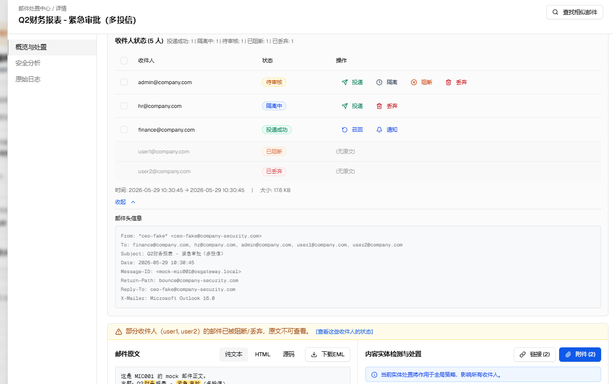
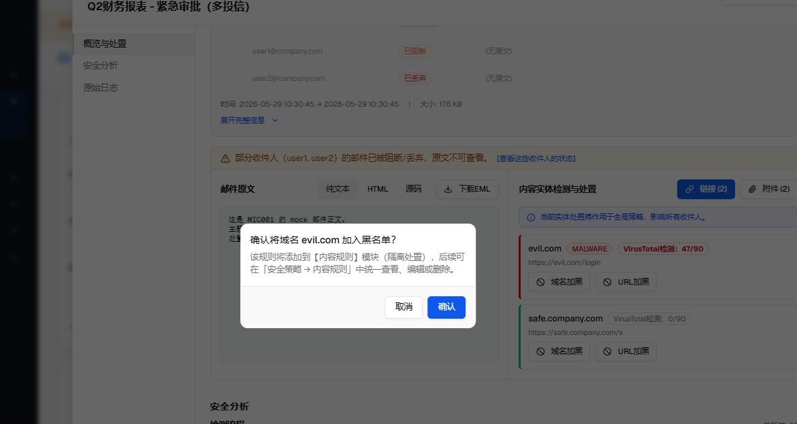
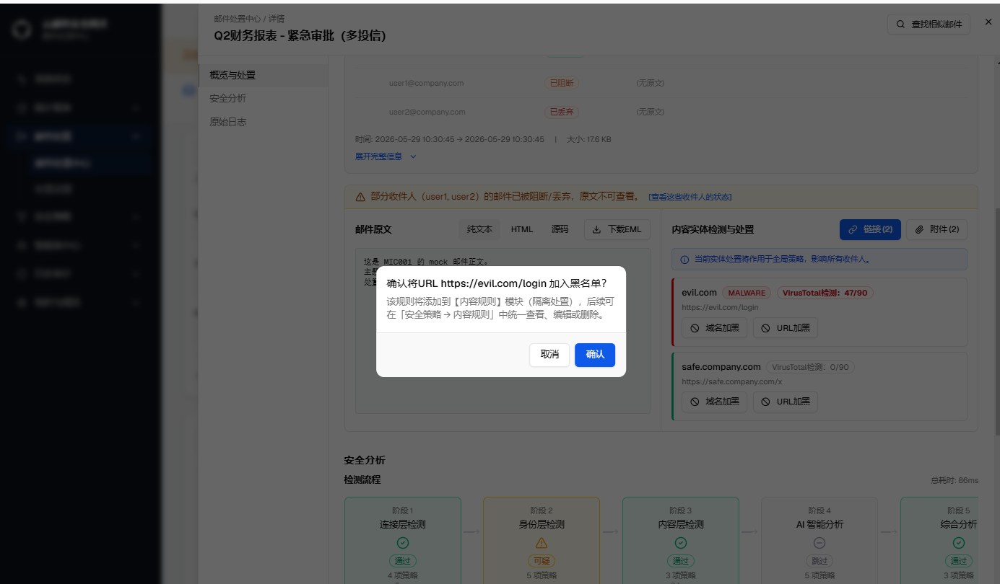
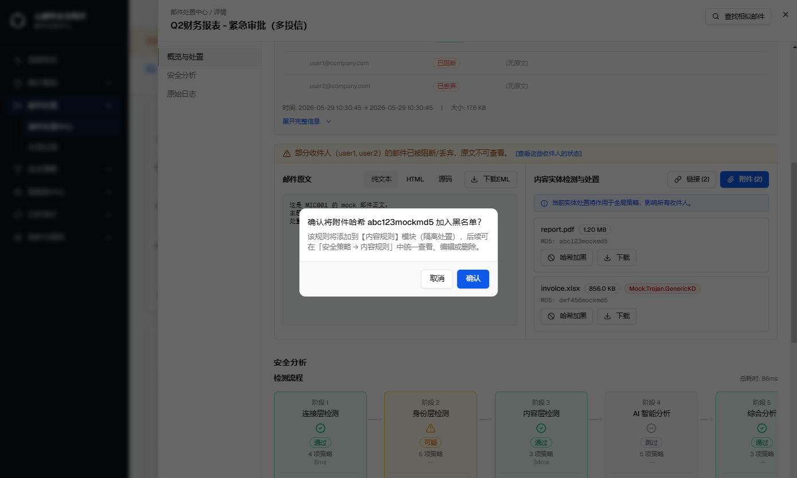
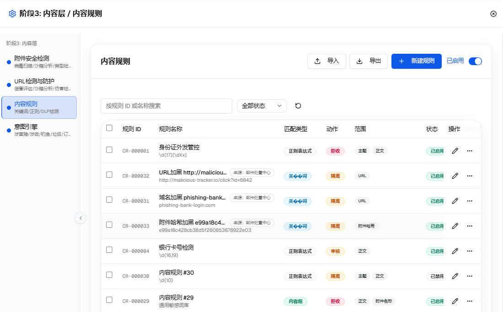

# GT-12923【0813】邮件处置中心总优化工单

| 字段 | 内容 |
|---|---|
| 规格版本 | v22（GT-12946 群发邮件详情 origin 展示对齐版） |
| 生成日期 | 2026-08-17 |
| 页面路由 | `/zh/email-disposal/center` |
| webapp 源码 | `src/components/email-disposal/` |
| 需求依据 | 用户在本工单多轮对话中提出的具体问题与确认 |
| 历史对话 | 已使用（阶段五 UI 复盘 + 文案修正 + 技能改造，均在当前会话内完成） |
| 对照 spec | not-used |
| 验证环境 | Mock 数据、zh locale、蓝色主题、桌面视口、AI-多租户形态、租户管理员/平台管理员视角 |

> 本文档汇总"邮件处置中心"模块在本工单下完成的全部改动，作为多个子变更的总览索引。每个子变更的详细验证过程（浏览器截图、单测、tsc 检查）已在开发过程中逐项完成，本文档记录变更内容、涉及文件与验证结论，不重复粘贴过程截图。

> **webapp 迁移校订（v17）**：正式 webapp 与后端已同步落地 GT-12955 批准的 13 项位置维度 `display_statuses[]` 契约；GT-12934 的 mixed/直投/放行逐收件人状态筛选、高亮和 Mock 契约均以后端列表为事实源。原始收件人 `pending_review` 在后端归一为 `audit_pending（待审核）`，不再误落 `sideline_pending（检测中）`；升级前保存的状态条件仍可执行并显示可读文案，同时在主 Badge 上联动到对应规范状态。已写入数据库的旧版状态投影本期不迁移，已知边界见 GT-12934 第 3.1 节与 Q-005。

> **GT-12935 方案 A 校订（v18）**：列表接口新增不含收件人地址数组的 `disposal_basis_groups[]` 轻量摘要；只有多依据 Tooltip 打开时才调用既有 `GET /mail-logs/{id}` 读取完整 `modules[]`。模块筛选继续使用 `disposal_policy_keys` 并集，具体规则筛选新增 `disposal_rule_ids`（根依据 + 所有命中模块规则 ID 并集）投影。旧行不回填该新投影，已知升级边界见 GT-12935 第 4.1 节与 Q-006。

> **GT-12935 代码评审校订（v19）**：同一策略模块内命中多条规则时也进入按需详情分支，并优先展示当前筛选命中的具体规则；规则选择器改为调用 `GET /mail-logs/_meta/disposal-rules` 在完整租户规则目录中搜索，不再从当前邮件页拼选项；分页列表改读写入时生成的有界 `disposal_basis_list` 投影。历史行不回填该列表投影，继续回退完整 `disposal_basis`，边界见 Q-007。

> **GT-12967 及详情页显示校订（v20）**：实体加黑改由 `POST /mail-logs/{id}/blacklist` 后端语义化接口权威创建租户内容规则；后端校验实体确实属于源邮件，固定同方向+隔离，并为域名/URL/MD5 使用边界正确的专用匹配语义。内容规则列表新增“来源：邮件处置中心”标识。同轮补齐安全分析“邮件标记”四语文案，认证仿冒模拟检测的无命中文案改为“检测通过”，并仅在 `OSGATEWAY_PRODUCT_FORM_SWITCHER=true` 时显示详情页“安全分析”。

> **GT-12936 方案 A 校订（v21）**：群发邮件的安全分析不再由浏览器把整封邮件动作反推到各收件人；新增后端权威的 `GET /mail-logs/{id}/analysis`，支持“全部收件人”汇总和精确收件人查询。检测流水线固定为阶段 1–5，阶段 4 仅展示当前真实存在的钓鱼、仿冒、威胁回溯三个智能体，钓鱼智能体完整研判明细收进自身检测行内，移除底部重复的独立紫色卡片。

> **GT-12946 校订（v22）**：详情页群发展示与 origin 一致，不再用收件人下拉选择器逐人切换。概览展示“群发结果”和多依据 `+N 项`，安全分析展示收件人/依据组汇总、阶段 `N 组`、检测项收件人分组及多张适用范围明确的处置依据卡片。分组语义仍由后端 `recipient_groups[]` 与已持久化的 `modules[].effective_for[]` 权威提供，不恢复 origin 中的客户端安全推断。

## 目录

- [A. 变更清单总览](#a-变更清单总览)
- [B. 产品形态 × 角色矩阵](#b-产品形态--角色矩阵)
- [GT-12931群发邮件/多投递信：执行动作筛选逻辑，以及展示逻辑调整](#gt-12931群发邮件多投递信执行动作筛选逻辑以及展示逻辑调整)
  - [1. 多收件人（mixed）记录展示逻辑优化：单一主要类别 Badge + hover 明细](#1-多收件人mixed记录展示逻辑优化单一主要类别-badge--hover-明细)
  - [2. 执行动作批量按钮文案统一：「放行」→「投递」](#2-执行动作批量按钮文案统一放行投递)
  - [3. CSV 导出新增收件人明细列](#3-csv-导出新增收件人明细列)
  - [4. 批量重新分类确认弹窗的 mixed 记录警示](#4-批量重新分类确认弹窗的-mixed-记录警示)
  - [5. mixed 邮件统计口径修正](#5-mixed-邮件统计口径修正)
  - [6. ru/th 国际化空洞补齐](#6-ruth-国际化空洞补齐)
- [GT-12955邮件状态枚举值优化](#gt-12955邮件状态枚举值优化)
  - [1. 邮件状态枚举维度重定义：从"风险/结果"维度改为"位置"维度](#1-邮件状态枚举维度重定义从风险结果维度改为位置维度)
  - [2. 已废弃枚举值的归并规则](#2-已废弃枚举值的归并规则)
- [GT-12934群发邮件/多投递信：邮件状态筛选逻辑，以及展示逻辑调整](#gt-12934群发邮件多投递信邮件状态筛选逻辑以及展示逻辑调整)
  - [1. 筛选逻辑修正：mixed 记录按收件人状态归一化后取交集匹配](#1-筛选逻辑修正mixed-记录按收件人状态归一化后取交集匹配)
  - [2. 展示逻辑修正：命中筛选值的收件人分组优先展示为主要类别 Badge](#2-展示逻辑修正命中筛选值的收件人分组优先展示为主要类别-badge)
  - [3. 关联缺陷修正：`pending_review` 状态归类空洞](#3-关联缺陷修正pending_review-状态归类空洞)
  - [3.1 存量状态投影的升级边界](#31-存量状态投影的升级边界)
- [GT-12935群发邮件/多投递信：处置依据筛选逻辑，以及展示逻辑调整](#gt-12935群发邮件多投递信处置依据筛选逻辑以及展示逻辑调整)
  - [1. 分组模型：按 policy_key 对 modules 归类](#1-分组模型按-policy_key-对-modules-归类)
  - [2. 展示逻辑：单桶不变，多桶主文案 + hover 明细](#2-展示逻辑单桶不变多桶主文案--hover-明细)
  - [3. 筛选联动：命中当前"处置依据"筛选值的桶优先展示](#3-筛选联动命中当前处置依据筛选值的桶优先展示)
  - [4. 关联缺陷修正：mixed 记录的处置依据筛选漏项](#4-关联缺陷修正mixed-记录的处置依据筛选漏项)
- [GT-12965邮件处置中心：详情页，去掉"更多""AI判定依据"](#gt-12965邮件处置中心详情页去掉更多ai判定依据)
  - [1. 移除详情页"更多"按钮与"AI判定依据"模块](#1-移除详情页更多按钮与ai判定依据模块)
- [GT-12966邮件处置中心——》查看——》展开完整信息模块：1.不展示"身份验证详情"以及"网络特征"；2.展示邮件头信息，也就是信头信息](#gt-12966邮件处置中心查看展开完整信息模块1不展示身份验证详情以及网络特征2展示邮件头信息也就是信头信息)
  - [1. 移除"身份验证详情""网络特征"，改为"邮件头信息"](#1-移除身份验证详情网络特征改为邮件头信息)
- [GT-12967邮件处置中心——》查看：域名加黑，URL加黑，哈希加黑](#gt-12967邮件处置中心查看域名加黑url加黑哈希加黑)
  - [1. 域名/URL/哈希加黑二次确认弹窗](#1-域名url哈希加黑二次确认弹窗)
  - [2. 内容规则来源标识："来源：邮件处置中心"](#2-内容规则来源标识来源邮件处置中心)
- [补充整改：详情页安全分析与检测文案](#补充整改详情页安全分析与检测文案)
- [GT-12936群发邮件/多投递信：安全分析按收件人查看](#gt-12936群发邮件多投递信安全分析按收件人查看)
  - [1. 后端权威分析契约](#1-后端权威分析契约)
  - [2. 详情页交互与智能体展示](#2-详情页交互与智能体展示)
  - [3. 与 origin 原型方案的差异](#3-与-origin-原型方案的差异)
  - [4. 验证结论与边界](#4-验证结论与边界)
- [GT-12946群发邮件详情多结果与多处置依据展示](#gt-12946群发邮件详情多结果与多处置依据展示)
- [H. 需确认事项](#h-需确认事项)
- [I. 版本历史](#i-版本历史)

## A. 变更清单总览

| 编号 | 变更内容 | 类型 | 主要涉及文件 | 所属需求 | 状态 |
|---|---|---|---|---|---|
| 1 | 多收件人（mixed）记录的执行动作/邮件状态列改为单一"主要类别"Badge + hover 明细 | UI 优化 | `recipient-status-badges.tsx` | [GT-12931](#gt-12931群发邮件多投递信执行动作筛选逻辑以及展示逻辑调整) | 已完成 |
| 2 | CSV 导出新增"收件人明细"列，逐收件人展开 mixed 记录的实际处置动作 | 功能新增 | `lib/csv-export.ts` | [GT-12931](#gt-12931群发邮件多投递信执行动作筛选逻辑以及展示逻辑调整) | 已完成 |
| 3 | 批量重新分类确认弹窗对 mixed 记录范围增加黄色警示条 | UI 优化 | `reclassify-dialog.tsx` | [GT-12931](#gt-12931群发邮件多投递信执行动作筛选逻辑以及展示逻辑调整) | 已完成 |
| 4 | 修正 `mixedMailHint` 文案与统计口径不一致（仅统计当前页却暗示全部结果） | 缺陷修正 | 邮件列表提示文案 i18n key | [GT-12931](#gt-12931群发邮件多投递信执行动作筛选逻辑以及展示逻辑调整) | 已完成 |
| 5 | 补齐 ru/th 语言文件缺失的 `recipientStatusBar` 命名空间 | 国际化修复 | `messages/ru.json`、`messages/th.json` | [GT-12931](#gt-12931群发邮件多投递信执行动作筛选逻辑以及展示逻辑调整) | 已完成 |
| 6 | 执行动作批量操作按钮文案由"放行"改为"投递" | 文案修正 | `messages/zh.json`（`emailDisposal.batch.release`） | [GT-12931](#gt-12931群发邮件多投递信执行动作筛选逻辑以及展示逻辑调整) | 已完成 |
| 7 | "邮件状态"改为 13 项位置维度契约，新增 `delivery_cancelled`，5 个旧顶层值归并到新状态，保留旧筛选入参兼容 | 契约迁移 | `internal/models/display_status.go`、`internal/storage/repo_maillog.go`、`api/openapi.yaml`、`types/email-disposal.ts` | [GT-12955](#gt-12955邮件状态枚举值优化) | 已落地 |
| 8 | "邮件状态"筛选对多收件人记录搜不出、命中后主 Badge 与筛选值不一致，以及 `pending_review` 误归类三处缺陷修正 | 缺陷修正 | `internal/models/display_status.go`、`internal/storage/repo_maillog.go`、`lib/display-status.ts`、`lib/mock/fixtures.ts`、`recipient-status-badges.tsx`、`mail-list-table.tsx`、`email-disposal-center-page.tsx` | [GT-12934](#gt-12934群发邮件多投递信邮件状态筛选逻辑以及展示逻辑调整) | 已完成 |
| 9 | "处置依据"列支撑群发邮件（mixed）多收件人命中不同策略模块的场景：列表返回轻量分组摘要，主文案取优先桶摘要 + "等 N 项"，hover 按需读取逐收件人明细；模块/具体规则筛选均按全命中并集匹配 | 功能新增 + 缺陷修正 | `internal/disposalbasis/`、`internal/storage/`、`configs/*/init.sql`、`api/openapi.yaml`、`components/disposal-basis-cell.tsx`、`lib/disposal-basis-config.ts`、`lib/mock/fixtures.ts`、`messages/{zh,en,th,ru}.json` | [GT-12935](#gt-12935群发邮件多投递信处置依据筛选逻辑以及展示逻辑调整) | 已完成 |
| 10 | 详情页"概览与处置"卡片头部移除"更多"（发信人加黑/加白右侧的下拉按钮，含"标记误报""标记漏报"两项未实现菜单）与"AI判定依据"内联展示行（原展示 AI 判定/云查简短依据文本），二者均按产品要求整体移除，其余处置按钮与"处置依据"行不变 | 功能移除 | `sender-actions.tsx`、`threat-summary-card.tsx`、`messages/{zh,en,th,ru}.json` | [GT-12965](#gt-12965邮件处置中心详情页去掉更多ai判定依据) | 已完成 |
| 11 | 详情页"展开完整信息"模块（B7）不再展示"身份验证详情"（Message-ID/Return-Path/Reply-To/X-Mailer）与"网络特征"（PTR/ASN）两个模块，改为按 From/To/Subject/Date/Message-ID/Return-Path/Reply-To/X-Mailer 邮件头顺序拼接展示"邮件头信息"（等宽信头格式文本） | 功能替换 | `send-receive-context-card.tsx`、`messages/{zh,en,th,ru}.json` | [GT-12966](#gt-12966邮件处置中心查看展开完整信息模块1不展示身份验证详情以及网络特征2展示邮件头信息也就是信头信息) | 已完成 |
| 12 | 详情页域名/URL/附件 MD5 加黑增加二次确认；客户端只提交实体意图，后端校验源邮件与租户后创建同方向、隔离动作的内容规则；内容规则列表展示邮件处置中心来源标识 | 功能新增+架构整改 | `mail_log_entity_blacklist.go`、`entitymatch/`、`repo_email_disposal_rules.go`、`entity-detection.tsx`、`ContentRulesTable.tsx`、`api/openapi.yaml` | [GT-12967](#gt-12967邮件处置中心查看域名加黑url加黑哈希加黑) | 已完成 |
| 13 | 补齐安全分析“邮件标记”四语文案；“No rules matched/未命中任何规则”改为“检测通过”及对应四语；详情页安全分析导航、内容区及跳转入口仅在产品形态切换器开启时显示 | 缺陷修复+展示门控 | `detail-modal.tsx`、`email-disposal-center-page.tsx`、`messages/{zh,en,th,ru}.json` | [补充整改](#补充整改详情页安全分析与检测文案) | 已完成 |
| 14 | 群发邮件安全分析的阶段与规则状态由后端按原始收件人归因权威计算；阶段 4 收敛为三个真实智能体，并将钓鱼智能体完整明细并入对应检测行 | 契约新增+UI 重构 | `internal/api/mail_log_analysis.go`、`api/openapi.yaml`、`detail-modal.tsx`、`analysis-section.tsx`、`disposal-detail-api.ts`、`messages/{zh,en,th,ru}.json` | [GT-12936](#gt-12936群发邮件多投递信安全分析按收件人查看) | 已完成 |
| 15 | 群发邮件详情对齐 origin 的多结果/多依据展示：概览群发结果、`+N 项`依据弹层、阶段 `N 组`、检测项收件人分组和多张处置依据卡片；去掉收件人选择器 | UI 对齐+契约补强 | `mail_log_analysis.go`、`threat-summary-card.tsx`、`analysis-section.tsx`、`disposal-basis-config.ts`、`messages/{zh,en,th,ru}.json` | [GT-12946](#gt-12946群发邮件详情多结果与多处置依据展示) | 已完成 |

> 编号 1–6 全部围绕"群发邮件/多投递信"场景下的执行动作筛选、展示与统计逻辑，v4 起统一归拢为独立需求 **GT-12931群发邮件/多投递信：执行动作筛选逻辑，以及展示逻辑调整**（见下方章节第 1–6 节），不再作为 GT-12923 下的零散变更条目单独描述；本表格保留编号仅用于追溯，具体内容以 GT-12931 章节为准。
>
> 编号 7 为独立需求 **GT-12955邮件状态枚举值优化**（见下方章节），v3 新增。
>
> 编号 8 为独立需求 **GT-12934群发邮件/多投递信：邮件状态筛选逻辑，以及展示逻辑调整**（见下方章节），v5 新增；与编号 1–6 同属"群发邮件/多投递信"场景，但聚焦"邮件状态"筛选维度而非"执行动作"筛选维度，且依赖 GT-12955 已重定义的 `DisplayStatus` 词表，因此单独立项、置于 GT-12955 之后。
>
> 编号 9 为独立需求 **GT-12935群发邮件/多投递信：处置依据筛选逻辑，以及展示逻辑调整**（见下方章节），v6 新增；与编号 1–6、编号 8 同属"群发邮件/多投递信"场景，聚焦"处置依据"列而非"执行动作"/"邮件状态"两列，三者视觉语言刻意不同（处置依据列是开放的策略模块+规则组合，不复用彩色 Badge），因此单独立项、置于 GT-12934 之后。
>
> 编号 10 为独立需求 **GT-12965邮件处置中心：详情页，去掉"更多""AI判定依据"**（见下方章节），v7 新增；与编号 1–9 均聚焦邮件处置中心**日志列表**不同，本需求聚焦**详情页**（概览与处置卡片头部），是本工单内第一个作用于详情页而非列表页的变更点，因此单独立项、置于 GT-12935 之后。
>
> 编号 11 为独立需求 **GT-12966邮件处置中心——》查看——》展开完整信息模块：1.不展示"身份验证详情"以及"网络特征"；2.展示邮件头信息，也就是信头信息**（见下方章节），v8 新增；与编号 10 同属**详情页**场景，但聚焦"概览与处置"卡片下方的"展开完整信息"（B7）模块而非卡片头部按钮/文案区，因此单独立项、置于 GT-12965 之后。
>
> 编号 12 为独立需求 **GT-12967邮件处置中心——》查看：域名加黑，URL加黑，哈希加黑**（见下方章节），v9 新增；与编号 10–11 同属**详情页**场景，但聚焦"概览与处置"卡片右侧的"内容实体检测与处置"模块（GT-12965/12966 均未涉及），补齐三个加黑按钮的二次确认交互，并首次将邮件处置中心创建的规则与运营手工创建的内容规则做来源区分，因此单独立项、置于 GT-12966 之后。
>
> 编号 14 为独立需求 **GT-12936群发邮件/多投递信：安全分析按收件人查看**。它处理的是详情页“安全分析”中逐收件人检测归因，不能复用列表页处置依据摘要，也不能继续由浏览器根据整封邮件动作推断。
>
> 编号 15 为独立需求 **GT-12946群发邮件详情多结果与多处置依据展示**。它复用 GT-12936 的后端权威语义，仅将用户可见的分组布局对齐 origin；两者是“权威判定契约”与“产品展示契约”的关系。

## B. 产品形态 × 角色矩阵

| 形态 \ 角色 | 平台管理员 | 租户管理员 |
|---|---|---|
| AI-单 | ✅ | ✅ |
| 传统-单 | ✅ | ✅ |
| 云-多 | ✅ | ✅ |
| AI-多 | ✅ | ✅ |
| 传统-多 | ✅ | ✅ |

邮件处置中心为全形态通用模块，各形态与角色下的可见性与可编辑性一致，无差异分支。

## GT-12931群发邮件/多投递信：执行动作筛选逻辑，以及展示逻辑调整

> 本需求收录本工单（GT-12923）下全部与"群发邮件/多投递信"场景相关的变更点——既包括"执行动作"筛选逻辑、展示逻辑本身（第 1、2 节），也包括围绕同一场景衍生出的 CSV 导出、批量操作弹窗提示、统计口径修正、国际化补齐（第 3–6 节）。原分散记录于变更一~六，v4 起统一归拢为独立需求名称，内容不变，仅重新组织归属与目录层级。

### 1. 多收件人（mixed）记录展示逻辑优化：单一主要类别 Badge + hover 明细

#### 1.1 背景

同一封邮件的不同收件人可能被系统执行了不同的处置动作（即 mixed 记录，对应"群发邮件/多投递信"场景）。优化前的实现会把每个处置类别渲染成一个独立 Badge 平铺展示（如 `[投递 6][旁路 1][隔离 1]`），导致：

- 该行的行高显著高于普通记录（单一动作只有 1 个 Badge），破坏列表整体的视觉节奏；
- 多个类别色同屏叠加（最多可达 7 种类别色），与设计规范"3–5 种色彩"的克制原则冲突。

#### 1.2 方案取舍

在 UI 优化讨论中比较了三个方向：

| 方案 | 描述 | 结论 |
|---|---|---|
| A（采用） | 只渲染 1 个"主要类别"Badge，其余类别折叠为 Badge 尾部的中性灰 `+N`，hover 展开完整明细 | 高度/密度与普通行完全一致，颜色数量始终为 1 种类别色，改动成本最低 |
| B（未采用） | 合并为单个多段文字 Badge（"投递 6 · 旁路 1 · 隔离 1"），放弃颜色编码 | 丢失"扫一眼颜色判断风险"的能力，对安全运营场景是实质倒退 |
| C（未采用） | 迷你分段进度条（stacked bar），按比例分配色块宽度 | 视觉语言与表格其余"离散状态"列不统一；1 人和 2 人的宽度差异不明显，不适合需要精确决策的处置场景 |

#### 1.3 执行动作筛选逻辑：主要类别选取规则（`pickPrimaryBucket`）

单纯"选数量最多的类别"会导致"筛选执行动作=投递，却看到隔离 Badge"的表面矛盾（因为后端对 mixed 记录的筛选是按 `disposition_actions` 数组做**交集匹配**）。因此规则分两种场景：

1. **筛选生效时**（`highlightKeys` 非空）：只在命中筛选值的类别里选，取人数最多的一个，保证"筛的是什么，展示的主 Badge 也一定是什么"。
2. **无筛选（默认列表态）**：按已评审的业务风险顺序选取：隔离 > 审核 > 旁路 > 投递失败 > 拒绝 > 丢弃 > 投递中 > 投递成功；同一档内按收件人数量降序。

执行动作筛选采用一份统一映射：`accept → deliver`、`quarantine → quarantine`、`audit → review`、`reject/bounce → block`、`discard → drop`；`drop` 同时兼容历史上 reason 非 block 的整封 `reject`。mixed 邮件按 `disposition_actions` 包含同一原始动作匹配。特别注意：**`sideline` 的语义是旁路检测中，不是审核**，因此不会映射到 `review`，也不进入执行动作筛选枚举；它仍可作为 mixed 行的实际动作 Badge/hover 明细出现，其当前进度由邮件状态 `sideline_pending（检测中）` 表达。

#### 1.4 实际页面呈现：邮件处置中心日志列表

上述 Badge 组件的实际落地位置是**邮件处置中心（`zh/email-disposal/center`）日志列表**的"执行动作"列与"邮件状态"列（列表最右两个状态列，紧邻"操作"列之前）。以下是该页面在浏览器中的真实渲染（Mock 数据，mixed 场景邮件主题为"季度营销报告 - 部分收件人白名单（混合处置演示）"，8 个收件人）：

该行"执行动作"列渲染为单一 Badge `隔离 1 +2`（黄色，因当前无筛选，按 [1.3](#13-执行动作筛选逻辑主要类别选取规则pickprimarybucket) 风险优先级规则选中"隔离"为主要类别，人数为 1，`+2` 表示还有 2 个其他类别未展开），"邮件状态"列同步渲染为对应的 `隔离中 +2`；与列表中其余单一动作记录（如同页"投递成功""待审核""拒收"）的行高完全一致。

鼠标 hover 该 Badge 后展开的完整明细（真实抓取自浏览器 DOM，未做文案改写）：

tooltip 内按类别分组列出全部 8 个收件人及每个人的实际处置依据：

- **投递 ×6**：`alice@company.com`、`bob@company.com`、`carol@company.com`（均为 `rule 投递白名单 matched at data stage`）；`frank@company.com`、`grace@company.com`、`henry@company.com`（均标注"混合处置：白名单收件人投递 + 规则命中隔离"）
- **旁路 ×1**：`eve@company.com`（`default_sideline`）
- **隔离 ×1**：`dave@company.com`（`rule 隔离扣留 matched at data stage`）

可见即使"投递"类别人数最多（6 人），主 Badge 仍按风险优先级选中人数更少但风险更高的"隔离"（1 人），与 [1.3](#13-执行动作筛选逻辑主要类别选取规则pickprimarybucket) 描述的规则一致。

"执行动作"高级筛选下拉的可选值（浏览器实际展开；`sideline` 是检测中间态，刻意不列入）：

批量工具栏中的"投递"按钮（原"放行"，见 [第 2 节](#2-执行动作批量按钮文案统一放行投递)），勾选一条"待审核"记录后按钮从禁用变为可点击：

#### 1.5 展示逻辑：涉及文件

- `src/components/email-disposal/components/recipient-status-badges.tsx` — 新增 `pickPrimaryBucket`、`RISK_PRIORITY`，多桶渲染分支改为单 Badge。
- `src/components/email-disposal/components/recipient-status-badges.test.ts` — 新增 `pickPrimaryBucket` 单测（筛选命中优先、多类别命中取最大、无命中回退风险优先级、同优先级按人数排序）。
- `src/components/email-disposal/mail-list-table.tsx` — 将当前生效的执行动作/邮件状态筛选值传给 Badge，使命中类别成为主要类别。

#### 1.6 验证结论

- 单元测试：22 项（含新增 5 项）全部通过。
- 浏览器验证：mixed 行 Badge 高度与普通行一致；hover tooltip 展开完整逐收件人明细，主要类别对应行有浅底色高亮，与 Badge 上数字一一对应（见 1.4 实际截图）。
- `tsc --noEmit`：涉及文件零新增错误。

### 2. 执行动作批量按钮文案统一：「放行」→「投递」

#### 2.1 变更内容

邮件处置中心工具栏中批量执行动作按钮的文案由"放行"改为"投递"，与筛选器"执行动作"下拉选项、上一节 mixed 记录列表徽章的文案统一，避免同一模块内三处"执行动作"相关文案不一致。

#### 2.2 涉及文件

- `messages/{zh,en,ru,th}.json` — 修改 `emailDisposal.batch.release` 键，四种语言统一为“投递”语义，未新增硬编码文案。

#### 2.3 验证结论

- 组件 `data-testid`、`onClick`（`onBatchAction('release')`）及批量处置逻辑均未改动。
- 浏览器可访问性快照验证：工具栏按钮实际渲染文本已更新为"投递"。
- 2318 项相关单元测试全部通过，UTF-8 编码自检无 U+FFFD 替换字符。

### 3. CSV 导出新增收件人明细列

#### 3.1 背景

CSV 导出此前只输出邮件层面的单一"执行动作"字段，mixed 记录导出后无法体现每个收件人具体被执行了什么动作，运营人员需要逐条回到列表页 hover 查看才能确认。

#### 3.2 方案

新增"收件人明细"列：

- 普通（单一动作）记录该列留空。
- mixed 记录列出全部收件人及各自的处置动作，格式为 `邮箱:动作; 邮箱:动作; ...`，动作文案复用列表页 Badge 使用的同一套中文标签映射，保证列表 Badge、hover tooltip、CSV 导出三处文案完全一致。

#### 3.3 涉及文件

- `src/components/email-disposal/lib/csv-export.ts`（新建，含单测）。

#### 3.4 验证结论

- 6 项单元测试通过。
- 实际触发导出并读取生成的 CSV blob 内容验证：mixed 记录的"收件人明细"列包含全部 8 个收件人及其各自动作（如"alice@company.com:投递; ...; dave@company.com:隔离; eve@company.com:旁路; ..."），文案与列表页 Badge 完全一致。

### 4. 批量重新分类确认弹窗的 mixed 记录警示

#### 4.1 背景

mixed 记录内不同收件人已有不同处置结果。批量投递/丢弃不得再处理终态收件人，批量召回也不得将未投递成功的收件人建为召回请求。确认弹窗同时需要明确提示实际生效范围。

#### 4.2 方案

`ReclassifyDialog` 新增 `mixedSelectionCount` 属性：当选中范围内的 mixed 记录数量大于 0 时，弹窗内显示黄色警示条，告知操作员只处理仍适用的收件人，终态收件人不会重复处置。

后端按已批准的方案 A 执行：

- **批量投递/丢弃**：对 `recipient_dispositions` 使用 `DisplayStatusForRecipient` 判定权威展示态，仅将 `quarantine_pending` / `sideline_pending` / `audit_pending` 且具有合法 `object_kind + object_id` 的对象纳入处置计划；已投递、投递中、投递失败、拒绝、丢弃等其他状态记为 `skipped`。同一对象的多个收件人合并执行一次，复用现有 object-mode 分发器与并发锁。
- **批量召回**：存在逐收件人明细时，仅 `DisplayStatusForRecipient(...) == delivered` 的收件人可召回；存量数据没有明细时，只有整封权威状态明确为 `delivered` 才回落为全部收件人。上述集合再按租户域配置路由到现有共享召回物化器：Coremail 使用 `coremail_tid`，Exchange 使用 `exchange_msg_id`；标准 SMTP 记为 `skipped / unsupported_backend`，支持召回但缺少 tracking ID 的收件人记为 `failed / tracking_id_missing`。
- **响应契约**：保留顶层 `succeeded` / `failed` / `not_applicable` / `reclassify_failed`；批量处置与批量召回都返回 `partial`。处置的 `partial` 表示同一 mixed 邮件的可操作对象有成功也有失败；召回的 `partial` 表示至少一个已投递收件人成功建单，同时另一个已投递收件人因不支持召回或缺少 tracking ID 被跳过/失败。两个接口均增量返回 `recipient_results[]`（包含 `mail_log_id` / `object_kind` / `object_id` / `recipients` / `status` / `reason`）。未投递收件人不属于召回适用范围，单独记为 `skipped / not_delivered`，不据此把成功邮件降为 `partial`。

浏览器实际验证：在日志列表中勾选前述 mixed 记录（"季度营销报告 - 部分收件人白名单（混合处置演示）"）并点击"召回"，弹窗在原有的"召回可能受目标邮件系统限制……"提示条下方，新增一条黄色 mixed 警示条：

对照组：勾选单一动作记录（非 mixed）时，弹窗内不出现该警示条，仅保留原有的召回限制提示。

#### 4.3 涉及文件

- `src/components/email-disposal/components/reclassify-dialog.tsx`
- `src/components/email-disposal/email-disposal-center-page.tsx`
- `internal/api/mail_log_disposal.go`
- `api/openapi.yaml`

#### 4.4 评审结论

- 2026-08-16：方案 A 已批准并落地，Q-001 关闭。终态收件人不重复处置；召回仅对确认投递成功的 Exchange 收件人建件。

### 5. mixed 邮件统计口径修正

#### 5.1 问题

`mixedMailHint` 提示文案的原文暗示"当前结果"中共有 N 封 mixed 邮件，但背后的计算逻辑实际只统计了**当前页**（`data.items`），而不是当前筛选条件下的**全部结果**。当结果跨多页时，文案会让用户误以为看到了完整统计。

#### 5.2 修正

将文案改为明确的"本页结果"表述，并注明其他分页可能还有更多 mixed 邮件，使文案与其背后真实的计算口径（仅当前页）保持一致，不再产生"文案暗示全量、逻辑只算当前页"的误导。

#### 5.3 涉及文件

- 邮件列表页 mixed 提示条对应的 i18n key（`emailDisposal` 命名空间下）。

### 6. ru/th 国际化空洞补齐

#### 6.1 问题

阶段四为"收件人状态徽章"功能新增的 `recipientStatusBar` 命名空间只在 `zh.json`/`en.json` 补齐，`ru.json`、`th.json` 两个语言文件完全缺失该子命名空间，是阶段四遗留的国际化空洞。现有的 i18n parity 测试当时未覆盖到这个子命名空间，因此没有在阶段四被发现。

#### 6.2 修正

在 `messages/ru.json`、`messages/th.json` 中补齐 `recipientStatusBar` 命名空间下的全部翻译键，与 `zh.json`/`en.json` 的键结构保持一致。

## GT-12955邮件状态枚举值优化

> **v14 批准裁决**：邮件状态必须收敛为 13 项，因为部分投递/部分召回等差异已由界面的逐收件人明细展示，不再重复占用顶层状态值。后端是展示状态事实源，前端只消费 `display_statuses[]`。

### 1. 邮件状态枚举维度重定义：从"风险/结果"维度改为"位置"维度

#### 1.1 方案概述

后端权威的 13 项规范展示状态及稳定顺序如下：

| 枚举值（`DisplayStatus`） | 中文标签 |
|---|---|---|
| `delivering` | 投递中 |
| `quarantine_pending` | 隔离中 |
| `sideline_pending` | 检测中 |
| `audit_pending` | 待审核 |
| `rejected` | 拒收 |
| `discarded` | 已丢弃 |
| `delivery_cancelled` | 投递中止 |
| `delivered` | 投递成功 |
| `delivery_failed` | 投递失败 |
| `recall_pending` | 召回中 |
| `recall_success` | 召回成功 |
| `recall_failed` | 召回失败 |
| `expired` | 已过期 |

mixed 邮件允许 `display_statuses[]` 含多个条目；每个条目的 `count` 表示该状态覆盖的对象数（投递态为收件人，召回态仅统计实际创建的召回请求）。筛选语义是“列表包含该状态”，由后端 SQL 与投影模型共同保证，前端只负责显示与把选中的多个状态作为 OR 条件提交。

#### 1.2 截图式交互预览

**状态 1 / 邮件状态筛选下拉框展开态**

| 字段 | 内容 |
|---|---|
| 触发路径 | 邮件处置中心 → 搜索区域筛选栏 → 点击"邮件状态"下拉框 |
| 路由 | `/zh/email-disposal/center` |
| 视口 | 桌面 1888×1152 |
| 形态/角色 | 全形态通用（AI-多租户 · 租户管理员视角下验证） |
| 验证依据 | 用户实拍浏览器截图 |

*正式页面以后端/OpenAPI 的 13 项契约为验收基准。*

#### 1.3 逐元素说明

| 元素 | 类型 | 说明 |
|---|---|---|
| "邮件状态"筛选下拉框 | 多选下拉（Checkbox 列表） | 位于搜索筛选栏第三行第一列，与"邮件类型""执行动作""IP 归属地"同行 |
| 下拉选项 | 13 个 Checkbox 选项 | 来自 `DISPLAY_STATUSES`，并由 OpenAPI/后端一致性测试守卫；文案来自 `emailDisposal.filters.statuses.<枚举值>` |
| 列表徽章（Badge） | 每条邮件记录"邮件状态"列 | 无条件直接消费 `display_statuses[]`；多状态记录显示 1 个主要 Badge + `+N`，hover 展开各状态覆盖数；`recipient_dispositions` 仅用于执行动作明细，不得重新推导邮件状态 |
| 清空按钮 | 文字按钮 | 清空全部已选状态选项 |

### 2. 已废弃枚举值的归并规则

#### 2.1 方案概述

移除的 5 个旧顶层值以及新增值按下表由后端统一投影。逐收件人原始状态和 `recall_state` 仍保留供详情/审计使用，只是不再作为顶层筛选项：

| 原始值/旧展示态 | 13 状态展示态 | 说明 |
|---|---|---|
| `action=bounce` / `bounced` | `delivery_failed` | 邮件未成功到达收件箱 |
| `partial_delivered` | 展示 `delivered` + `delivery_failed`；优先从 `delivery_recipients_summary` 取得精确人数 | 无处置明细也不再误报“投递中”；摘要损坏时按 raw partial 已证明的最小事实回落为 1 成功 + 1 失败 |
| `partial_recall_success` | 同时展示 `recall_success` + `recall_failed` | count 分别读取 `recall_success_total` 与 `recall_req_total - recall_success_total`，不使用整封收件人数 |
| `workflow=rejected_after_review` | `discarded` | 审核后邮件仍停在网关 |
| `workflow=deleted` | `discarded` | 清理动作不再单列位置状态 |
| `delivery_status_summary=cancelled` | `delivery_cancelled` | 与未进入投递队列的 `discarded` 区分 |

旧深链/已保存查询中的 `bounced`、`partial_delivered`、`partial_recall_success`、`deleted`、`reviewed_rejected` 仍被后端接受，并使用专用谓词保持原记录集合；它们不会扩大为整个 `delivery_failed` / `recall_success` / `discarded` 新分类。API 响应不再下发旧值。

#### 2.2 涉及文件

- `internal/models/display_status.go` — 13 项权威枚举、逐收件人映射与 `display_statuses[]` 聚合。
- `internal/storage/repo_maillog.go` — 状态筛选 SQL，mixed 邮件采用包含语义。
- `api/openapi.yaml` — API 枚举契约。
- `webapp/src/types/email-disposal.ts` — 与 OpenAPI 对拍的前端 union。
- `webapp/src/lib/display-status.ts` — 状态 Badge 配色唯一事实源。
- `webapp/src/components/email-disposal/quick-filters.tsx` — 多选筛选入口。

#### 2.3 验证结论

- 后端模型、存储筛选、OpenAPI、前端 union 和四语言 i18n 键由契约测试对拍。
- mixed 状态展示与筛选使用同一后端投影；前端迁移只增加筛选态主要类别高亮，不改变状态事实。

#### 2.4 差异标注

- 本次已按独立后端契约迁移落地，不是仅修改 webapp 下拉项。
- 原始投递/召回/工作流状态域不受影响；收缩的只是 `display_statuses[]` 展示契约。

## GT-12934群发邮件/多投递信：邮件状态筛选逻辑，以及展示逻辑调整

> 本需求聚焦"群发邮件/多投递信"场景在**"邮件状态"筛选维度**下的两处缺陷：搜索栏筛选生效时搜不出符合条件的多收件人（mixed）记录；即便搜出来了，列表行"邮件状态"列展示的主要类别也可能与筛选值不一致，造成用户困惑。与 [GT-12931](#gt-12931群发邮件多投递信执行动作筛选逻辑以及展示逻辑调整) 聚焦"执行动作"筛选维度的既有优化对称，本需求依赖 GT-12955 已重定义的 `DisplayStatus` 词表落地。

### 背景

一封 mixed 邮件的不同收件人可能被系统判定为不同的最终状态（如 8 个收件人中 6 个已投递、1 个隔离、1 个正在检测）。优化前，"邮件状态"筛选与展示均只使用该邮件的**整体位置汇总状态**，带来两个问题：

1. **搜不出**：用户在搜索栏勾选"邮件状态：投递成功"，期望搜出"包含已投递收件人"的邮件（包括群发邮件），但 mixed 记录的整体状态恒为"投递中"，永远不会等于"投递成功"，导致这批邮件被漏掉——即使其中确实有收件人已投递成功。
2. **展示矛盾**：即便通过其他条件搜出了 mixed 记录，"邮件状态"列的主要类别 Badge 是按无筛选时的默认风险优先级规则选取的（隔离/审核优先于投递成功），与用户刚刚筛选的"投递成功"没有关联，用户会疑惑"我筛的是投递成功，为什么看到的是隔离中"。

### 1. 筛选逻辑修正：mixed 记录按收件人状态归一化后取交集匹配

#### 1.1 方案概述

进入逐收件人模式的记录，其筛选规则从"要求整体汇总状态精确等于筛选值"改为：**只要该邮件的任一收件人的最终状态命中筛选值，这封邮件就算命中**（OR 语义）。逐收件人模式包括：`action=mixed`、带权威逐收件人展示态的直投 `action=accept`，以及 released/approved/timeout_released 放行族。其余没有逐收件人展示态、或已经形成整封级终态（召回、审核驳回、丢弃、过期、删除）的记录仍按整封状态精确匹配。

直投/放行纳入该模式是为了正确表达同一封邮件“部分投递成功、部分投递失败”的真实结果，不是扩大 mixed 需求范围；若仍按整封状态压平，会重新产生列表与筛选不一致。

该 OR 语义与 [GT-12931 第 1.3 节](#13-执行动作筛选逻辑主要类别选取规则pickprimarybucket) 中"执行动作"筛选对 `disposition_actions` 数组做交集匹配的既有处理方式保持一致，未引入第二套不同的筛选范式。

#### 1.2 词表归一化

正式 webapp 不在浏览器中归一化原始 `status`。后端通过 `DisplayStatusForRecipient` 与 `ComputeDisplayStatuses` 将逐收件人状态投影成规范 `display_statuses[]`；列表展示、高亮和筛选都使用同一组规范值。这样能保留投递中、投递失败、部分投递、退信和召回等正式契约语义。

#### 1.3 涉及文件

- `internal/storage/repo_maillog.go` — `display_status` 查询在逐收件人模式下按 `disposition_display_statuses` 做包含匹配；无明细与整封级终态记录保持整封状态匹配。
- `internal/models/display_status.go` — `ComputeDisplayStatuses` 作为状态展示的单一事实源，前端不再维护重复映射表。

### 2. 展示逻辑修正：命中筛选值的收件人分组优先展示为主要类别 Badge

#### 2.1 方案概述

复用 [GT-12931 第 1.3 节](#13-执行动作筛选逻辑主要类别选取规则pickprimarybucket) 的“筛选生效时优先展示命中类别”机制。当前 13 值条件直接比较 `display_statuses[].status`；升级前保存的旧值只在筛选值侧转换为对应规范高亮 key，不读取邮件原始字段、不重新计算展示状态。命中项优先成为主要 Badge，未筛选时维持默认风险优先级。处于 NOT 分组里的正向条件不参与高亮，避免把明确排除的状态选成主要 Badge。

#### 2.2 涉及文件

- `src/components/email-disposal/components/recipient-status-badges.tsx` — `DisplayStatusBadges` / `pickPrimaryDisplayStatus` 直接处理后端规范 `display_statuses[]`，不从收件人明细反推。
- `src/components/email-disposal/mail-list-table.tsx` — 新增 `activeDisplayStatuses` prop，"邮件状态"列给 `<DisplayStatusBadges>` 传入 `highlightKeys={activeDisplayStatuses}`。
- `src/components/email-disposal/email-disposal-center-page.tsx` — 相似邮件模式外，将当前搜索栏"邮件状态"筛选值（`searchParams.displayStatus` 拆分为数组）通过 `activeDisplayStatuses` 传给 `MailListTable`。
- `src/lib/display-status.ts` — 只维护旧筛选值到 13 项规范高亮 key 的兼容映射；不承担邮件状态计算。

### 3. 关联缺陷修正：`pending_review` 状态归类空洞

排查筛选链路时发现，收件人原始状态词表中的 `pending_review`（人工复核中）此前未进入后端规范状态映射。在主列表已经改为只消费 `display_statuses[]` 后，仅给前端 `STATUS_CATEGORY` 增加映射无法修正正式列表：后端会继续回落 `final_action`，并可能把 `final_action=sideline` 错报成“检测中”。

方案 A 将映射放回后端单一事实源：`DisplayStatusForRecipientStatus("pending_review") = audit_pending`，且优先级高于 `final_action`。前端保留 `STATUS_CATEGORY.pending_review=audit` 只用于仍直接展示原始收件人状态的详情组件。这里的原始收件人状态与旧顶层筛选别名同名但字段域不同：旧筛选参数 `pending_review` 继续按历史集合解释，不改变保存查询结果。

#### 3.1 存量状态投影的升级边界

`mail_log.disposition_display_statuses` 是持久化投影列。升级前已落库的记录可能仍保留旧映射结果（例如原始收件人 `pending_review` 曾回落到错误分类）。经本轮评审裁决：

- 本期**不执行存量回填、迁移或读时重算**，避免把未评估的大范围数据改写带入本需求。
- 新增记录以及后续因合法业务写入而重新生成投影的记录，使用新规则；未被重新写入的历史记录可能继续以旧状态参与展示、筛选和计数。
- 上述影响是已知升级限制，不宣称“旧数据已完全兼容”。如后续要求历史口径立即一致，应单独评审并实施可重入的分批回填/投影版本化方案。

> 这一边界仅指邮件数据的持久化投影。升级前保存的筛选模板仍保留查询兼容，并通过独立 `legacyStatuses` 文案表显示可读标签；它不会把 8 个退役值重新放回 13 项活跃筛选枚举。

### 4. 验证结论

- **单元测试**：`pickPrimaryDisplayStatus` 覆盖默认风险优先级与筛选命中优先；后端覆盖 `pending_review + final_action=sideline → audit_pending`；旧状态条件覆盖高级筛选校验及规范高亮转换；`mail-list-table.test.tsx` 覆盖 mixed + 召回时仍只显示后端状态。
- **Mock 契约**：Mock 与后端统一采用“收件人真实 `status` 优先、`final_action` 仅兜底”，并覆盖 mixed、直投、放行三个逐收件人入口；矛盾的 mixed 演示明细已修正为动作与状态一致。批量投递只改写仍可操作的对象，终态收件人保持不变并返回 `skipped`；投递成功后的即时状态为 `delivering`，不在投递事实未回写时乐观标记 `delivered`。Mock 的召回门也只识别后端约定的 4 个活跃状态，未知非空值不再抢占展示优先级。`email-disposal-mock.test.ts` 覆盖部分投递双筛选命中、批量投递后的逐收件人状态以及召回白名单。
- **数据库对拍**：增加存量 `recall_state='none'` 用例，验证列表包含状态与状态筛选命中保持双向一致；无数据库测试环境时用例只编译并明确 skip，不能将 skip 记为端到端通过。
- **`tsc --noEmit`**：涉及文件零新增类型错误。
- **浏览器验证**（Mock 数据、zh locale、蓝色主题、桌面视口、AI-多租户 · 租户管理员视角）：搜索栏勾选"邮件状态：投递成功"并提交后，结果集包含此前会被漏掉的 3 条含已投递收件人的 mixed 记录（含 8 收件人的"季度营销报告"演示记录），且该行"邮件状态"列的主要类别 Badge 展示为"投递成功"，与筛选值一致；hover 展开明细可见其余收件人的真实状态未被覆盖或丢失。

| 字段 | 内容 |
|---|---|
| 触发路径 | 邮件处置中心 → 搜索区域筛选栏 → 勾选"邮件状态：投递成功" → 点击"搜索" |
| 路由 | `/zh/email-disposal/center` |
| 形态/角色 | 全形态通用（AI-多租户 · 租户管理员视角下验证） |
| 验证依据 | 浏览器截图（Mock 数据） |

*hover 展开"邮件状态"列 Badge 的明细：*

> v15 正式 webapp 的 hover 内容以后端 `display_statuses[]` 为准，展示“规范状态 × count”，不再从 `recipient_dispositions` 反推收件人状态。上图仅保留主 Badge + hover 的视觉基线；部分召回的现有投影只有计数，无法安全声称具体是哪个收件人成功/失败。

*对照：同一行"执行动作"列 Badge 的 hover 明细（`dimension='action'`），验证两个维度的分组结果互不干扰：*

*补充场景：筛选"邮件状态：已丢弃"命中的另一条 mixed 记录（用户实拍截图），同样验证主要类别 Badge 与筛选值一致：*

### 5. 差异标注

- 与优化前相比，具备权威逐收件人展示态的 mixed、直投和放行记录，参与"邮件状态"筛选的判定口径从"整体汇总状态精确匹配"改为"任一收件人归一化状态命中即算匹配"；无明细记录及整封级终态仍按整封状态匹配。
- mixed 记录"邮件状态"列主要类别 Badge 的选取规则新增"筛选生效时优先展示命中类别"分支，逻辑与既有的"执行动作"列完全对称；未筛选时的默认展示（风险优先级排序）不变。
- 收件人原始状态 `pending_review` 由后端归一为 `audit_pending（待审核）`；`sideline` 仍唯一表示 `sideline_pending（检测中）`。旧顶层筛选别名按历史集合兼容，二者不混用。

## GT-12935群发邮件/多投递信：处置依据筛选逻辑，以及展示逻辑调整

> 本需求聚焦"群发邮件/多投递信"场景下"处置依据"列的展示与筛选：一封邮件的不同收件人可能因命中不同策略模块而产生多条处置依据，优化前该列只渲染顶层单一 `disposal_basis`，其余收件人命中的模块既不可见、也无法被"处置依据"筛选命中。本需求与 [GT-12931](#gt-12931群发邮件多投递信执行动作筛选逻辑以及展示逻辑调整)（执行动作列）、[GT-12934](#gt-12934群发邮件多投递信邮件状态筛选逻辑以及展示逻辑调整)（邮件状态列）同属"群发邮件/多投递信"场景下的列级优化，但"处置依据"列的视觉语言与另外两列刻意不同：执行动作/邮件状态是 7 类封闭枚举的结果维度，有天然可复用的语义配色（彩色 Badge）；处置依据是开放的约 30 个策略模块 + 具体规则组合，硬套彩色徽章只会让配色显得随意，因此维持现状的纯文本 + Tooltip 风格，不引入 Badge。

### 背景

正式数据使用 `disposal_basis.modules[]` 表达本封邮件命中的模块。每个模块携带 `policy_key`/`rule_id`/`rule_name`、`recipients[]`，以及可选的 `effective_for[]`：非空表示最终决定这些收件人的动作，空数组表示已知仅命中但未生效，缺失表示旧数据或前置阶段没有归属信息。顶层 `disposal_basis` 仍是整封邮件最严重的主依据。旧字段 `per_recipient[]` 已停写，只允许作为存量回落，不能成为新功能的数据源。

1. **展示不全**：8 个收件人的群发邮件若有 6 个命中"IP 频率限制"、2 个命中"IP 黑白名单"，列表行只会显示"IP 频率限制"的摘要，命中"IP 黑白名单"的 2 个收件人的信息完全不可见。
2. **筛不出**：用户在搜索栏勾选"处置依据：IP 黑白名单"，期望搜出"包含命中该模块收件人"的邮件，但筛选逻辑只比较顶层字段（恒为"IP 频率限制"），即使邮件里确实有收件人命中了"IP 黑白名单"，这封邮件也会被漏掉。

### 1. 分组模型：按 policy_key 对 modules 归类

扩展处置依据解析逻辑：通过既有 `resolveHitModules()` 读取 `modules[]`，按 `policy_key` 分组，并保留每条命中的 `recipients[]` 与 `effective_for[]` 三态信息。

- `modules[]` 非空时，以模块清单为准；同一 `policy_key` 下的多条规则合并为同一展示组。
- `modules[]` 缺失时，`resolveHitModules()` 才回落到旧 `per_recipient[]`，并明确不伪造 `effective_for[]`。
- 两者都缺失时，以顶层主依据形成单组，保持旧数据可读。
- 最终生效归属优先读取非空 `effective_for[]`；`effective_for: []` 只展示“命中但未生效”，不得算作最终处置依据；字段缺失则展示命中信息但不声称已生效。

配套新增两个排序/选取函数，供展示与筛选高亮复用同一套规则（详见 [3](#3-筛选联动命中当前处置依据筛选值的桶优先展示)）：

- `pickPrimaryBasisGroup(groups, highlightPolicyKeys?, highlightRuleIds?)` — 选出列表主文案使用的"优先桶"：筛选生效时命中筛选值的桶优先，否则优先生效模块，再回落到顶层主依据/原始顺序。
- `sortBasisGroupsForTooltip(groups, highlightPolicyKeys?, highlightRuleIds?)` — 为 Tooltip 排序展开顺序：命中筛选值的桶排最前，其余保持原始顺序；不涉及筛选时为无操作（原数组顺序不变）。

涉及文件：`src/components/email-disposal/lib/disposal-basis-config.ts`（新增 `DisposalBasisRecipientGroup` 接口与上述三个函数）。

### 2. 展示逻辑：单桶不变，多桶主文案 + hover 明细

#### 2.1 方案概述

新增独立组件 `DisposalBasisCell`，从 `mail-list-table.tsx` 中抽出原有的处置依据渲染逻辑并扩展多桶支持：

- **单桶单规则命中**（仅 1 个 group 且仅 1 个 entry）：渲染逻辑与优化前完全一致——`formatListReason()` 摘要文本 + Tooltip 展示同一摘要；阶段 1 平台策略遮蔽（租户视角下命中平台侧策略）逻辑不变。
- **多依据命中**（多个 group，或同一 group 内有多条规则）：
  - 主文案由 `formatMultiBasisListReason()` 拼接：优先桶（[1](#1-分组模型按-policy_key-对-modules-归类)）摘要 + `"等 N 项"`（N = 命中的模块数）。
  - 列表响应使用 `disposal_basis_groups[]` 生成主文案和组标题，不下发完整收件人数组。
  - Tooltip 第一次打开时才通过 `GET /mail-logs/{id}` 读取完整 `modules[]`，按 `policy_key` 分组展开：组标题展示模块名及命中人数，组内同时区分“最终生效”“仅命中”“归属未知”；结果由查询缓存复用，不会因同一次悬停反复请求。
  - 详情加载中显示加载文案；失败时仍保留列表摘要和组标题，不把整个处置依据单元格置空。
  - 阶段 1 平台策略遮蔽按组生效：命中平台策略的组标题/规则名替换为遮蔽占位文案，其余真实模块组正常展示、互不影响。

#### 2.2 新增 i18n key

| Key | zh | en |
|---|---|---|
| `emailDisposal.table.disposalBasisGroupHeader` | `{module}（{count} 人）` | `{module} ({count} recipients)` |
| `emailDisposal.table.disposalBasisRuleLine` | `{recipient} — 规则：{ruleName}（{ruleId}）· {state}` | `{recipient} — Rule: {ruleName} ({ruleId}) · {state}` |
| `emailDisposal.table.disposalBasisPlatformRuleLine` | `{recipient} — 规则：{policyLabel} · {state}` | `{recipient} — Rule: {policyLabel} · {state}` |
| `emailDisposal.table.disposalBasisLoading` | `正在加载逐收件人明细…` | `Loading per-recipient details…` |
| `emailDisposal.table.disposalBasisLoadFailed` | `逐收件人明细加载失败，已显示分组摘要` | `Could not load per-recipient details; showing the group summary` |
| `emailDisposal.table.disposalBasisState.*` | `最终生效 / 仅命中 / 归属未知` | `Final action / Hit only / Attribution unknown` |

以上 key 均已补齐 zh/en/th/ru 四语言文案（`messages/{zh,en,th,ru}.json`）。

#### 2.3 涉及文件

- `src/components/email-disposal/components/disposal-basis-cell.tsx`（新增）— `DisposalBasisCell` 组件，承接原 `mail-list-table.tsx` 内联的处置依据渲染逻辑并扩展多桶分支。
- `src/components/email-disposal/lib/disposal-basis-config.ts` — 新增 `formatMultiBasisListReason()`（组装多桶主文案，四语言 `"等 N 项"` 后缀独立配置）。
- `src/components/email-disposal/mail-list-table.tsx` — "处置依据"列改为渲染 `<DisposalBasisCell>`，原内联的单值渲染逻辑移入新组件；新增 `activeDisposalPolicyKeys`/`activeDisposalRuleIds` 两个 props 向下传递当前筛选值。
- `internal/disposalbasis/disposalbasis.go`、`internal/storage/repo_maillog.go`、`internal/storage/repo_mail_recipients.go` — 生成轻量分组摘要并统一覆盖普通列表与收件人快速路径；完整详情不裁剪。
- `messages/zh.json`、`messages/en.json`、`messages/th.json`、`messages/ru.json` — 新增 [2.2](#22-新增-i18n-key) 的多依据文案。

### 3. 筛选联动：命中当前"处置依据"筛选值的桶优先展示

搜索栏"处置依据"筛选（模块 `disposal_policy_keys` / 具体规则 `disposal_rule_ids`）生效时，`email-disposal-center-page.tsx` 将当前筛选值通过 `activeDisposalPolicyKeys`/`activeDisposalRuleIds` 传给 `MailListTable` → `DisposalBasisCell`，命中筛选值的分组在主文案与 Tooltip 展开顺序中都会被优先展示（复用 [1](#1-分组模型按-policy_key-对-modules-归类) 的 `pickPrimaryBasisGroup`/`sortBasisGroupsForTooltip`）。

同一 `policy_key` 内存在多条规则时，主文案进一步在优先分组内选择 `rule_id` 命中的 entry，不再固定取第一条。具体规则模式的输入框以 250ms 防抖调用 `GET /mail-logs/_meta/disposal-rules?search=...&limit=12`，后端在调用者有效租户作用域的完整规则目录中按显示规则 ID/名称搜索并只返回 `{id,name}`；结果与当前邮件分页无关。

涉及文件：`src/components/email-disposal/email-disposal-center-page.tsx`（新增两个 prop 的下发逻辑，`similarMode` 时不传）。

### 4. 关联缺陷修正：mixed 记录的处置依据筛选漏项

模块筛选继续使用后端已维护的 `mail_log.disposal_policy_keys` 并集字段；具体规则筛选使用新增的 `mail_log.disposal_rule_ids` 定界并集字段。后者在新写入及合法异步投影更新时由“顶层规则 ID + `modules[]` 中全部规则 ID”生成，避免只按顶层主规则筛选造成漏项。多个筛选值使用 OR 语义，精确匹配逗号定界 token，避免 `CR-1` 误命中 `CR-10`。mock 层同步使用相同并集语义。

涉及文件：`internal/models/field_registry.go`、`internal/storage/repo_mail_logs_virtual.go`、`internal/storage/repo_maillog.go`、`internal/storage/repo_email_type_sync.go`、`internal/storage/repo_lifecycle_projection.go`、七种数据库 `configs/*/init.sql`、openGauss 增量迁移、`src/lib/mock/fixtures.ts`。

#### 4.1 存量规则投影升级边界

- 本期按用户裁决**不回填**升级前历史行的 `disposal_rule_ids`；新增列为可空字段，迁移只做加列。
- 新写入邮件与后续经过合法处置依据投影更新的邮件会得到规则 ID 并集；未触发重算的旧行仍可能只能被模块筛选命中，不能保证被具体规则 ID 筛选命中。
- 前端展示仍可通过旧 `per_recipient[]` 或顶层依据回落，不因新投影为空而隐藏旧行。
- 若后续要求旧数据的具体规则筛选立即完整，应另立需求评审可重入、分批和跨数据库一致的回填方案。
- `disposal_basis_list` 同样不回填：新写入/合法投影更新的行从该有界 JSON 读取；历史行为 NULL 时回退完整 `disposal_basis`，因此历史大群发邮件仍可能承担旧版 DB 传输/JSON 解析成本，且旧根级 `recipients`/`recipient`/`effective_for` 数组仍可能随列表返回。该兼容风险只做备注，本期不改写旧数据。

### 5. 验证结论

- **后端单元测试**：覆盖规则 ID 根依据/全部模块并集、分组摘要去重计数、`effective_for` 三态、旧 `per_recipient[]` 回落和虚拟筛选 SQL。
- **前端单元测试**：覆盖正式 `modules[]` 分组、列表摘要映射、筛选高亮排序，以及 Tooltip 关闭时零请求、打开后才加载详情并展示逐收件人生效状态。
- **Mock 契约测试**：列表不含 `modules[]` 但包含计数摘要，详情保留完整模块；模块筛选与非主规则 ID 筛选都能命中 mixed 演示记录。
- **`tsc --noEmit`**：本次涉及文件零新增类型错误；全仓仍仅有既有的 `tests/e2e/helpers/internal-client.ts` 缺少 `undici` 类型依赖错误。
- **浏览器截图**：下列截图保留 origin 原型已验证的交互视觉基线；v18 正式接口的“列表摘要 + Tooltip 按需详情”属于同视觉、不同数据装载方式，当前由组件交互测试与接口契约测试验证，不把旧截图冒充为新请求时序证据。

| 字段 | 内容 |
|---|---|
| 触发路径 | 邮件处置中心 → 搜索区域筛选栏 → "处置依据"下拉 → 勾选模块 → 点击"搜索" |
| 路由 | `/zh/email-disposal/center` |
| 形态/角色 | 全形态通用（AI-多租户 · 租户管理员视角下验证） |
| 验证依据 | 浏览器截图（Mock 数据） |

*hover 一条 6 收件人 mixed 记录的"处置依据"列，Tooltip 按模块分组展开逐收件人明细：*

### 6. 差异标注

- 与优化前相比，mixed 记录的处置依据展示读取 `modules[]`，筛选读取后端 `disposal_policy_keys` 并集；旧 `per_recipient[]` 仅用于存量展示回落。
- 与 origin 原型相比，正式 webapp 不在分页列表携带完整逐收件人数组：列表读取 `disposal_basis_groups[]`，多依据 Tooltip 打开后再读取详情；避免分页载荷随“模块数 × 收件人数”膨胀。
- 具体规则筛选不再读取顶层 `disposal_basis.rule_id`，而读取 `disposal_rule_ids` 全命中并集；旧行不回填的边界见 [4.1](#41-存量规则投影升级边界)。
- "处置依据"列多模块命中时的主文案新增"优先桶摘要 + 等 N 项"的展示分支；单模块命中时的展示与优化前完全一致。
- 新增的分组/排序机制与 [GT-12931](#gt-12931群发邮件多投递信执行动作筛选逻辑以及展示逻辑调整)"执行动作"列、[GT-12934](#gt-12934群发邮件多投递信邮件状态筛选逻辑以及展示逻辑调整)"邮件状态"列的"筛选命中优先展示"设计对称，但实现上是独立的一套函数（`groupRecipientBasisByPolicy` 等），不复用另外两列基于 Badge 分类的 `recipient-status-badges.tsx`——处置依据列本身不引入 Badge，两套渲染路径互不依赖。

## GT-12965邮件处置中心：详情页，去掉"更多""AI判定依据"

> 本需求聚焦邮件处置中心**详情页**（点击列表行进入的"概览与处置"卡片），与本工单其余变更点（GT-12931/GT-12955/GT-12934/GT-12935）均作用于**列表页**不同，是本工单内第一个改动详情页的需求。按用户提供的详情页截图红框标注，移除头部的"更多"下拉按钮与"AI判定依据"内联展示行，其余功能模块不变。

### 1. 移除详情页"更多"按钮与"AI判定依据"模块

#### 1.1 背景

详情页"概览与处置"卡片头部此前包含以下两处元素：

1. **"更多"按钮**（`sender-actions.tsx`）：位于"发信人加黑""发信人加白"两个按钮右侧的下拉触发按钮（`···  更多`），点击展开菜单，菜单内仅有"标记误报""标记漏报"两项，点击后均只弹出"暂未实现"（`notImplementedToast`）提示，未接入任何真实业务逻辑。
2. **"AI判定依据"内联行**（`threat-summary-card.tsx`）：位于"命中特征"徽章行与"处置依据"行之间，展示一段 AI 判定/云查简短依据文本（如"AI 判定为 显示名 仿冒（置信度：94%）"），来源依优先级取 `disposal_basis`（经 `formatHitDetail` 渲染）→ `phish_agent_check.summary` → `cac_result.description` 三者之一。

产品评审认为：第 1 项是完全未实现的占位功能，不应保留入口误导用户；第 2 项与下方"处置依据"行（同样来自 `disposal_basis`，经统一规则字典渲染）在多数场景下信息重复，且当来源退回 `cac_result.description`（外部 CAC 反垃圾云查服务）时容易被误读为"AI 判定"，故两者一并整体移除。

#### 1.2 最终方案

- 从 `SenderActions` 组件中完整删除"更多"下拉按钮及其菜单（含"标记误报""标记漏报"两个菜单项、对应的 `onClick` 空实现与 `notImplemented` 兜底函数），保留"发信人加黑""发信人加白"两个按钮及非单收件人场景下的多投提示不变。
- 从 `ThreatSummaryCard` 组件中完整删除"AI判定依据"内联行（原 Row 3）及其取值计算逻辑（`inlineVerdict` 及依赖的 `formatHitDetail`/`phish_agent_check`/`cac_result` 优先级判断），下方"处置依据"行（原 Row 4）保持原有渲染逻辑与位置不变，不因移除上一行而改变布局层级。
- 不改动"命中特征"徽章行、收发信上下文、收件人状态矩阵等其余"概览与处置"模块内容。

#### 1.3 截图式交互预览

| 字段 | 内容 |
|---|---|
| 状态名称 | 变更前（用户实拍留档，标注待移除元素） |
| 触发路径 | 邮件处置中心 → 日志列表点击一条记录 → 详情弹窗/详情页 → "概览与处置" 标签 |
| 路由 | `/zh/email-disposal/center`（详情以弹窗形式叠加在列表页之上） |
| 视口 | 桌面 |
| 形态/角色 | 全形态通用（AI-多租户 · 租户管理员视角下用户实拍） |
| 验证依据 | 用户在本次对话中提供的真实浏览器截图，经用户明确授权直接用于本文档 |

**状态 1 / 详情弹窗顶部——"更多"按钮位置（红框标注）**

*红框内为"更多"按钮（位于"发信人加黑""发信人加白"右侧），本次变更将其与其下拉菜单一并移除；同一行左侧的"发信人加黑""发信人加白"两个按钮不受影响。*

**状态 2 / 详情弹窗全屏视图——"AI判定依据"行位置（红框标注）**

*红框内为"AI判定依据"行（位于"命中特征"徽章行与"处置依据"行之间），本次变更将其整行移除；下方"处置依据"行（`仿冒邮件检测智能体「高管仿冒识别」隔离`）保持不变，不因上一行被移除而改变自身内容或位置。*

*说明：以上两张截图为用户在本次对话中提供的真实浏览器截图（早于本次代码改动拍摄，用于标定待移除范围），经用户明确授权直接收录本文档；"变更后"状态因当前验证环境的邮件列表 mock 数据加载异常（与本次改动无关，见 [H. 需确认事项](#h-需确认事项) Q-002）未能在本次会话内补充实拍，已改用单元测试作为等效验证依据（见 [1.5 验证结论](#15-验证结论)）。*

#### 1.4 涉及文件

- `src/components/email-disposal/sections/overview/sender-actions.tsx` — 删除"更多"下拉按钮（`DropdownMenu`/`DropdownMenuTrigger`/`DropdownMenuContent`/`DropdownMenuItem` 及两个菜单项）与 `notImplemented` 兜底函数；移除未再使用的 `MoreHorizontal` 图标及 `DropdownMenu` 系列组件导入。
- `src/components/email-disposal/sections/overview/sender-actions.test.tsx` — 更新断言：确认 `email-disposal-overview-action-more` 测试 ID 不再渲染，删除原有的"E7 更多菜单"专项测试用例。
- `src/components/email-disposal/sections/overview/threat-summary-card.tsx` — 删除"AI判定依据"内联行（原 Row 3）渲染分支与 `inlineVerdict` 计算逻辑；移除未再使用的 `Sparkles` 图标导入及 `formatHitDetail` 导入。
- `src/components/email-disposal/sections/overview/threat-summary-card.test.tsx` — 用参数化用例分别覆盖 `disposal_basis`、`phish_agent_check.summary`、`cac_result.description` 三种原数据来源，确认"AI判定依据""云查依据"均不再渲染；同时保留"处置依据"正向断言。
- `messages/zh.json`、`messages/en.json`、`messages/ru.json`、`messages/th.json` — 移除四语言下均已孤立的 `emailDisposal.detail.overview.aiJudgmentBasis`、`cloudCheckBasis`、`senderActions.more` 及整个 `senderActions.menu` 对象（`exportEml`/`exportPdf`/`markFalsePositive`/`markFalseNegative`/`addToInvestigation`），共 8 个 key。`emailDisposal.detail.overview.senderActions.notImplementedToast` 仍被安全分析、收发信上下文和实体处置模块复用，保留不动。

#### 1.5 验证结论

- **单元测试**：`sender-actions.test.tsx`、`threat-summary-card.test.tsx` 专项 46 项全部通过；邮件处置组件目录合计 31 个测试文件、473 项全部通过。新增/更新的断言明确验证 `email-disposal-overview-action-more` 测试 ID 与"AI判定依据"/"云查依据"文本在 DOM 中均不再出现。
- **`tsc --noEmit`**：涉及文件零新增类型错误。
- **国际化自检**：对 `messages/{zh,en,ru,th}.json` 逐文件执行 U+FFFD 替换字符扫描，四文件均为 0 处；`email-disposal-detail-i18n-parity.test.ts` 通过，四语言键结构保持一致。
- **浏览器验证**：受限于当前会话验证环境的邮件列表 mock 数据加载异常（搜索任意条件均返回"共 0 条"，经排查与本次改动的代码路径无关），未能补充实拍"变更后"的详情页真实截图，已记录为 [H. 需确认事项](#h-需确认事项) Q-002，待环境恢复后补拍。

#### 1.6 差异标注

- 与变更前相比，详情页"概览与处置"卡片头部按钮组由"发信人加黑 / 发信人加白 / 更多"三个减少为"发信人加黑 / 发信人加白"两个；"更多"下拉菜单内"标记误报""标记漏报"两个占位入口一并消失，不影响其余处置流程（投递/隔离/丢弃/通知等均在下方收件人矩阵中执行，不受本次变更影响）。
- "命中特征"徽章行与"处置依据"行之间的"AI判定依据"内联行整体消失；"处置依据"行的内容、样式与位置均保持不变。

## GT-12966邮件处置中心——》查看——》展开完整信息模块：1.不展示"身份验证详情"以及"网络特征"；2.展示邮件头信息，也就是信头信息

> 本需求同样聚焦邮件处置中心**详情页**，与 [GT-12965](#gt-12965邮件处置中心详情页去掉更多ai判定依据) 同属详情页场景，但作用范围不同：GT-12965 改动的是"概览与处置"卡片**头部**（按钮组 + AI判定依据行），本需求改动的是同一卡片下方"发送/接收上下文"区域内的**"展开完整信息"（B7）折叠模块**——点击"展开完整信息"后展示的详情内容。

### 1. 移除"身份验证详情""网络特征"，改为"邮件头信息"

#### 1.1 背景

详情页"概览与处置"卡片内，点击收发信上下文区域的"展开完整信息"按钮展开后，原展示两个并排模块：

1. **"身份验证详情"**：`Message-ID`、`Return-Path`、`Reply-To`、`X-Mailer` 四个字段，逐行展示。
2. **"网络特征"**：`PTR`（反向域名解析）、`ASN`（自治系统号）两个字段。

产品评审认为：这两个模块名称与内容存在错位——"身份验证详情"实际展示的是邮件头字段而非 SPF/DKIM/DMARC 等身份验证结果（身份验证结果已在上方"命中特征"徽章行独立展示），"网络特征"仅两个字段、信息密度低且与"发信 IP/地理位置"等上下文信息重复度高；同时用户在安全排查场景中更需要的是**完整的邮件头信息（信头）**，用于比对 `From`/`Reply-To` 不一致、`Message-ID` 域名可疑等钓鱼特征。故将两个模块整体替换为一个统一的"邮件头信息"区块。

#### 1.2 最终方案

- 移除“身份验证详情”与“网络特征”两个模块（含各自标题与全部字段），展开区域不再展示 PTR/ASN。
- 新增单一“邮件头信息”模块。前端直接以纯文本 `<pre>` 展示详情接口返回的 `raw_headers`，保持保存时的字段顺序、字段名大小写和重复字段（尤其是多条 `Received`）；React 文本节点负责转义，不把信头当 HTML 解释。
- 禁止用 `sender`、`recipients`、`subject`、`received_at` 等 SMTP 信封或结构化字段现场伪造 `From`/`To`/`Subject`/`Date`。这些字段与真实 RFC 信头可能不同，特别是 Bcc 收件人不得被合成进 `To`。
- 原始 EML 不属于本功能的可用性前提：信头在邮件进入系统时提取，并随邮件日志写入 `mail_log`。详情读取时不再请求 antispam EML 服务。

##### 1.2.1 持久化与容量边界

- `mail_log.raw_headers`：保存信头文本；客户邮件由 Milter 的有序 header 回调采集；网关自产信由待发送 RFC 消息的 header block 提取，覆盖统一 `gatewaymail` 路径、验证码、告警、威胁回溯通知以及放行/重投邮件。
- `mail_log.raw_headers_truncated`：明确标记保存内容是否因容量上限而截断。
- 单封信头最多保存 **256 KiB**。超过上限时按有效 UTF-8 边界截断并置 `raw_headers_truncated=true`，前端必须显示“内容不完整”提示，不能把截断内容伪装成完整信头。
- Milter 已将字段名和值分开交给应用，因此系统能保留观察到的顺序、大小写、重复字段和值，但不能恢复 SMTP 传输前的原始折行字节；落库时统一使用 CRLF 连接字段。
- 升级前的历史行不回填。`raw_headers` 为 NULL/空时前端明确显示“邮件头信息不可用”，不得回退到 EML，也不得现场拼接。

##### 1.2.2 读取与接口边界

- `GET /mail-logs/{id}` 在完成租户鉴权后，按主键单独读取 `raw_headers` 与 `raw_headers_truncated` 并返回。
- 大字段刻意不加入 `mailLogColumns()`、`mailLogListColumns()` 等共享投影，列表、相似邮件、研判和处置操作路径不承担最多 256 KiB/封的额外数据库传输。
- 兼容字段 `return_path`、`reply_to`、`x_mailer` 仍可返回，但仅从已持久化的 `raw_headers` 派生，不再依赖 EML。

#### 1.3 截图式交互预览

| 字段 | 内容 |
|---|---|
| 状态名称 | 邮件头信息展开态 |
| 触发路径 | 邮件处置中心 → 日志列表点击一条记录 → 详情弹窗 → “概览与处置” → 收发信上下文区域点击“展开完整信息” |
| 路由 | `/zh/email-disposal/center`（详情以弹窗形式叠加在列表页之上） |
| 视口 | 桌面 |
| 形态/角色 | 全形态通用 |
| 验收重点 | 展示持久化信头原文；不出现“身份验证详情”“网络特征”、PTR、ASN；旧数据和截断数据有明确提示 |

**状态 1 / 详情弹窗——展开完整信息后的“邮件头信息”模块**

*该截图仅用于说明模块位置与视觉形态。截图里的八行内容是样例邮件实际保存的信头，不代表产品只保存或固定生成这八个字段；真实页面按 `raw_headers` 原文展示任意数量和顺序的信头字段。*

#### 1.4 涉及文件

- 后端采集与传输：`internal/mailheaders/raw.go`、`internal/antispam/milter.go`、`internal/gatewaymail/gatewaymail.go`、`internal/gwmaillog/gwmaillog.go`、`internal/gwmaillog/release.go`、`internal/api/gateway_mail_log.go`；所有自产信写日志均通过要求传入 RFC 消息的公共入口，放行站点由 AST 守卫保证携带 `MessageData`。
- 数据模型与存储：`internal/models/email.go`、`internal/models/mail_log.go`、`internal/storage/repo_maillog.go`。
- 数据库：七种后端的 `configs/<backend>/init.sql`，以及在线升级使用的 `configs/opengauss/migrations/v8.0/202608162300_add_mail_log_raw_headers.sql`。
- API：`internal/api/mail_logs.go`、`internal/api/maillog_eml_headers.go`、`api/openapi.yaml`。详情页从持久化列取值，原有 EML 即时富化路径已移除。
- webapp：`src/types/email-disposal-detail.ts`、`src/components/email-disposal/sections/overview/send-receive-context-card.tsx`、对应测试、mock fixture，以及四种语言的 messages 文件。

#### 1.5 验证结论

- Go 回归：`go test ./...` 全仓通过；`internal/antispam`、`internal/storage`、`internal/mailheaders`、`internal/models`、`internal/gwmaillog`、`internal/gatewaymail`、`internal/api` 等直接相关包均已覆盖。
- Schema 专项测试：七后端 init.sql 列集合一致性、scanner 自检、CreateMailLog 列/占位符一致性、统计来源守卫、详情大字段投影边界以及 `internal/schemamigrate` 全部通过。
- 前端测试：邮件处置中心 31 个测试文件共 475 项全部通过；其中 `send-receive-context-card.test.tsx` 的 14 项覆盖原文精确展示、不合成信封/Bcc 数据、旧数据不可用提示、截断提示和旧模块移除。
- ESLint：涉及文件 0 error；fixture 文件仍有 3 条与本需求无关的既有 unused-variable warning。
- 生产构建：补齐 `package-lock.json` 中缺失的 `remark-gfm@4.0.1` 依赖树后，干净执行 `npm ci` 与 `npm run build` 均通过；Turbopack、TypeScript 和静态页面生成全部成功。
- openGauss DB 集成用例已同步为持久化信头契约；需要在带 `dbtest` 数据库环境中执行，当前单元测试环境未运行真实数据库集成。

#### 1.6 差异标注

- 与旧实现相比，折叠区从“身份验证详情 + 网络特征”两个模块变为一个“邮件头信息”原文模块。
- 与本节早期方案相比，不再由前端固定拼接八行模拟信头；数据真源改为 intake 时持久化的 `mail_log.raw_headers`。
- PTR/ASN 从该折叠区移除；真实信头中若本身含相似文本，仍作为原文内容正常显示，前端不做字段级删改。
- 折叠/展开交互和外层 `data-testid="email-disposal-overview-context-fullinfo"` 保持不变，新增内层邮件头及截断提示测试 ID。

## GT-12967邮件处置中心——》查看：域名加黑，URL加黑，哈希加黑

> 本需求同样聚焦邮件处置中心**详情页**"概览与处置"卡片，但作用范围与 GT-12965/GT-12966 均不同：后两者聚焦卡片头部按钮组、AI判定依据行、"展开完整信息"折叠模块，本需求聚焦卡片右侧的**"内容实体检测与处置"模块**——链接（URL）与附件两个 Tab 内，每一行的"域名加黑""URL加黑""哈希加黑"三个操作按钮。本需求包含两个变更点：① 三个按钮由"点击即直接调用 API"改为"点击后二次确认，确认后才调用 API"；② 首次为邮件处置中心创建的内容规则打上来源标识，与运营手工创建的规则区分。

### 1. 域名/URL/哈希加黑二次确认弹窗

#### 1.1 背景

"内容实体检测与处置"模块内，链接 Tab 每一行的"域名加黑""URL加黑"按钮、附件 Tab 每一行的"哈希加黑"按钮，此前点击后立即调用 `addUrlRule`/`addAttachmentHashRule` 向 `/unified-rules` 发起写入请求，无任何二次确认。由于该模块顶部已有全局提示"当前实体处置将作用于全局策略，影响所有收件人"，误触加黑按钮的后果是对全租户范围生效的隔离规则，风险高于详情页内其余仅影响单条邮件的处置操作（投递/隔离/丢弃）。产品评审要求补充二次确认，交互形态对齐同一详情页"发信人加黑""发信人加白"按钮（`sender-actions.tsx`）已有的确认弹窗模式。

#### 1.2 最终方案

- 三个按钮点击后不再直接调用 API，而是打开一个二次确认弹窗；用户点击弹窗内"确认"后，客户端只向 `POST /api/v1/mail-logs/{id}/blacklist` 提交 `{kind,value}` 意图，不再自行拼装 priority、tenant、direction、stage 或条件树。点击"取消"或关闭弹窗不产生任何写入。
- 弹窗为**单例复用**：域名加黑、URL加黑、哈希加黑三种场景共用同一个 `AlertDialog` 实例（而非为链接/附件列表的每一行各自渲染一个弹窗实例），因为同一时刻用户只可能点开一个加黑按钮，三种场景的弹窗结构（标题+说明+取消/确认按钮）完全一致，仅标题中的"类型"文案与规则值不同。
- 弹窗标题按场景为"确认将此域名/URL/附件哈希加入黑名单？"，目标值在弹窗内以等宽文本完整展示。
- 弹窗明确说明：确认后创建一条与当前邮件**同方向**的本租户内容规则，后续命中邮件进入**隔离**，规则可在【内容规则】统一管理。
- 确认按钮在请求进行中显示 Loading 态（复用 `Loader2` 旋转图标），请求成功后弹窗关闭并触发成功 Toast 与 `onDisposed` 回调（刷新详情数据）；请求失败则弹窗保持打开，展示失败 Toast，用户可重试或取消。
- 弹窗使用单一 `AlertDialog` 自带的 overlay（`bg-black/60`），不叠加额外 portal 遮罩，避免重复遮罩、焦点陷阱和 z-index 分裂。
- 后端从源 `mail_log` 权威派生 tenant 和邮件方向，并固定 action=`quarantine`。priority 在租户级事务锁下从管理员可编辑区间 100–1000 选取最高空位；同一语义请求幂等返回已有规则。
- 域名使用主机名边界匹配（精确域名及其子域，不会误命中 `evil.com.attacker.test`）；URL 使用规范化后整体精确匹配；附件 MD5 在逗号分隔的多附件哈希中按 token 精确匹配。URL/域名在 DATA 阶段生效，附件 MD5 在 sideline 附件安全结果可用后生效。

#### 1.3 截图式交互预览

| 字段 | 内容 |
|---|---|
| 状态名称 | 变更后（用户实拍留档） |
| 触发路径 | 邮件处置中心 → 日志列表点击一条记录 → 详情弹窗 → "概览与处置" → "内容实体检测与处置" 模块 → 点击"域名加黑"/"URL加黑"/"哈希加黑" |
| 路由 | `/zh/email-disposal/center`（详情以弹窗形式叠加在列表页之上） |
| 视口 | 桌面 |
| 形态/角色 | 全形态通用（AI-多租户 · 租户管理员视角下用户实拍） |
| 验证依据 | 用户在本次对话中提供的真实浏览器截图，经用户明确授权直接用于本文档 |

**状态 1 / 链接 Tab——点击"域名加黑"后的确认弹窗**

*弹窗标题按域名场景渲染为"确认将域名 evil.com 加入黑名单？"，下方链接列表仍可见 `evil.com`（MALWARE，VirusTotal检测：47/90）与 `safe.company.com` 两条记录，弹窗打开期间背后页面被半透明遮罩覆盖；点击"取消"关闭弹窗且不发起请求，点击"确认"才调用 `POST /mail-logs/{id}/blacklist`。*

**状态 2 / 链接 Tab——点击"URL加黑"后的确认弹窗**

*与"域名加黑"弹窗结构完全一致，仅标题类型文案由"域名"改为"URL"、值由域名改为完整 URL（`https://evil.com/login`），验证了两种场景复用同一 `AlertDialog` 实例、仅按 `pendingAction.kind` 切换文案的实现方式。*

**状态 3 / 附件 Tab——点击"哈希加黑"后的确认弹窗（含完整详情页布局）**

*该图是 v9 时的历史视觉留档。图中 `abc123mockmd5` 不是合法 MD5，v20 已将 Mock 附件值改为 32 位十六进制摘要，真实后端也会拒绝非法哈希。图中“安全分析”仅代表产品形态切换器开启时的界面；生产默认关闭时不显示该导航和内容区。*

*说明：以上三张截图为用户在本次对话中提供的真实浏览器截图，经用户明确授权直接收录本文档；因当前验证环境的邮件列表 mock 数据加载异常（与 [H. 需确认事项](#h-需确认事项) Q-002/Q-003 同一环境限制），未能在本次会话内自行复现该交互并补充实拍，已改用单元测试作为等效验证依据（见 [1.5 验证结论](#15-验证结论-2)）。*

#### 1.4 涉及文件

- `src/components/email-disposal/sections/overview/entity-detection.tsx` — 管理单例确认弹窗与 loading/重试状态，确认后仅提交实体意图。
- `src/components/email-disposal/lib/disposal-detail-api.ts` — 新增 `blacklistMailLogEntity`，统一调用 `/mail-logs/{id}/blacklist`；删除域名/URL/MD5 的前端规则树拼装。
- `internal/api/mail_log_entity_blacklist.go` — 实体归属、租户、方向、动作、stage 和 metadata 的权威实现。
- `internal/storage/repo_email_disposal_rules.go` — 事务锁、幂等查重与 priority 空位分配。
- `internal/entitymatch/`、`internal/antispam/rule_eval.go` — 域名边界、URL 精确匹配与多附件 MD5 token 匹配。
- `messages/{zh,en,ru,th}.json` — 确认标题、影响说明、确认与处理中文案四语同步。

#### 1.5 验证结论

- **后端单元测试**：覆盖域名子域边界/URL 查询串/MD5 多 token，以及规则 metadata、方向和 stage 生成。
- **前端单元测试**：覆盖三种实体在确认前不发请求，确认后仅提交 `{kind,value}`；Mock 覆盖动态创建、幂等重试及不属于源邮件的实体拒绝。
- **前端验证**：按 lockfile 执行干净依赖安装后，6 个相关测试文件共 166 项全部通过，`tsc --noEmit` 与 `npm run build` 均通过；Turbopack 已验证可解析 `remark-gfm`。
- **国际化自检**：对 `messages/{zh,en,ru,th}.json` 逐文件执行 JSON 语法校验，四文件均解析通过，新增 `confirmDialog` 子对象结构在四语言下保持一致。
- **浏览器验证**：用户在本轮对话中提供的三张真实浏览器截图（见 [1.3 截图式交互预览](#13-截图式交互预览-2)）已直接确认域名/URL/哈希三种场景弹窗效果与代码实现完全一致；受限于验证环境的邮件列表 mock 数据加载异常，未能在本次会话内独立复现该交互，已归入 [H. 需确认事项](#h-需确认事项) 的既有环境限制记录（Q-002/Q-003 同一原因，不新增编号）。

#### 1.6 差异标注

- 与变更前相比，"域名加黑""URL加黑""哈希加黑"三个按钮点击后不再立即产生写入，而是先打开确认弹窗，用户需额外点击一次"确认"才会真正调用 API；误触按钮后可通过"取消"零成本撤回，不再需要用户自行前往【内容规则】模块手动删除误加的规则。
- 规则写入成功后仍有成功 Toast 与 `onDisposed` 刷新回调；规则语义、priority 和幂等性则由前端猜测改为后端权威决定。

### 2. 内容规则来源标识："来源：邮件处置中心"

#### 2.1 背景

【内容规则】模块的规则可能由管理员手工创建，也可能由邮件处置中心的实体加黑动作创建。两者属于不同产品语义，需要在持久化 metadata 和列表 UI 中可追溯区分。

#### 2.2 最终方案

- 后端为该类规则写入 `metadata.source=email_disposal_center`、`source_mail_log_id` 和 `entity_kind`，作为来源显示、幂等查重与条件树重建的稳定契约。
- `ContentRulesTable.tsx` 解析 metadata，在规则名称下方显示蓝色“来源：邮件处置中心”徽章；手工创建规则不显示该徽章。
- 来源标识仅用于追溯与展示，不额外改变内容规则页既有的编辑、启停、复制或删除权限。
- Mock 端点镜像真实请求：点击实体加黑后动态创建来源规则，再进入【内容规则】即可看到；不预置与用户操作无关的 3 条静态假数据。

#### 2.3 截图式交互预览

| 字段 | 内容 |
|---|---|
| 状态名称 | 变更后（用户实拍留档） |
| 触发路径 | 安全策略 → 内容规则 → 阶段3: 内容层 → 内容规则 Tab |
| 路由 | `/zh/security/filter-rules`（内容规则弹窗/面板） |
| 视口 | 桌面 |
| 形态/角色 | 全形态通用（用户实拍） |
| 验证依据 | 用户在本次对话中提供的真实浏览器截图，经用户明确授权直接用于本文档 |

**状态 1 / 内容规则列表——邮件处置中心来源规则的徽章展示**

*图中可见新增的 3 条演示规则均带有"来源：邮件处置中心"标识，与"身份证外发管控""银行卡号检测""内容规则 #30"等手工创建的规则（规则名称下无来源徽章）形成直观区分；三条规则的匹配类型均为"关键词"，动作均为"隔离"，范围分别为 URL/URL/附件哈希，与 [1.2 最终方案](#12-最终方案-2) 描述的字段构造一致。*

*说明：本截图为用户在本次对话中提供的真实浏览器截图，经用户明确授权直接收录本文档；受限于当前验证环境的限制，未能在本次会话内自行复现该页面并补充实拍，已改用单元测试作为等效验证依据（见 [2.5 验证结论](#25-验证结论)）。*

#### 2.4 涉及文件

- `src/components/security/content-rules/ContentRulesTable.tsx` — 新增来源徽章渲染。
- `src/lib/mock/fixtures.ts` — 新增语义化 Mock 端点，镜像后端实体校验、幂等与动态规则创建；附件 fixture 改为合法 MD5。
- `src/lib/mock/email-disposal-mock.test.ts` — 覆盖来源 metadata、语义条件树、附件 sideline stage、幂等重试和非源邮件实体拒绝。

#### 2.5 验证结论

- **单元测试**：已补齐来源标识、条件树与 Mock 端点断言；相关前端测试已包含在 6 个文件、166 项通过结果中。
- **浏览器验证**：用户在本轮对话中提供的真实浏览器截图（见 [2.3 截图式交互预览](#23-截图式交互预览)）已直接确认"来源：邮件处置中心"徽章的真实渲染效果；受限于验证环境限制，未能在本次会话内独立复现，已归入 [H. 需确认事项](#h-需确认事项) 的既有环境限制记录。

#### 2.6 差异标注

- 与变更前相比，来源标识由“仅历史截图/未落地设想”改为真实持久化 metadata + 列表徽章 + 动态 Mock 闭环；不再依赖预置静态规则证明功能。

## 补充整改：详情页安全分析与检测文案

- `emailDisposal.detail.analysis.check.mailMarking` 在四个 locale 中均缺失，而检测阶段已经产出 `mailMarking`；四语同步补齐，消除 next-intl 运行时解析错误。
- 认证仿冒模拟检测无命中时，中文从“未命中任何规则”改为“检测通过”，英/泰/俄语同步使用对应语义，避免不同 locale 产品口径分裂。
- 详情页“安全分析”为 demo/诊断界面：`EmailDisposalCenterPage` 从既有 `ProductFormContext.switcherEnabled` 传入显示开关，`DetailModal` 默认 fail-closed。开关未开启时，同时隐藏左侧导航、内容区、概览中的查看依据跳转入口，并从滚动定位节点中移除；只有 `OSGATEWAY_PRODUCT_FORM_SWITCHER=true` 时完整显示。
- `detail-modal.test.tsx` 覆盖开关关闭/开启两种 DOM 与跳转入口状态；四个 locale JSON 已通过解析检查。

## GT-12936群发邮件/多投递信：安全分析按收件人查看

### 背景

一封群发邮件可对不同收件人命中不同规则，并产生不同动作。原安全分析在浏览器内读取邮件级 `matched_*_rule_pages` 和整封 `action` 生成五阶段结果，会把某个收件人的命中合并到其他收件人，且无法表达“同一封邮件中 A 被隔离、B 检测通过”。origin 后续原型虽尝试在浏览器交叉比对规则 ID 与收件人桶，但客户端仍不知道规则真实 action，且规则删除、页面映射变化或跨阶段归因时会再次产生口径漂移。

本需求按已批准的方案 A 落地：**后端负责逐收件人安全语义，前端只负责国际化和展示。**

### 1. 后端权威分析契约

新增 `GET /api/v1/mail-logs/{id}/analysis`：

- 不传 `recipient`：返回 `scope=all` 的整封汇总。当至少两个收件人在某个检测项上产生不同权威结果时，该 check 附带 `recipient_groups[]`，每组给出 `recipients[]` / `status` / `rule_ids[]`；结果一致时省略该字段。
- 传 `recipient=<完整信封收件人>`：大小写不敏感校验该地址属于本邮件，返回 `scope=recipient`；非法地址返回 400。
- 复用邮件详情的租户边界，越权访问返回 403；客户端不能通过分析端点读取其他租户邮件。
- 响应固定包含 `final_verdict`、`total_elapsed_ms` 和 5 个 `stages[]`。阶段内每个 check 返回稳定 key、`status` 与 `rule_ids[]`；文案由客户端四语本地化，API 不返回中文标签。
- 规则命中从保留收件人归因的 `matched_tag_rules` / `matched_action_rules` 计算；action 规则使用该规则自身 action，不使用整封邮件的 `mixed`/最终 action 猜测。`accept/deliver/continue` 为通过，`sideline` 为检测中，标记类非阻断动作为可疑，隔离/拒收/丢弃/审核等处置为威胁；tag 规则为可疑；邮件标记属于处理能力，命中也保持通过。
- 连接层空收件人桶、认证结果和缺少收件人归属的历史依据按全局证据处理，避免把未知归属误报成“该收件人安全”；具有明确收件人归属的命中不得传播给其他收件人。
- 阶段顺序固定为：1 连接层、2 身份层、3 内容层（含意图引擎）、4 AI 智能分析、5 综合分析。
- 阶段 4 只包含当前产品真实存在的三个智能体：钓鱼邮件检测智能体、仿冒邮件检测智能体、威胁回溯智能体。仿冒与威胁回溯读取现有真实规则/处置依据，未运行的智能体显示“未接入”；不得照搬 origin 原型中已过期的虚拟智能体或把真实信号恒定显示为未接入。

OpenAPI 同步声明 `MailLogAnalysis`、`MailLogAnalysisStage`、`MailLogAnalysisCheck`、`MailLogAnalysisRecipientGroup` 及端点参数/错误响应。后端 JSON 延续 snake_case；`disposal-detail-api.ts` 在 API 边界统一转换 `duration_ms → durationMs`、`rule_ids → ruleIds`、`recipient_groups → recipientGroups`，渲染组件不直接接触两套命名。

### 2. 详情页交互与智能体展示

- 详情页只请求一次 `scope=all` 分析，用后端 `recipient_groups[]` 直接展示有差异的收件人组；不按收件人数量发起 N 次请求，也不在浏览器重新计算判定。精确 `recipient` 查询保留为 API/排障能力，不作为当前页面的主交互。
- 具备 AI 能力时，五阶段卡片、最终判定和总耗时全部读取分析响应；非 AI 产品形态沿用既有能力门，隐藏 AI 阶段并将综合阶段显示为阶段 4。
- 阶段 4 的 AI 卡片保持较宽尺寸，三行依次展示钓鱼、仿冒、威胁回溯智能体。
- 钓鱼智能体存在完整研判结果时，其检测行可展开并显示研判结论、风险等级、置信度、摘要、明细、溯源步骤、处置建议和错误信息；页面底部原独立紫色“AI 智能研判”卡片删除，避免同一结果重复展示和视觉脱节。
- “安全分析”整体继续服从已批准的产品形态开关：只有 `OSGATEWAY_PRODUCT_FORM_SWITCHER=true` 时请求分析端点并显示导航/内容；开关关闭时不发起隐藏功能的后台请求。

### 3. 与 origin 原型方案的差异

| 项目 | origin 原型 | 正式 webapp |
|---|---|---|
| 逐收件人语义 | 浏览器交叉比对两套规则数组并分组 | 后端按持久化收件人桶和规则真实 action 计算 |
| 展示方式 | 同一卡片内平铺“N 组”规则集合 | 对齐 origin 的汇总、`N 组`和收件人范围展示，数据来自后端权威分组 |
| AI 智能体 | 使用已过期的原型智能体集合/信号 | 仅钓鱼、仿冒、威胁回溯三个真实智能体 |
| 钓鱼研判明细 | 与检测流水线分离的独立卡片 | 收进阶段 4 的钓鱼智能体行内 |
| 错误处理 | 客户端仍可本地推导 | 加载失败明确报错与重试，不伪造分析结论 |

因此本次复用 origin 的用户可见布局，但没有复制 `src/app/mockup/analysis-groups/page.tsx` 的客户端判定逻辑。正式 webapp 的 `recipientGroups` 是 API 边界对后端 `recipient_groups` 的命名转换，不是前端产生的新事实源。

### 4. 验证结论与边界

- 后端单元测试覆盖：多收件人隔离、规则 action 与整封 `mixed` 分离、tag 可疑、连接/认证全局信号、钓鱼风险分档、五阶段/三个智能体目录、`sideline=检测中`、标记类非阻断动作，以及同一检测项的多收件人权威分组。
- 前端测试覆盖：API snake_case 转换与收件人 URL 编码、后端判定优先于邮件级 action、分组契约转换、钓鱼研判行内展开、origin 风格的群发汇总/阶段分组/多依据卡片，以及详情抽屉只请求一次全量分析。
- 相关前端 6 个测试文件共 97 项通过；`npx tsc --noEmit` 与后端定向测试通过。
- 升级前缺少收件人归属的依据无法安全拆分，本期按全局证据保守展示并在此明确备注，不做历史数据回填；这不会把明确属于 A 的新数据传播给 B。

## GT-12946群发邮件详情多结果与多处置依据展示

本需求经批准后将前端可见效果对齐 origin，同时保留 GT-12936 的后端权威语义：

- “概览与处置”卡片顶部显示“群发结果”及各类收件人结果 Badge；主处置依据后显示 `+N 项`，点开后按策略模块列出全部依据、收件人和“已生效/仅命中/未知”状态。
- “安全分析”顶部显示“X 位收件人 · Y 类处置依据”与动作计数；存在分歧的阶段显示 `N 组`，检测项下按 `recipient_groups[]` 列出收件人、状态和规则 ID。
- 安全分析底部不再只显示一张整封邮件卡片；按真正生效的 `modules[].effective_for[]` 以“策略 + 规则 + 动作”分组，每组一张卡片并显示适用收件人范围。`effective_for=[]` 的仅命中规则不冒充最终处置依据。
- 租户视角继续隐藏阶段 1 平台策略详情；概览弹层、阶段分组和底部卡片使用同一遮罩规则，不因新增分组 UI 泄露平台规则。
- 旧数据不迁移：仅在新 `modules[].effective_for[]` 缺失时使用旧 `per_recipient[]` 作展示回落；如历史记录完全缺少收件人归属，页面保守显示整体依据，不伪造精确适用范围。

## H. 需确认事项

| 编号 | 事项 | 原因 | 状态 | 复核日期 | 验证依据 | 处理说明/版本 |
|---|---|---|---|---|---|---|
| Q-001 | 批量投递/召回对 mixed 记录中已处于终态的收件人是否会被重新处理 | 原实现缺少收件人级生效规则 | **已关闭** | 2026-08-16 | `planMixedDisposeTargets` / `recallEligibleRecipients` 单元测试、Coremail/Exchange 混合后端 dbtest、OpenAPI 契约测试 | 已批准方案 A：终态收件人 skipped；召回仅选 delivered + 可召回邮件系统（Coremail/Exchange） |
| Q-002 | GT-12965"变更后"状态的详情页浏览器实拍截图未能补充 | 当前验证环境下邮件处置中心列表任意筛选条件均返回"共 0 条"（含清空全部筛选、手动选取 8 月 1–15 日区间），经排查与本次代码改动路径无关，疑为验证环境 mock 数据/租户范围加载异常 | **无法验证** | 2026-08-15 | 已通过单元测试（`sender-actions.test.tsx`/`threat-summary-card.test.tsx`）确认对应元素在 DOM 中不再渲染，作为等效验证依据 | 待验证环境数据恢复后补拍"变更后"真实截图替换本节说明 |
| Q-003 | GT-12966"变更前"（身份验证详情/网络特征模块）的详情页浏览器实拍截图缺失 | 与 Q-002 同一环境限制导致无法自行实拍；且代码改动已先于本文档完成，界面已切换为"变更后"状态，当前环境无法临时回退代码进行"变更前"实拍 | **无法验证** | 2026-08-15 | "变更后"效果已由用户提供的真实截图（见 GT-12966 章节 1.3 节）确认；"变更前"内容以代码 diff 与背景描述（1.1 节）为准 | 待验证环境数据恢复后，如仍需"变更前"实拍，需从 git 历史临时回退相关文件后补拍，再还原 |
| Q-004 | `sideline` 是否应归入执行动作“审核” | `sideline` 是旁路检测中的中间态，审核由原始 `audit` 唯一表达 | **已关闭** | 2026-08-16 | 前端动作归一化单测、后端 `ActionExprAlias`/mixed action dbtest | 已按产品口径移除 sideline→review 映射；检测进度继续显示为 `sideline_pending（检测中）` |
| Q-005 | GT-12934 新映射是否回填升级前的 `disposition_display_statuses` 存量投影 | 全量数据改写需要单独评估执行窗口、重入性和跨数据库方案 | **已裁决：本期不处理** | 2026-08-16 | GT-12934 第 3.1 节的明确升级边界 | 只保证新写入/合法重算的投影使用新规则；历史行可继续显示旧口径。若要统一历史口径，另立需求评审分批回填/投影版本化 |
| Q-006 | GT-12935 是否回填升级前邮件的 `disposal_rule_ids` 规则并集投影 | 旧行数量与跨数据库批量更新窗口未评估 | **已裁决：本期不处理** | 2026-08-16 | GT-12935 第 4.1 节、增量迁移 SQL 注释 | 仅新写入/合法投影更新产生规则并集；旧行继续可展示并可按模块筛选，具体规则筛选完整性待另立回填需求 |
| Q-007 | GT-12935 是否回填/清洗升级前邮件的 `disposal_basis_list` 及根级收件人数组 | 用户明确先不处理旧数据；全量改写需单独评估容量与升级窗口 | **已裁决：本期不处理** | 2026-08-16 | GT-12935 第 4.1 节、`202608162200_add_mail_log_disposal_basis_list.sql` | 新行使用有界列表投影；旧行 NULL 回退完整 `disposal_basis`，保留可读性但旧行性能与根级数组载荷风险继续存在 |

## I. 版本历史

| 版本 | 日期 | 摘要 |
|---|---|---|
| v1 | 2026-08-13 | 首版：汇总本工单下的 6 项变更（mixed 记录 UI 优化、CSV 收件人明细列、重新分类弹窗警示、统计口径修正、ru/th 国际化补齐、"放行"→"投递"文案修正） |
| v2 | 2026-08-13 | 将编号 1（mixed 记录展示逻辑优化）与编号 6（执行动作按钮文案统一）两项变更归拢为独立需求名称 **GT-12931群发邮件/多投递信：执行动作筛选逻辑，以及展示逻辑调整**，内容不变，仅调整目录层级与归属；同步在 HTML Spec 索引的对应一级目录下新增该需求的导航入口 |
| v3 | 2026-08-14 | 新增独立需求 **GT-12955邮件状态枚举值优化**（编号 7）：将"邮件状态"枚举维度由"风险/结果"改为"邮件当前所在位置"，17 项精简为 13 项，新增 `delivery_cancelled`；同步更新与该枚举共用的检测日志模块配色表、mock 筛选逻辑及相关单元测试；同步在 HTML Spec 索引的对应一级目录下新增该需求的导航入口 |
| v4 | 2026-08-14 | 调整文档章节顺序：原独立的"C. CSV 导出新增收件人明细列""D. 批量重新分类确认弹窗的 mixed 记录警示""E. mixed 邮件统计口径修正""F. ru/th 国际化空洞补齐"四项变更，内容本质均围绕"群发邮件/多投递信"的 mixed 记录场景，归并为 **GT-12931群发邮件/多投递信：执行动作筛选逻辑，以及展示逻辑调整** 章节下的第 3–6 节，移动到 GT-12955 之前；同步更新目录、变更清单总览表"所属需求"列及章节内部交叉引用锚点，内容与结论均未变更 |
| v5 | 2026-08-14 | 新增独立需求 **GT-12934群发邮件/多投递信：邮件状态筛选逻辑，以及展示逻辑调整**（编号 8）：修正 mixed 记录在"邮件状态"筛选维度下搜不出、命中后主要类别 Badge 与筛选值不一致两处缺陷，改为按收件人状态归一化后取交集匹配（OR 语义），并复用 GT-12931 已有的高亮机制使命中类别优先展示；同步修正收件人状态词表中 `pending_review` 归类空洞（此前落入"其他"）；同步在 HTML Spec 索引的对应一级目录下新增该需求的导航入口 |
| v6 | 2026-08-15 | 新增独立需求 **GT-12935群发邮件/多投递信：处置依据筛选逻辑，以及展示逻辑调整**（编号 9）：新增 `groupRecipientBasisByPolicy`/`pickPrimaryBasisGroup`/`sortBasisGroupsForTooltip` 支撑"处置依据"列按策略模块分组展示（多模块命中时主文案取优先桶摘要 + "等 N 项"，hover 按模块分组展开逐收件人明细），命中当前"处置依据"筛选值的分组优先展示；同步修正 mixed 记录在"处置依据"筛选下的漏项缺陷（`disposal_policy_keys` 改为对 `per_recipient` 取交集匹配）；同步在 HTML Spec 索引的对应一级目录下新增该需求的导航入口 |
| v7 | 2026-08-15 | 新增独立需求 **GT-12965邮件处置中心：详情页，去掉"更多""AI判定依据"**（编号 10）：移除详情页"概览与处置"卡片头部的"更多"下拉按钮（含"标记误报""标记漏报"两项未实现菜单）与"AI判定依据"内联展示行；同步清理四语言下已孤立的 5 个 i18n key；同步在 HTML Spec 索引的对应一级目录下新增该需求的导航入口 |
| v8 | 2026-08-15 | 新增独立需求 **GT-12966邮件处置中心——》查看——》展开完整信息模块：1.不展示"身份验证详情"以及"网络特征"；2.展示邮件头信息，也就是信头信息**（编号 11）：详情页"展开完整信息"（B7）模块移除"身份验证详情"/"网络特征"两个模块，改为按 From/To/Subject/Date/Message-ID/Return-Path/Reply-To/X-Mailer 邮件头顺序拼接展示统一的"邮件头信息"文本块；同步在 HTML Spec 索引的对应一级目录下新增该需求的导航入口 |
| v9 | 2026-08-15 | 新增独立需求 **GT-12967邮件处置中心——》查看：域名加黑，URL加黑，哈希加黑**（编号 12）：① "内容实体检测与处置"模块的"域名加黑""URL加黑""哈希加黑"三个按钮由直接调用 API 改为先弹出单例复用的二次确认弹窗，确认后才真正写入内容规则；② 首次在 mock 数据层新增 3 条 `metadata.source=email_disposal_center` 的演示规则，使 `ContentRulesTable.tsx` 既有的"来源：邮件处置中心"徽章渲染逻辑在验证环境下可见，用于区分运营手工创建与邮件处置中心创建的内容规则；同步在 HTML Spec 索引的对应一级目录下新增该需求的导航入口 |
| v10 | 2026-08-16 | 迁入正式 webapp 并按 master 契约校订：保留后端权威的 17 项 `display_statuses[]`；mixed 处置依据改以 `modules[]` / `effective_for[]` 为事实源，旧 `per_recipient[]` 仅作存量回落；规格、21 张截图、Markdown 查看器、中央索引与 MD-spec-PM-version skill 一并迁移。 |
| v11 | 2026-08-16 | GT-12931 方案 A 经评审批准并落地：mixed 批量投递/丢弃仅处理仍可操作的收件人对象，召回仅处理已投递的 Exchange 收件人；增加 `partial` / `recipient_results` 增量响应契约，Q-001 关闭。 |
| v12 | 2026-08-16 | 经复核并批准修正 GT-12931 的历史 Exchange-only 限制：邮件处置中心复用共享 `MaterializeRecall`，已投递的 Coremail 与 Exchange 收件人分别使用 `coremail_tid` / `exchange_msg_id` 发起召回；标准 SMTP 跳过，缺少 tracking ID 返回收件人级失败。 |
| v13 | 2026-08-16 | 评审整改：统一 mixed 执行动作前后端映射（`audit→审核`、`discard→丢弃`，明确 `sideline=检测中` 且不归入审核）；召回增加顶层 `partial`，避免部分收件人成功时误报整封成功；object/mixed 终态守卫改为 `message_uuid + tenant` 单行投影检查并覆盖出站审核与 in-flight 状态；补齐对应单元测试、dbtest 与 OpenAPI 契约。 |
| v14 | 2026-08-16 | GT-12955 经评审批准后落地：`display_statuses[]` 从 17 项收敛为 13 项位置维度契约，新增 `delivery_cancelled`；同步后端投影/SQL 筛选/AI 字段注册/OpenAPI、前端唯一状态源/mock/四语言和契约测试；旧 17 状态筛选值保留查询兼容。 |
| v15 | 2026-08-16 | GT-12955 评审整改：部分召回改为 `recall_success` + `recall_failed` 精确计数分桶，召回 count 只覆盖实际请求；mixed 主列表状态列取消前端二次推导；无处置明细的 `partial_delivered` 从投递摘要恢复成败分桶；五个退役筛选值改为保持原记录集合的专用兼容谓词。 |
| v16 | 2026-08-16 | GT-12934 方案 A 评审整改：原始收件人 `pending_review` 在后端 SSOT 归为 `audit_pending`；逐收件人模式的无召回门统一兼容 NULL/none/空/未知；旧保存状态条件继续通过高级筛选校验并转换为规范主 Badge 高亮；Mock 改为真实 status 优先、动作仅兜底并覆盖 mixed/直投/放行；规格明确非 mixed 的直投/放行也需按逐收件人真实投递结果筛选。 |
| v17 | 2026-08-16 | GT-12934 代码评审整改：明确备注存量 `disposition_display_statuses` 本期不回填的升级边界；退役筛选值改用独立 `legacyStatuses` 四语言文案，保持旧模板可读且不污染 13 项活跃枚举；Mock 批量投递按后端对象计划更新逐收件人 `delivering` 状态、保留终态并返回收件人结果；Mock 召回门收紧为后端 4 值白名单。 |
| v18 | 2026-08-16 | GT-12935 方案 A 经评审批准并落地：列表新增无地址数组的 `disposal_basis_groups[]` 摘要，多依据 Tooltip 打开后按需读取详情 `modules[]`；新增 `disposal_rule_ids` 全命中规则并集投影，具体规则筛选不再局限顶层主依据；七数据库初始化、openGauss 迁移、OpenAPI、Mock、四语言与测试同步；明确旧规则投影本期不回填。 |
| v19 | 2026-08-16 | GT-12935 代码评审整改：修复同一模块多规则时固定展示第一条且不加载详情；具体规则选择器改为完整租户规则目录的服务端搜索；新增 `disposal_basis_list` 有界写时投影并覆盖普通列表/收件人快速路径，避免新行列表读取完整模块与地址 JSON；七数据库初始化、openGauss 增量迁移、OpenAPI、Mock 与测试同步。按裁决不回填旧行，Q-007 记录其性能及根级数组兼容边界。 |
| v20 | 2026-08-17 | GT-12967 评审整改：实体加黑改为后端语义化接口，实体归属/租户/同方向/隔离/stage/priority/幂等统一由后端保证；新增域名边界、URL 精确、MD5 token 匹配与内容规则来源徽章；Mock 改为用户动作后动态创建。同轮补齐邮件标记检测文案，无命中口径改为“检测通过”，并将详情页安全分析完整门控于 `OSGATEWAY_PRODUCT_FORM_SWITCHER=true`。 |
| v21 | 2026-08-17 | GT-12936 方案 A 经评审批准并落地：新增后端权威的整封/逐收件人安全分析接口，前端不再推导安全语义；五阶段顺序与策略流水线一致，阶段 4 仅保留三个真实智能体，钓鱼完整研判收进对应检测行并移除底部重复卡片；同步 OpenAPI、四语言与前后端契约测试。 |
| v22 | 2026-08-17 | GT-12946 经批准后落地：前端群发邮件详情对齐 origin 的“群发结果”、多依据 `+N 项`、阶段 `N 组`、检测项收件人分组与多张处置依据卡片，去掉收件人下拉切换；后端整封分析新增可选 `recipient_groups[]` 权威分组，前端只发起一次全量请求。依据范围使用 `modules[].effective_for[]`，旧 `per_recipient[]` 仅作存量回落，本期不做历史数据迁移。 |
