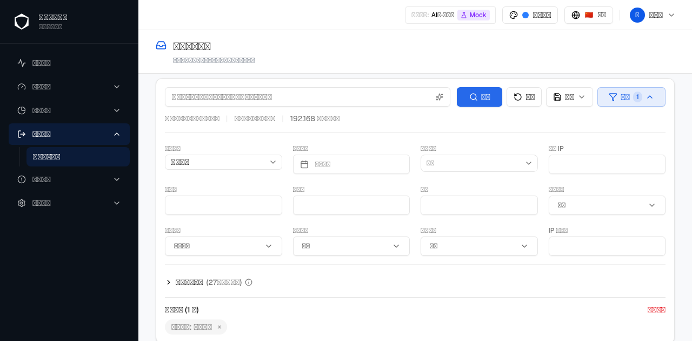
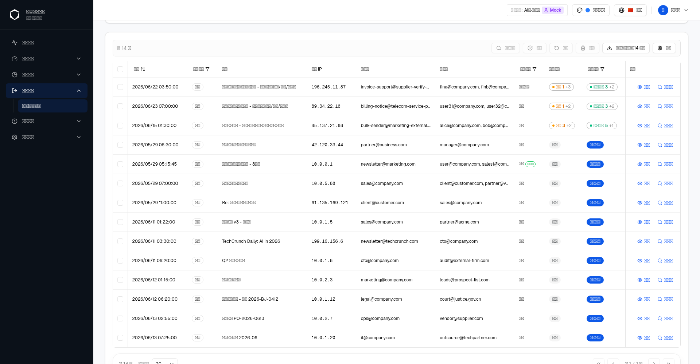
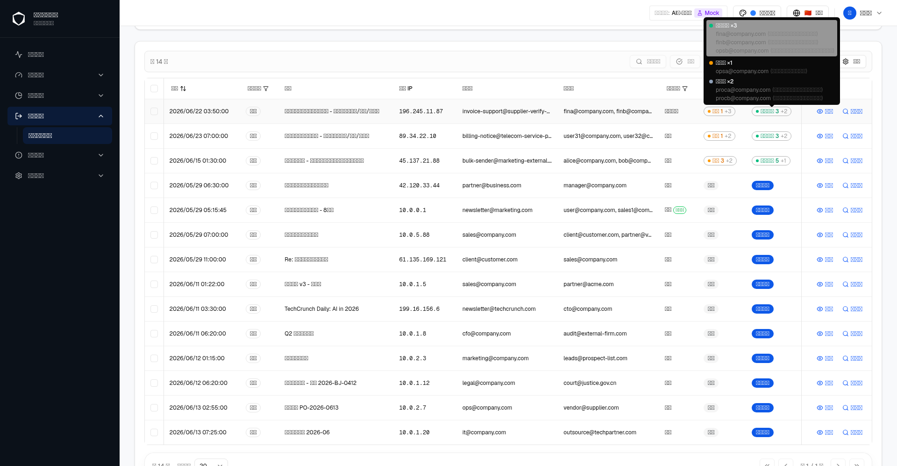
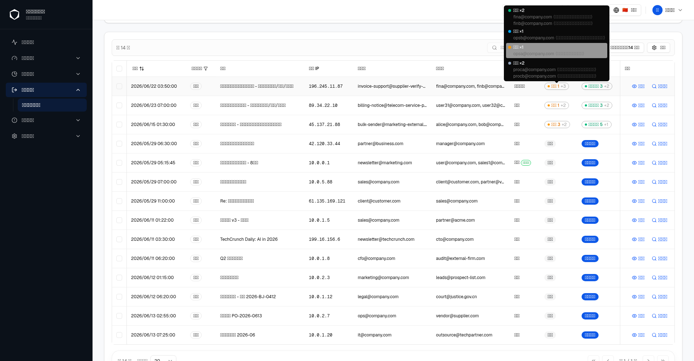
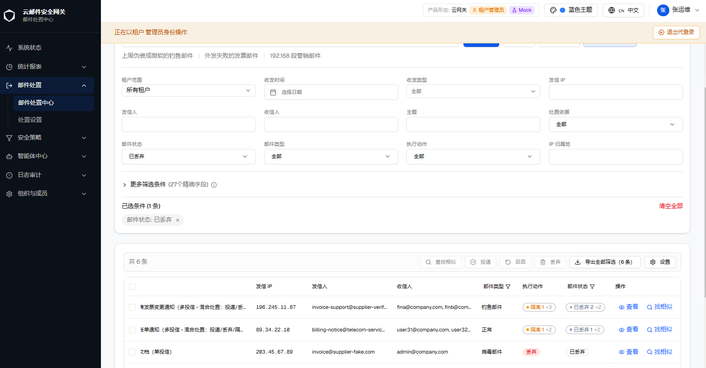
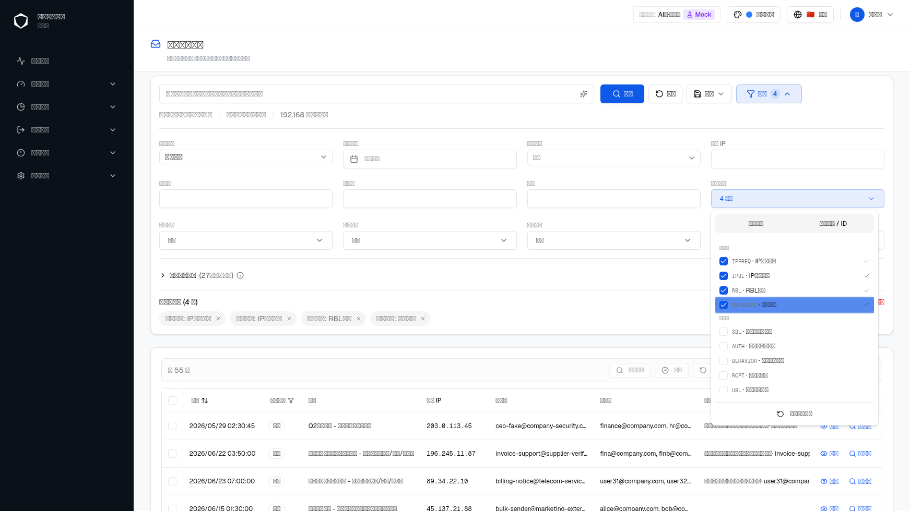
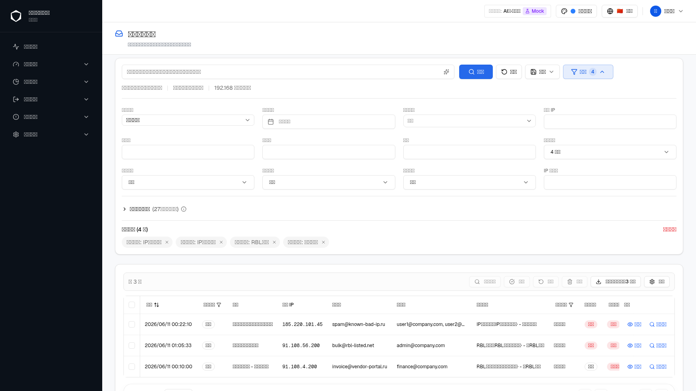
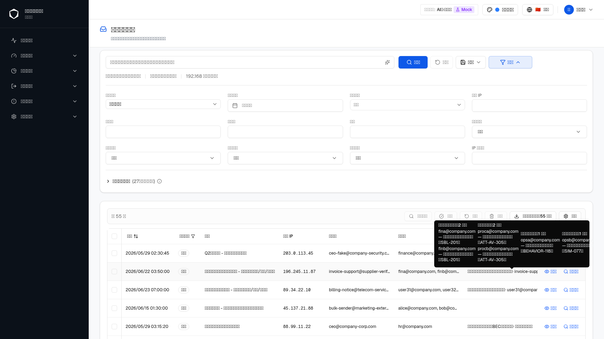
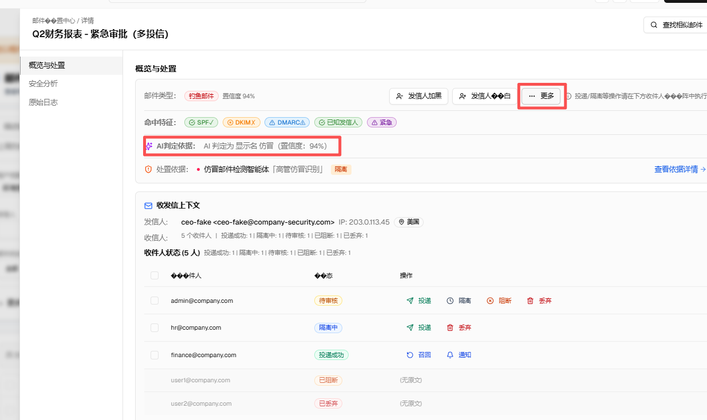
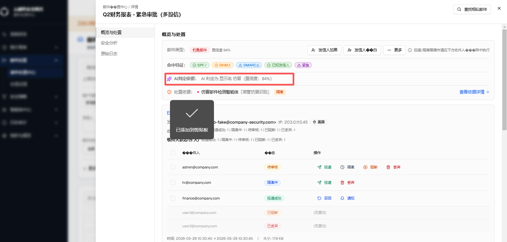

# GT-12923【0813】邮件处置中心总优化工单

| 字段 | 内容 |
|---|---|
| 规格版本 | v6 |
| 生成日期 | 2026-08-14 |
| 页面路由 | `zh/email-disposal/center` |
| webapp 源码 | `src/components/email-disposal/` |
| 需求依据 | 用户在本工单多轮对话中提出的具体问题与确认 |
| 历史对话 | 已使用（阶段五 UI 复盘 + 文案修正 + 技能改造，均在当前会话内完成） |
| 对照 spec | not-used |
| 验证环境 | Mock 数据、zh locale、蓝色主题、桌面视口、AI-多租户形态、租户管理员/平台管理员视角 |

> 本文档汇总"邮件处置中心"模块在本工单下完成的全部改动，作为多个子变更的总览索引。每个子变更的详细验证过程（浏览器截图、单测、tsc 检查）已在开发过程中逐项完成，本文档记录变更内容、涉及文件与验证结论，不重复粘贴过程截图。

## 目录

- [A. 变更清单总览](#a-变更清单总览)
- [B. 产品形态 × 角色矩阵](#b-产品形态--角色矩阵)
- [GT-12931群发邮件/多投递信：执行动作筛选逻辑，以及展示逻辑调整](#gt-12931群发邮件多投递信执行动作筛选逻辑以及展示逻辑调整)
  - [1. 多收件人（mixed）记录展示逻辑优化：单一主要类别 Badge + hover 明细](#1-多收件人mixed记录展示逻辑优化单一主要类别-badge--hover-明细)
  - [2. 执行动作批量按钮文案统一：「放行」→「投递」](#2-执行动作批量按钮文案统一放行投递)
  - [3. CSV 导出新增收件人明细列](#3-csv-导出新增收件人明细列)
  - [4. 批量重新分类确认弹窗的 mixed 记录警示](#4-批量重新分类确认弹窗的-mixed-记录警示)
  - [5. mixed 邮件统计口径修正](#5-mixed-邮件统计口径修正)
  - [6. ru/th 国际化空洞补齐](#6-ruth-国际化空洞补齐)
- [GT-12955邮件状态枚举值优化](#gt-12955邮件状态枚举值优化)
  - [1. 邮件状态枚举维度重定义：从"风险/结果"维度改为"位置"维度](#1-邮件状态枚举维度重定义从风险结果维度改为位置维度)
  - [2. 已废弃枚举值的归并规则](#2-已废弃枚举值的归并规则)
- [GT-12934群发邮件/多投递信：邮件状态筛选逻辑，以及展示逻辑调整](#gt-12934群发邮件多投递信邮件状态筛选逻辑以及展示逻辑调整)
  - [1. 筛选逻辑修正：mixed 记录按收件人状态归一化后取交集匹配](#1-筛选逻辑修正mixed-记录按收件人状态归一化后取交集匹配)
  - [2. 展示逻辑修正：命中筛选值的收件人分组优先展示为主要类别 Badge](#2-展示逻辑修正命中筛选值的收件人分组优先展示为主要类别-badge)
  - [3. 关联缺陷修正：`pending_review` 状态归类空洞](#3-关联缺陷修正pending_review-状态归类空洞)
- [GT-12935群发邮件/多投递信：处置依据筛选逻辑，以及展示逻辑调整](#gt-12935群发邮件多投递信处置依据筛选逻辑以及展示逻辑调整)
  - [1. 分组模型：按 policy_key 对 per_recipient 归类](#1-分组模型按-policy_key-对-per_recipient-归类)
  - [2. 展示逻辑：单桶不变，多桶主文案 + hover 明细](#2-展示逻辑单桶不变多桶主文案--hover-明细)
  - [3. 筛选联动：命中当前"处置依据"筛选值的桶优先展示](#3-筛选联动命中当前处置依据筛选值的桶优先展示)
  - [4. 关联缺陷修正：mixed 记录的处置依据筛选漏项](#4-关联缺陷修正mixed-记录的处置依据筛选漏项)
- [GT-12965邮件处置中心：详情页，去掉"更多""AI判定依据"](#gt-12965邮件处置中心详情页去掉更多ai判定依据)
  - [1. 移除详情页"更多"按钮与"AI判定依据"模块](#1-移除详情页更多按钮与ai判定依据模块)
- [H. 需确认事项](#h-需确认事项)
- [I. 版本历史](#i-版本历史)

## A. 变更清单总览

| 编号 | 变更内容 | 类型 | 主要涉及文件 | 所属需求 | 状态 |
|---|---|---|---|---|---|
| 1 | 多收件人（mixed）记录的执行动作/邮件状态列改为单一"主要类别"Badge + hover 明细 | UI 优化 | `recipient-status-badges.tsx` | [GT-12931](#gt-12931群发邮件多投递信执行动作筛选逻辑以及展示逻辑调整) | 已完成 |
| 2 | CSV 导出新增"收件人明细"列，逐收件人展开 mixed 记录的实际处置动作 | 功能新增 | `lib/csv-export.ts` | [GT-12931](#gt-12931群发邮件多投递信执行动作筛选逻辑以及展示逻辑调整) | 已完成 |
| 3 | 批量重新分类确认弹窗对 mixed 记录范围增加黄色警示条 | UI 优化 | `reclassify-dialog.tsx` | [GT-12931](#gt-12931群发邮件多投递信执行动作筛选逻辑以及展示逻辑调整) | 已完成 |
| 4 | 修正 `mixedMailHint` 文案与统计口径不一致（仅统计当前页却暗示全部结果） | 缺陷修正 | 邮件列表提示文案 i18n key | [GT-12931](#gt-12931群发邮件多投递信执行动作筛选逻辑以及展示逻辑调整) | 已完成 |
| 5 | 补齐 ru/th 语言文件缺失的 `recipientStatusBar` 命名空间 | 国际化修复 | `messages/ru.json`、`messages/th.json` | [GT-12931](#gt-12931群发邮件多投递信执行动作筛选逻辑以及展示逻辑调整) | 已完成 |
| 6 | 执行动作批量操作按钮文案由"放行"改为"投递" | 文案修正 | `messages/zh.json`（`emailDisposal.batch.release`） | [GT-12931](#gt-12931群发邮件多投递信执行动作筛选逻辑以及展示逻辑调整) | 已完成 |
| 7 | "邮件状态"枚举维度重定义：由"风险/结果"维度改为"邮件当前所在位置"维度，17 项精简为 13 项，新增 `delivery_cancelled` | 需求变更 | `types/email-disposal.ts`、`lib/display-status.ts`、`lib/disposal-api.ts`、`quick-filters.tsx`、`mail-list-table.tsx`、`similar-results-sheet.tsx`、`lib/mock/fixtures.ts`、`messages/zh.json`、`messages/en.json` | [GT-12955](#gt-12955邮件状态枚举值优化) | 已完成 |
| 8 | "邮件状态"筛选对多收件人（mixed）记录搜不出、命中后主 Badge 展示类别与筛选值不一致两处缺陷修正 | 缺陷修正 | `lib/mock/fixtures.ts`、`lib/email-log-action.ts`、`recipient-status-badges.tsx`、`mail-list-table.tsx`、`email-disposal-center-page.tsx` | [GT-12934](#gt-12934群发邮件多投递信邮件状态筛选逻辑以及展示逻辑调整) | 已完成 |
| 9 | "处置依据"列支撑群发邮件（mixed）多收件人命中不同策略模块的场景：按模块分组、主文案取优先桶摘要 + "等 N 项"、hover 展开逐收件人明细；同步修正该场景下"处置依据"筛选漏项 | 功能新增 + 缺陷修正 | `components/disposal-basis-cell.tsx`（新增）、`lib/disposal-basis-config.ts`、`mail-list-table.tsx`、`email-disposal-center-page.tsx`、`lib/mock/fixtures.ts`、`messages/{zh,en,th,ru}.json` | [GT-12935](#gt-12935群发邮件多投递信处置依据筛选逻辑以及展示逻辑调整) | 已完成 |
| 10 | 详情页"概览与处置"卡片头部移除"更多"（发信人加黑/加白右侧的下拉按钮，含"标记误报""标记漏报"两项未实现菜单）与"AI判定依据"内联展示行（原展示 AI 判定/云查简短依据文本），二者均按产品要求整体移除，其余处置按钮与"处置依据"行不变 | 功能移除 | `sender-actions.tsx`、`threat-summary-card.tsx`、`messages/{zh,en,th,ru}.json` | [GT-12965](#gt-12965邮件处置中心详情页去掉更多ai判定依据) | 已完成 |

> 编号 1–6 全部围绕"群发邮件/多投递信"场景下的执行动作筛选、展示与统计逻辑，v4 起统一归拢为独立需求 **GT-12931群发邮件/多投递信：执行动作筛选逻辑，以及展示逻辑调整**（见下方章节第 1–6 节），不再作为 GT-12923 下的零散变更条目单独描述；本表格保留编号仅用于追溯，具体内容以 GT-12931 章节为准。
>
> 编号 7 为独立需求 **GT-12955邮件状态枚举值优化**（见下方章节），v3 新增。
>
> 编号 8 为独立需求 **GT-12934群发邮件/多投递信：邮件状态筛选逻辑，以及展示逻辑调整**（见下方章节），v5 新增；与编号 1–6 同属"群发邮件/多投递信"场景，但聚焦"邮件状态"筛选维度而非"执行动作"筛选维度，且依赖 GT-12955 已重定义的 `DisplayStatus` 词表，因此单独立项、置于 GT-12955 之后。
>
> 编号 9 为独立需求 **GT-12935群发邮件/多投递信：处置依据筛选逻辑，以及展示逻辑调整**（见下方章节），v6 新增；与编号 1–6、编号 8 同属"群发邮件/多投递信"场景，聚焦"处置依据"列而非"执行动作"/"邮件状态"两列，三者视觉语言刻意不同（处置依据列是开放的策略模块+规则组合，不复用彩色 Badge），因此单独立项、置于 GT-12934 之后。
>
> 编号 10 为独立需求 **GT-12965邮件处置中心：详情页，去掉"更多""AI判定依据"**（见下方章节），v7 新增；与编号 1–9 均聚焦邮件处置中心**日志列表**不同，本需求聚焦**详情页**（概览与处置卡片头部），是本工单内第一个作用于详情页而非列表页的变更点，因此单独立项、置于 GT-12935 之后。

## B. 产品形态 × 角色矩阵

| 形态 \ 角色 | 平台管理员 | 租户管理员 |
|---|---|---|
| AI-单 | ✅ | ✅ |
| 传统-单 | ✅ | ✅ |
| 云-多 | ✅ | ✅ |
| AI-多 | ✅ | ✅ |
| 传统-多 | ✅ | ✅ |

邮件处置中心为全形态通用模块，各形态与角色下的可见性与可编辑性一致，无差异分支。

## GT-12931群发邮件/多投递信：执行动作筛选逻辑，以及展示逻辑调整

> 本需求收录本工单（GT-12923）下全部与"群发邮件/多投递信"场景相关的变更点——既包括"执行动作"筛选逻辑、展示逻辑本身（第 1、2 节），也包括围绕同一场景衍生出的 CSV 导出、批量操作弹窗提示、统计口径修正、国际化补齐（第 3–6 节）。原分散记录于变更一~六，v4 起统一归拢为独立需求名称，内容不变，仅重新组织归属与目录层级。

### 1. 多收件人（mixed）记录展示逻辑优化：单一主要类别 Badge + hover 明细

#### 1.1 背景

同一封邮件的不同收件人可能被系统执行了不同的处置动作（即 mixed 记录，对应"群发邮件/多投递信"场景）。优化前的实现会把每个处置类别渲染成一个独立 Badge 平铺展示（如 `[投递 6][旁路 1][隔离 1]`），导致：

- 该行的行高显著高于普通记录（单一动作只有 1 个 Badge），破坏列表整体的视觉节奏；
- 多个类别色同屏叠加（最多可达 7 种类别色），与设计规范"3–5 种色彩"的克制原则冲突。

#### 1.2 方案取舍

在 UI 优化讨论中比较了三个方向：

| 方案 | 描述 | 结论 |
|---|---|---|
| A（采用） | 只渲染 1 个"主要类别"Badge，其余类别折叠为 Badge 尾部的中性灰 `+N`，hover 展开完整明细 | 高度/密度与普通行完全一致，颜色数量始终为 1 种类别色，改动成本最低 |
| B（未采用） | 合并为单个多段文字 Badge（"投递 6 · 旁路 1 · 隔离 1"），放弃颜色编码 | 丢失"扫一眼颜色判断风险"的能力，对安全运营场景是实质倒退 |
| C（未采用） | 迷你分段进度条（stacked bar），按比例分配色块宽度 | 视觉语言与表格其余"离散状态"列不统一；1 人和 2 人的宽度差异不明显，不适合需要精确决策的处置场景 |

#### 1.3 执行动作筛选逻辑：主要类别选取规则（`pickPrimaryBucket`）

单纯"选数量最多的类别"会导致"筛选执行动作=投递，却看到隔离 Badge"的表面矛盾（因为后端对 mixed 记录的筛选是按 `disposition_actions` 数组做**交集匹配**）。因此规则分两种场景：

1. **筛选生效时**（`highlightKeys` 非空）：只在命中筛选值的类别里选，取人数最多的一个，保证"筛的是什么，展示的主 Badge 也一定是什么"。
2. **无筛选（默认列表态）**：按业务风险优先级选（隔离/审核/旁路排队中 优先于 拒绝/丢弃/投递成功），让运营人员刷列表时第一眼看到风险信号，而不是被数量占多数但价值最低的"投递成功"占据主 Badge 位置。

#### 1.4 实际页面呈现：邮件处置中心日志列表

上述 Badge 组件的实际落地位置是**邮件处置中心（`zh/email-disposal/center`）日志列表**的"执行动作"列与"邮件状态"列（列表最右两个状态列，紧邻"操作"列之前）。以下是该页面在浏览器中的真实渲染（Mock 数据，mixed 场景邮件主题为"季度营销报告 - 部分收件人白名单（混合处置演示）"，8 个收件人）：

该行"执行动作"列渲染为单一 Badge `隔离 1 +2`（黄色，因当前无筛选，按 [1.3](#13-执行动作筛选逻辑主要类别选取规则pickprimarybucket) 风险优先级规则选中"隔离"为主要类别，人数为 1，`+2` 表示还有 2 个其他类别未展开），"邮件状态"列同步渲染为对应的 `隔离中 +2`；与列表中其余单一动作记录（如同页"投递成功""待审核""拒收"）的行高完全一致。

鼠标 hover 该 Badge 后展开的完整明细（真实抓取自浏览器 DOM，未做文案改写）：

tooltip 内按类别分组列出全部 8 个收件人及每个人的实际处置依据：

- **投递 ×6**：`alice@company.com`、`bob@company.com`、`carol@company.com`（均为 `rule 投递白名单 matched at data stage`）；`frank@company.com`、`grace@company.com`、`henry@company.com`（均标注"混合处置：白名单收件人投递 + 规则命中隔离"）
- **旁路 ×1**：`eve@company.com`（`default_sideline`）
- **隔离 ×1**：`dave@company.com`（`rule 隔离扣留 matched at data stage`）

可见即使"投递"类别人数最多（6 人），主 Badge 仍按风险优先级选中人数更少但风险更高的"隔离"（1 人），与 [1.3](#13-执行动作筛选逻辑主要类别选取规则pickprimarybucket) 描述的规则一致。

"执行动作"高级筛选下拉的可选值（浏览器实际展开，与 Badge 类别文案一一对应）：

批量工具栏中的"投递"按钮（原"放行"，见 [第 2 节](#2-执行动作批量按钮文案统一放行投递)），勾选一条"待审核"记录后按钮从禁用变为可点击：

#### 1.5 展示逻辑：涉及文件

- `src/components/email-disposal/components/recipient-status-badges.tsx` — 新增 `pickPrimaryBucket`、`RISK_PRIORITY`，多桶渲染分支改为单 Badge。
- `src/components/email-disposal/components/recipient-status-badges.test.ts` — 新增 `pickPrimaryBucket` 单测（筛选命中优先、多类别命中取最大、无命中回退风险优先级、同优先级按人数排序）。
- `src/components/email-disposal/mail-list-table.tsx` — 更新注释，无逻辑变更。

#### 1.6 验证结论

- 单元测试：22 项（含新增 5 项）全部通过。
- 浏览器验证：mixed 行 Badge 高度与普通行一致；hover tooltip 展开完整逐收件人明细，主要类别对应行有浅底色高亮，与 Badge 上数字一一对应（见 1.4 实际截图）。
- `tsc --noEmit`：涉及文件零新增错误。

### 2. 执行动作批量按钮文案统一：「放行」→「投递」

#### 2.1 变更内容

邮件处置中心工具栏中批量执行动作按钮的文案由"放行"改为"投递"，与筛选器"执行动作"下拉选项、上一节 mixed 记录列表徽章的文案统一，避免同一模块内三处"执行动作"相关文案不一致。

#### 2.2 涉及文件

- `messages/zh.json` — 仅修改 `emailDisposal.batch.release` 键的值，未新增硬编码文案。

#### 2.3 验证结论

- 组件 `data-testid`、`onClick`（`onBatchAction('release')`）及批量处置逻辑均未改动。
- 浏览器可访问性快照验证：工具栏按钮实际渲染文本已更新为"投递"。
- 2318 项相关单元测试全部通过，UTF-8 编码自检无 `�` 乱码。

### 3. CSV 导出新增收件人明细列

#### 3.1 背景

CSV 导出此前只输出邮件层面的单一"执行动作"字段，mixed 记录导出后无法体现每个收件人具体被执行了什么动作，运营人员需要逐条回到列表页 hover 查看才能确认。

#### 3.2 方案

新增"收件人明细"列：

- 普通（单一动作）记录该列留空���
- mixed 记录列出全部收件人及各自的处置动作，格式为 `邮箱:动作; 邮箱:动作; ...`，动作文案复用列表页 Badge 使用的同一套中文标签映射，保证列表 Badge、hover tooltip、CSV 导出三处文案完全一致。

#### 3.3 涉及文件

- `src/components/email-disposal/lib/csv-export.ts`（新建，含单测）。

#### 3.4 验证结论

- 6 项单元测试通过。
- 实际触发导出并读取生成的 CSV blob 内容验证：mixed 记录的"收件人明细"列包含全部 8 个收件人及其各自动作（如"alice@company.com:投递; ...; dave@company.com:隔离; eve@company.com:旁路; ..."），文案与列表页 Badge 完全一致。

### 4. 批量重新分类确认弹窗的 mixed 记录警示

#### 4.1 背景

批量放行/召回操作是对整封邮件执行的，但如果选中范围内包含 mixed 记录（邮件内不同收件人已有不同处置结果），操作对各收件人的实际生效范围需要以系统处理结果为准，此前确认弹窗没有对这种情况做出提示，用户可能误以为操作会均匀作用于所有收件人。

#### 4.2 方案

`ReclassifyDialog` 新增 `mixedSelectionCount` 属性：当选中范围内的 mixed 记录数量大于 0 时，弹窗内显示一条黄色警示条，明确告知"此操作按整封邮件执行，对各收件人的实际生效范围以系统处理结果为准"。

浏览器实际验证：在日志列表中勾选前述 mixed 记录（"季度营销报告 - 部分收件人白名单（混合处置演示）"）并点击"召回"，弹窗在原有的"召回可能受目标邮件系统限制……"提示条下方，新增一条黄色 mixed 警示条：

对照组：勾选单一动作记录（非 mixed）时，弹窗内不出现该警示条，仅保留原有的召回限制提示。

#### 4.3 涉及文件

- `src/components/email-disposal/reclassify-dialog.tsx`

#### 4.4 需确认事项

- 收件人级的实际生效判断逻辑（即批量放行/召回对 mixed 记录中已经是终态的收件人是否会重新处理）需要与后端确认，当前警示条只做提示，不改变实际提交行为。见 [H. 需确认事项](#h-需确认事项) Q-001。

### 5. mixed 邮件统计口径修正

#### 5.1 问题

`mixedMailHint` 提示文案的原文暗示"当前结果"中共有 N 封 mixed 邮件，但背后的计算逻辑实际只统计了**当前页**（`data.items`），而不是当前筛选条件下的**全部结果**。当结果跨多页时，文案会让用户误以为看到了完整统计。

#### 5.2 修正

将文案改为明确的"本页结果"表述，并注明其他分页可能还有更多 mixed 邮件，使文案与其背后真实的计算口径（仅当前页）保持一致，不再产生"文案暗示全量、逻辑只算当前页"的误导。

#### 5.3 涉及文件

- 邮件列表页 mixed 提示条对应的 i18n key（`emailDisposal` 命名空间下）。

### 6. ru/th 国际化空洞补齐

#### 6.1 问题

阶段四为"收件人状态徽章"功能新增的 `recipientStatusBar` 命名空间只在 `zh.json`/`en.json` 补齐，`ru.json`、`th.json` 两个语言文件完全缺失该子命名空间，是阶段四遗留的国际化空洞。现有的 i18n parity 测试当时未覆盖到这个子命名空间，因此没有在阶段四被发现。

#### 6.2 修正

在 `messages/ru.json`、`messages/th.json` 中补齐 `recipientStatusBar` 命名空间下的全部翻译键，与 `zh.json`/`en.json` 的键结构保持一致。

## GT-12955邮件状态枚举值优化

> 本需求为"邮件处置中心"搜索模块"邮件状态"筛选枚举值的重新定义，仅涉及展示态状态词表与其归并映射逻辑，不改变列表数据本身、执行动作词表、召回等其他筛选维度。

### 1. 邮件状态枚举维度重定义：从"风险/结果"维度改为"位置"维度

#### 1.1 方案概述

优化前的"邮件状态"枚举（`DisplayStatus`）按"结果性质"组织（如已退信、审核驳回、已删除等 17 项），运营人员在实际排查时更关心的是"这封邮件现在在哪个环节、卡在谁手里"，而不是抽象的结果分类。本次优化将枚举维度改为"邮件当前所在位置"，共 13 项，按以下五组位置节点组织：

| 分组 | 枚举值（`DisplayStatus`） | 中文标签 |
|---|---|---|
| 仍在我方系统内 | `delivering` | 投递中（含"投递失败但仍在重试"、"部分投递成功"等未确定为单一终态的情况，位置未变） |
| 仍在我方系统内 | `quarantine_pending` | 隔离中 |
| 仍在我方系统内 | `sideline_pending` | 检测中 |
| 仍在我方系统内 | `audit_pending` | 待审核 |
| 已停在网关（未离开我方） | `rejected` | 拒收 |
| 已停在网关（未离开我方） | `discarded` | 已丢弃 |
| 已停在网关（未离开我方） | `delivery_cancelled`（新增） | 投递中止 |
| 已离开网关，去向已确定 | `delivered` | 投递成功 |
| 已离开网关，去向已确定 | `delivery_failed` | 投递失败（含对方退信场景） |
| 针对已送达邮件的位置变更 | `recall_pending` | 召回中 |
| 针对已送达邮件的位置变更 | `recall_success` | 召回成功 |
| 针对已送达邮件的位置变更 | `recall_failed` | 召回失败 |
| 已归档/清理 | `expired` | 已过期 |

新增枚举值 `delivery_cancelled`（投递中止）用于区分两种此前被合并展示为"已丢弃"的场景：邮件从未进入投递队列直接被丢弃（`discard`，位置维度下仍是 `discarded`），与邮件已进入投递队列、由我方主动中止转发（原始值 `deliveryStatus=cancelled`）——后者已经"离开过决策阶段、进入过投递流程"，是与前者不同的位置节点，因此拆分为独立枚举值。

#### 1.2 截图式交互预览

**状态 1 / 邮件状态筛选下拉框展开态**

| 字段 | 内容 |
|---|---|
| 触发路径 | 邮件处置中心 → 搜索区域筛选栏 → 点击"邮件状态"下拉框 |
| 路由 | `/zh/email-disposal/center` |
| 视口 | 桌面 1888×1152 |
| 形态/角色 | 全形态通用（AI-多租户 · 租户管理员视角下验证） |
| 验证依据 | 用户实拍浏览器截图 |

*下拉框自上而下依次为：投递中、隔离中、检测中、待审核、拒收、已丢弃、投递中止、投递成功、投递失败、召回中（滚动条下方另有召回成功、召回失败、已过期，共 13 项），与上表枚举顺序一致；下拉框底部为"清空"按钮。截图中页面字体渡染为方块，是当前预览环境的字体加载问题，不影响枚举文案与选项结构的验证。*

#### 1.3 逐元素说明

| 元素 | 类型 | 说明 |
|---|---|---|
| "邮件状态"筛选下拉框 | 多选下拉（Checkbox 列表） | 位于搜索筛选栏第三行第一列，与"邮件类型""执行动作""IP 归属地"同行 |
| 下拉选项 | 13 个 Checkbox 选项 | 文案见 1.1 表格"中文标签"列，i18n key 为 `emailDisposal.filters.statuses.<枚举值>`（`zh.json`/`en.json` 均已补齐，其余语言文件沿用既有 fallback 规则，本次未新增语言空洞） |
| 列表徽章（Badge） | 每条邮件记录"邮件状态"列 | 复用 `src/lib/display-status.ts` 的 `DISPLAY_STATUS_VARIANTS` 配色表：`rejected`/`quarantine_pending`/`delivery_failed`/`recall_failed` 为 `destructive`（红）；`delivered`/`recall_success` 为 `default`；`sideline_pending`/`audit_pending`/`delivering`/`recall_pending` 为 `secondary`；`discarded`/`delivery_cancelled`/`expired` 为 `outline` |
| 清空按钮 | 文字按钮 | 清空全部已选状态选项 |

### 2. 已废弃枚举值的归并规则

#### 2.1 方案概述

`DisplayStatus` 同时被"邮件处置中心"与"钓鱼邮件检测智能体 › 检测日志"两个模块共用（`src/lib/display-status.ts` 为唯一状态源，避免两处维护两份配色）。移除的 5 个旧枚举值（`bounced`/`partial_delivered`/`partial_recall_success`/`deleted`/`reviewed_rejected`）在展示层归并到语义最贴近的新枚举值，映射逻辑集中在 `mapToDisplayStatus`（`src/components/email-disposal/lib/disposal-api.ts`）与 mock 层的 `displayStatusOf`（`src/lib/mock/fixtures.ts`）：

| 原始动作/工作流值 | 旧展示态 | 新展示态 | 归并理由 |
|---|---|---|---|
| `action=bounce`（对方退信） | `bounced` | `delivery_failed` | 均表示"邮件已离开网关但未成功停在收件箱"这同一个位置结果 |
| `deliveryStatus=partial_delivered` | `partial_delivered` | `delivering` | 位置未确定为单一终态时，统一按"投递中"展示 |
| `deliveryStatus=cancelled` | `discarded` | `delivery_cancelled`（新增，见 1.1） | 已进入投递队列后被中止，与从未进入队列的 `discard` 是不同的位置节点 |
| `workflowOutcome=rejected_after_review` | `reviewed_rejected` | `discarded` | 审核后拦截本质仍是"停在网关"，不再单列 |
| `workflowOutcome=deleted` | `deleted` | `discarded` | 人工清除本质仍是"停在网关"的一次清理动作，不再单列 |
| `recallStatusSummary=partial_recall_success`（历史值 `expanded`） | `partial_recall_success` | `recall_success` | 邮件仍留在收件箱这个位置（多收件人场景下只召回了一部分），不视为独立位置节点 |

#### 2.2 涉及文件

- `src/types/email-disposal.ts` — `DisplayStatus` 类型定义，17 项精简为 13 项。
- `src/lib/display-status.ts` — `DISPLAY_STATUS_VARIANTS` 配色表、`PHISHING_MAIL_STATUS_OPTIONS` 选项列表、`mapPhishingDispositionToDisplayStatus` 映射函数（供检测日志模块复用，本次联动更新）。
- `src/components/email-disposal/lib/disposal-api.ts` — `mapToDisplayStatus` 归并逻辑。
- `src/components/email-disposal/quick-filters.tsx` — 搜索筛选栏"邮件状态"选项数组。
- `src/components/email-disposal/mail-list-table.tsx` — 列表内联状态选项数组、"可召回"判断条件（原 `['delivered', 'partial_delivered']` 收窄为 `['delivered']`）。
- `src/components/email-disposal/similar-results-sheet.tsx` — 移除本文件内重复维护的配色表，改为直接复用 `display-status.ts` 的 `DISPLAY_STATUS_VARIANTS`。
- `src/components/phishing-detection/detail-actions.ts` — 移除已废弃的 `partial_delivered` case 分支。
- `src/lib/mock/fixtures.ts` — `displayStatusOf` mock 筛选逻辑，与生产映射逻辑保持一致。
- `messages/zh.json`、`messages/en.json` — `emailDisposal.filters.statuses` 命名空间：新增 `delivery_cancelled`，移除 `bounced`/`partial_delivered`/`partial_recall_success`/`deleted`/`reviewed_rejected` 对应词条。
- `src/components/email-disposal/lib/disposal-api.test.ts` — 同步更新受影响的单元测试断言。

#### 2.3 验证结论

- 单元测试：邮件处置中心与钓鱼检测模块相关测试文件（含 `disposal-api.test.ts`、`display-status.test.ts`、mock 相关测试）合计 601 项全部通过。
- `tsc --noEmit`：涉及文件零新增错误（既有错误均为其他模块历史遗留，与本次改动无关）。
- 浏览器验证：见 [1.2 截图式交互预览](#12-截图式交互预览)，下拉框实际展开的 13 个选项与设计方案一致，且不再包含已移除的 5 个旧值。

#### 2.4 差异标注

- 与优化前相比，"邮件状态"筛选下拉框选项数量由 17 项减少为 13 项；已移除的 5 个筛选值不会再出现在搜索结果中（数据仍归并展示为对应的新状态，不影响可检索性）。
- `mail-list-table.tsx` 内"可召回"判断条件收窄：原可对 `delivered`/`partial_delivered` 两种状态的邮件发起召回，现由于 `partial_delivered` 已归并入 `delivering`（未确定为单一终态），只有 `delivered` 状态可发起召回。

## GT-12934群发邮件/多投递信：邮件状态筛选逻辑，以及展示逻辑调整

> 本需求聚焦"群发邮件/多投递信"场景在**"邮件状态"筛选维度**下的两处缺陷：搜索栏筛选生效时搜不出符合条件的多收件人（mixed）记录；即便搜出来了，列表行"邮件状态"列展示的主要类别也可能与筛选值不一致，造成用户困惑。与 [GT-12931](#gt-12931群发邮件多投递信执行动作筛选逻辑以及展示逻辑调整) 聚焦"执行动作"筛选维度的既有优化对称，本需求依赖 GT-12955 已重定义的 `DisplayStatus` 词表落地。

### 背景

一封 mixed 邮件的不同收件人可能被系统判定为不同的最终状态（如 8 个收件人中 6 个已投递、1 个隔离、1 个正在检测）。优化前，"邮件状态"筛选与展示均只使用该邮件的**整体位置汇总状态**（`displayStatusOf()` / `mapToDisplayStatus()`，mixed 记录恒返回 `delivering`「投递中」这一占位值），带来两个问题：

1. **搜不出**：用户在搜索栏勾选"邮件状态：投递成功"，期望搜出"包含已投递收件人"的邮件（包括群发邮件），但 mixed 记录的整体状态恒为"投递中"，永远不会等于"投递成功"，导致这批邮件被漏掉——即使其中确实有收件人已投递成功。
2. **展示矛盾**：即便通过其他条件搜出了 mixed 记录，"邮件状态"列的主要类别 Badge 是按无筛选时的默认风险优先级规则选取的（隔离/审核优先于投递成功），与用户刚刚筛选的"投递成功"没有关联，用户会疑惑"我筛的是投递成功，为什么看到的是隔离中"。

### 1. 筛选逻辑修正：mixed 记录按收件人状态归一化后取交集匹配

#### 1.1 方案概述

mixed 记录的筛选规则从"要求整体汇总状态精确等于筛选值"改为：**只要该邮件的任一收件人的最终状态命中筛选值，这封邮件就算命中**（OR 语义）。非 mixed（单一动作）记录不受影响，仍按整体状态精确匹配。

该 OR 语义与 [GT-12931 第 1.3 节](#13-执行动作筛选逻辑主要类别选取规则pickprimarybucket) 中"执行动作"筛选对 `disposition_actions` 数组做交集匹配的既有处理方式保持一致，未引入第二套不同的筛选范式。

#### 1.2 词表归一化

收件人逐条明细的原始 `status` 字段（`delivered`/`quarantined`/`pending_review`/`sidelined`/`audited`/`blocked`/`bounced`/`failed`/`cancelled` 等，动作/工作流层词表）与"邮件状态"筛选下拉框使用的 `DisplayStatus` 词表（GT-12955 重定义后的位置维度词表：`delivered`/`quarantine_pending`/`audit_pending`/`sideline_pending`/`rejected`/`delivery_failed`/`delivery_cancelled` 等）并非同一套词表，需要先归一化再比较：

| 收件人原始 `status` | 归一化后的 `DisplayStatus` |
|---|---|
| `delivered`、`marked_delivered` | `delivered`（投递成功） |
| `quarantined` | `quarantine_pending`（隔离中） |
| `pending_review`、`audited` | `audit_pending`（待审核） |
| `sidelined` | `sideline_pending`（检测中） |
| `blocked`、`rejected` | `rejected`（拒收） |
| `bounced`、`failed` | `delivery_failed`（投递失败） |
| `cancelled` | `delivery_cancelled`（投递中止） |

#### 1.3 涉及文件

- `src/lib/mock/fixtures.ts` — `mockEmailDisposalList` 的 `display_status` 查询参数处理逻辑：新增 `normalizeToDisplayStatus` 归一化函���与映射表；mixed 记录改为对 `recipient_dispositions` 数组归一化后取交集匹配，非 mixed 记录保持原有精确匹配。
- `src/lib/email-log-action.ts` — 新增 `normalizeRawStatusToDisplayStatus`（与 mock 层逻辑等价，供前端展示层复用，避免维护��份映射表）。

### 2. 展示逻辑修正：命中筛选值的收件人分组优先展示为主要类别 Badge

#### 2.1 方案概述

复用 [GT-12931 第 1.3 节](#13-执行动作筛选逻辑主要类别选取规则pickprimarybucket) 已有的"筛选生效时优先展示命中类别"机制——该机制此前仅在 `dimension='action'`（执行动作列）时生效，`dimension='status'`（邮件状态列）此前被明确标注为"不接收 `highlightKeys`，始终走默认风险优先级规则"。本次为 `isBucketHighlighted`/`pickPrimaryBucket`/`sortBucketsByHighlight` 三个函数新增 `dimension` 参数，`status` 维度也按 [1.2](#12-词表归一化) 的归一化词表参与高亮判定：当前生效的"邮件状态"筛选值经归一化后，与收件人分组的原始状态比较，命中筛选值的分组在挑选主要类别时获得最高优先级；未筛选时，维持原有的默认风险优先级规则不变。

#### 2.2 涉及文件

- `src/components/email-disposal/components/recipient-status-badges.tsx` — `isBucketHighlighted`/`pickPrimaryBucket`/`sortBucketsByHighlight` 新增 `dimension` 参数（默认 `'action'`，向后兼容既有调用方）；`status` 维度下改用 `normalizeRawStatusToDisplayStatus` 归一化后比较。
- `src/components/email-disposal/mail-list-table.tsx` — 新增 `activeDisplayStatuses` prop，"邮件状态"列的 `<RecipientStatusBadges dimension="status">` 补充传入 `highlightKeys={activeDisplayStatuses}`。
- `src/components/email-disposal/email-disposal-center-page.tsx` — 相似邮件模式外，将当前搜索栏"邮件状态"筛选值（`searchParams.displayStatus` 拆分为数组）通过 `activeDisplayStatuses` 传给 `MailListTable`。

### 3. 关联缺陷修正：`pending_review` 状态归类空洞

排查筛选链路时发现，收件人原始状态词表中的 `pending_review`（人工复核中）此前未被收录进任何展示分类（`STATUS_CATEGORY` 映射表），会兜底落入语义空洞的"其他"分类，导致个别 mixed 记录的"邮件状态"徽章展示为无意义的"其他 x1"。本次修正将 `pending_review` 归入既有的 `audit`（审核）分类——与 `audited` 同属"待人工判定"语义，不新增分类、不影响其他状态的既有归类。涉及文件：`src/components/email-disposal/components/recipient-status-badges.tsx`（`STATUS_CATEGORY` 映射表）。

### 4. 验证结论

- **单元测试**：新增 `isBucketHighlighted`/`pickPrimaryBucket` 的 `status` 维度归一化断言（`recipient-status-badges.test.ts`），新增 mixed 记录按 `display_status` 交集匹配的断言（`email-disposal-mock.test.ts`，覆盖"投递成功""隔离中"两个筛选值）；邮件处置中心相关测试文件合计 519 项全部通过。
- **`tsc --noEmit`**：涉及文件零新增类型错误。
- **浏览器验证**（Mock 数据、zh locale、蓝色主题、桌面视口、AI-多租户 · 租户管理员视角）：搜索栏勾选"邮件状态：投递成功"并提交后，结果集包含此前会被漏掉的 3 条含已投递收件人的 mixed 记录（含 8 收件人的"季度营销报告"演示记录），且该行"邮件状态"列的主要类别 Badge 展示为"投递成功"，与筛选值一致；hover 展开明细可见其余收件人的真实状态未被覆盖或丢失。

| 字段 | 内容 |
|---|---|
| 触发路径 | 邮件处置中心 → 搜索区域筛选栏 → 勾选"邮件状态：投递成功" → 点击"搜索" |
| 路由 | `/zh/email-disposal/center` |
| 形态/角色 | 全形态通用（AI-多租户 · 租户管理员视角下验证） |
| 验证依据 | 浏览器截图（Mock 数据） |

*hover 展开"邮件状态"列 Badge 的明细：*

*对照：同一行"执行动作"列 Badge 的 hover 明细（`dimension='action'`），验证两个维度的分组结果互不干扰：*

*补充场景：筛选"邮件状态：已丢弃"命中的另一条 mixed 记录（用户实拍截图），同样验证主要类别 Badge 与筛选值一致：*

### 5. 差异标注

- 与优化前相比，mixed 记录参与"邮件状态"筛选的判定口径从"整体汇总状态精确匹配"改为"任一收件人归一化状态命中即算匹配"；非 mixed 记录筛选口径不变。
- mixed 记录"邮件状态"列主要类别 Badge 的选取规则新增"筛选生效时优先展示命中类别"分支，逻辑与既有的"执行动作"列完全对称；未筛选时的默认展示（风险优先级排序）不变。
- 收件人状态词表中的 `pending_review` 归类由"其他"改为"待审核"，仅影响该状态在收件人明细分类展示时的类别与配色，不影响筛选逻辑。

## GT-12935群发邮件/多投递信：处置依据筛选逻辑，以及展示逻辑调整

> 本需求聚焦"群发邮件/多投递信"场景下"处置依据"列的展示与筛选：一封邮件的不同收件人可能因命中不同策略模块而产生多条处置依据，优化前该列只渲染顶层单一 `disposal_basis`，其余收件人命中的模块既不可见、也无法被"处置依据"筛选命中。本需求与 [GT-12931](#gt-12931群发邮件多投递信执行动作筛选逻辑以及展示逻辑调整)（执行动作列）、[GT-12934](#gt-12934群发邮件多投递信邮件状态筛选逻辑以及展示逻辑调整)（邮件状态列）同属"群发邮件/多投递信"场景下的列级优化，但"处置依据"列的视觉语言与另外两列刻意不同：执行动作/邮件状态是 7 类封闭枚举的结果维度，有天然可复用的语义配色（彩色 Badge）；处置依据是开放的约 30 个策略模块 + 具体规则组合，硬套彩色徽章只会让配色显得随意，因此维持现状的纯文本 + Tooltip 风格，不引入 Badge。

### 背景

一封 mixed 邮件的 `disposal_basis.per_recipient[]` 携带逐收件人的命中记录（每条附带 `recipient` 字段标识命中人、`policy_key`/`rule_id`/`rule_name` 标识命中的具体规则）。优化前，"处置依据"列的渲染与"处置依据"筛选均只使用顶层单一 `disposal_basis` 字段（固定取种子数据里的第一条依据），带来两个问题：

1. **展示不全**：8 个收件人的群发邮件若有 6 个命中"IP 频率限制"、2 个命中"IP 黑白名单"，列表行只会显示"IP 频率限制"的摘要，命中"IP 黑白名单"的 2 个收件人的信息完全不可见。
2. **筛不出**：用户在搜索栏勾选"处置依据：IP 黑白名单"，期望搜出"包含命中该模块收件人"的邮件，但筛选逻辑只比较顶层字段（恒为"IP 频率限制"），即使邮件里确实有收件人命中了"IP 黑白名单"，这封邮件也会被漏掉。

### 1. 分组模型：按 policy_key 对 per_recipient 归类

新增 `groupRecipientBasisByPolicy()`：将单条 mail_log 的 `disposal_basis` 按 `policy_key` 分组，返回 `DisposalBasisRecipientGroup[]`（`{ policyKey, entries }`）。

- 有 `per_recipient` 时（mixed 记录，多依据），忽略顶层字段，只按 `per_recipient` 内的记录分组——`per_recipient` 是顶层字段的展开，两者不会同时提供不同信息。
- 没有 `per_recipient`（非 mixed，或未提供多依据的既有 mixed 记录）时，只要顶层 `policy_key` 存在就返回单元素数组，保证下游渲染与筛选逻辑只需按数组长度判断"单桶/多桶"，不用额外分支处理"没有 `per_recipient`"的旧数据形态。

配套新增两个排序/选取函数，供展示与筛选高亮复用同一套规则（详见 [3](#3-筛选联动命中当前处置依据筛选值的桶优先展示)）：

- `pickPrimaryBasisGroup(groups, highlightPolicyKeys?, highlightRuleIds?)` — 选出列表主文案使用的"优先桶"：筛选生效时命中筛选值的桶优先，否则取 `per_recipient` 中出现的原始顺序（数组第一个分组）。
- `sortBasisGroupsForTooltip(groups, highlightPolicyKeys?, highlightRuleIds?)` — 为 Tooltip 排序展开顺序：命中筛选值的桶排最前，其余保持原始顺序；不涉及筛选时为无操作（原数组顺序不变）。

涉及文件：`src/components/email-disposal/lib/disposal-basis-config.ts`（新增 `DisposalBasisRecipientGroup` 接口与上述三个函数）。

### 2. 展示逻辑：单桶不变，多桶主文案 + hover 明细

#### 2.1 方案概述

新增独立组件 `DisposalBasisCell`，从 `mail-list-table.tsx` 中抽出原有的处置依据渲染逻辑并扩展多桶支持：

- **单桶命中**（`groups.length <= 1`）：渲染逻辑与优化前完全一致——`formatListReason()` 摘要文本 + Tooltip 展示同一摘要；阶段 1 平台策略遮蔽（租户视角下命中平台侧策略）逻辑不变。
- **多桶命中**（`groups.length > 1`）：
  - 主文案由新增的 `formatMultiBasisListReason()` 拼接：优先桶（[1](#1-分组模型按-policy_key-对-per_recipient-归类) 的 `pickPrimaryBasisGroup`）的 `formatListReason()` 摘要 + `"等 N 项"`（N = 命中的模块数，不是收件人数/规则条数）。`"等 N 项"` 与主文案同等字重，不做灰色弱化——处置依据列本身是纯文本风格，没有 Badge 承载主次层级，弱化反而显得样式突兀，与"执行动作"列"隔离 1+3"的 Badge 弱化角标刻意采用不同的视觉语言，不强行统一。
  - Tooltip 按 `policy_key` 分组展开：组标题 `"{模块名}（{收件人数} 人）"`，组内逐收件人展示 `"{邮箱} — 规则：{规则名}（{规则ID}）"`；命中当前筛选值的组排最前（[3](#3-筛选联动命中当前处置依据筛选值的桶优先展示)）。
  - 阶段 1 平台策略遮蔽按组生效：命中平台策略的组标题/规则名替换为遮蔽占位文案，其余真实模块组正常展示、互不影响。

#### 2.2 新增 i18n key

| Key | zh | en |
|---|---|---|
| `emailDisposal.table.disposalBasisGroupHeader` | `{module}（{count} 人）` | `{module} ({count} recipients)` |
| `emailDisposal.table.disposalBasisRuleLine` | `{recipient} — 规则：{ruleName}（{ruleId}）` | `{recipient} — Rule: {ruleName} ({ruleId})` |
| `emailDisposal.table.disposalBasisPlatformRuleLine` | `{recipient} — 规则：{policyLabel}` | `{recipient} — Rule: {policyLabel}` |

三个 key 均已补齐 zh/en/th/ru 四语言文案（`messages/{zh,en,th,ru}.json`）。

#### 2.3 涉及文件

- `src/components/email-disposal/components/disposal-basis-cell.tsx`（新增）— `DisposalBasisCell` 组件，承接原 `mail-list-table.tsx` 内联的处置依据渲染逻辑并扩展多桶分支。
- `src/components/email-disposal/lib/disposal-basis-config.ts` — 新增 `formatMultiBasisListReason()`（组装多桶主文案，四语言 `"等 N 项"` 后缀独立配置）。
- `src/components/email-disposal/mail-list-table.tsx` — "处置依据"列改为渲染 `<DisposalBasisCell>`，原内联的单值渲染逻辑移入新组件；新增 `activeDisposalPolicyKeys`/`activeDisposalRuleIds` 两个 props 向下传递当前筛选值。
- `messages/zh.json`、`messages/en.json`、`messages/th.json`、`messages/ru.json` — 新增 [2.2](#22-新增-i18n-key) 三个 key。

### 3. 筛选联动：命中当前"处置依据"筛选值的桶优先展示

搜索栏"处置依据"筛选（模块 `disposal_policy_keys` / 具体规则 `disposal_rule_ids`）生效时，`email-disposal-center-page.tsx` 将当前筛选值通过 `activeDisposalPolicyKeys`/`activeDisposalRuleIds` 传给 `MailListTable` → `DisposalBasisCell`，命中筛选值的分组在主文案与 Tooltip 展开顺序中都会被优先展示（复用 [1](#1-分组模型按-policy_key-对-per_recipient-归类) 的 `pickPrimaryBasisGroup`/`sortBasisGroupsForTooltip`）：用户刚筛选了"IP 黑白名单"，主文案会直接展示"IP 黑白名单"命中摘要而不是随机的另一个模块，不用再点开 Tooltip 确认"到底是不是我筛的这条"。相似邮件模式（`similarMode`）下不传，保持该模式原有的无筛选态展示。

涉及文件：`src/components/email-disposal/email-disposal-center-page.tsx`（新增两个 prop 的下发逻辑，`similarMode` 时不传）。

### 4. 关联缺陷修正：mixed 记录的处置依据筛选漏项

排查展示逻辑时同步发现并修正了对称的筛选侧缺陷：`mockEmailDisposalList` 对 `disposal_policy_keys` 查询参数的判定此前只比较顶层 `item.disposal_policy_keys` 字段（固定取种子数据的第一条依据），对多依据的 mixed 记录只反映"第一个"依据，会漏掉其余收件人命中的模块。修正为：mixed 记录（`disposal_basis.per_recipient` 非空）改为对 `per_recipient` 内全部记录的 `policy_key` 取交集匹配（OR 语义，与 [GT-12931 第 1.3 节](#13-执行动作筛选逻辑主要类别选取规则pickprimarybucket)"执行动作"筛选、[GT-12934 第 1 节](#1-筛选逻辑修正mixed-记录按收件人状态归一化后取交集匹配)"邮件状态"筛选保持一致的处理范式）；非 mixed 记录，以及没有提供 `per_recipient` 的既有 mixed 记录，回退到顶层字段精确匹配，行为不变。

涉及文件：`src/lib/mock/fixtures.ts`（`mockEmailDisposalList` 的 `disposal_policy_keys` 查询参数处理逻辑）。

### 5. 验证结论

- **单元测试**：新增 `groupRecipientBasisByPolicy`/`pickPrimaryBasisGroup`/`sortBasisGroupsForTooltip`/`formatMultiBasisListReason` 的分组、优先桶选取、Tooltip 排序、多桶主文案拼接（含四语言后缀）断言（`disposal-basis-config.test.ts`）；邮件处置中心相关测试文件合计 28 个、484 项全部通过。
- **`tsc --noEmit`**：涉及文件零新增类型错误（仓库内既有的少量类型错误均分布在 `mail-routing`/`statistics`/`tests/e2e` 等与本次改动无关的模块，非本次改动引入）。
- **浏览器验证**（Mock 数据、zh locale、蓝色主题、桌面视口、AI-多租户 · 租户管理员视角）：搜索栏"处置依据"筛选下拉框勾选"IP 频率限制""IP 黑白名单""RBL 过滤""境外邮件"四项模块并提交，结果集精确命中 3 条记录；对一条 6 收件人的 mixed 记录（"供应商发票变更通知"）hover"处置依据"列，Tooltip 按模块分组展开为 4 个分组（发件人黑白名单 2 人、反病毒引擎 2 人、发送行为管控 1 人、相似邮件检测 1 人），逐收件人展示邮箱与命中规则，与该邮件真实的多收件人多依据命中情况一致。

| 字段 | 内容 |
|---|---|
| 触发路径 | 邮件处置中心 → 搜索区域筛选栏 → "处置依据"下拉 → 勾选模块 → 点击"搜索" |
| 路由 | `/zh/logs/mail-investigation` |
| 形态/角色 | 全形态通用（AI-多租户 · 租户管理员视角下验证） |
| 验证依据 | 浏览器截图（Mock 数据） |

*hover 一条 6 收件人 mixed 记录的"处置依据"列，Tooltip 按模块分组展开逐收件人明细：*

### 6. 差异标注

- 与优化前相比，mixed 记录参与"处置依据"筛选的判定口径从"顶层单一字段精确匹配"改为"`per_recipient` 内任一记录的 `policy_key` 命中即算匹配"；非 mixed 记录筛选口径不变。
- "处置依据"列多模块命中时的主文案新增"优先桶摘要 + 等 N 项"的展示分支；单模块命中时的展示与优化前完全一致。
- 新增的分组/排序机制与 [GT-12931](#gt-12931群发邮件多投递信执行动作筛选逻辑以及展示逻辑调整)"执行动作"列、[GT-12934](#gt-12934群发邮件多投递信邮件状态筛选逻辑以及展示逻辑调整)"邮件状态"列的"筛选命中优先展示"设计对称，但实现上是独立的一套函数（`groupRecipientBasisByPolicy` 等），不复用另外两列基于 Badge 分类的 `recipient-status-badges.tsx`——处置依据列本身不引入 Badge，两套渲染路径互不依赖。

## GT-12965邮件处置中心：详情页，去掉"更多""AI判定依据"

> 本需求聚焦邮件处置中心**详情页**（点击列表行进入的"概览与处置"卡片），与本工单其余变更点（GT-12931/GT-12955/GT-12934/GT-12935）均作用于**列表页**不同，是本工单内第一个改动详情页的需求。按用户提供的详情页截图红框标注，移除头部的"更多"下拉按钮与"AI判定依据"内联展示行，其余功能模块不变。

### 1. 移除详情页"更多"按钮与"AI判定依据"模块

#### 1.1 背景

详情页"概览与处置"卡片头部此前包含以下两处元素：

1. **"更多"按钮**（`sender-actions.tsx`）：位于"发信人加黑""发信人加白"两个按钮右侧的下拉触发按钮（`···  更多`），点击展开菜单，菜单内仅有"标记误报""标记漏报"两项，点击后均只弹出"暂未实现"（`notImplementedToast`）提示，未接入任何真实业务逻辑。
2. **"AI判定依据"内联行**（`threat-summary-card.tsx`）：位于"命中特征"徽章行与"处置依据"行之间，展示一段 AI 判定/云查简短依据文本（如"AI 判定为 显示名 仿冒（置信度：94%）"），来源依优先级取 `disposal_basis`（经 `formatHitDetail` 渲染）→ `phish_agent_check.summary` → `cac_result.description` 三者之一。

产品评审认为：第 1 项是完全未实现的占位功能，不应保留入口误导用户；第 2 项与下方"处置依据"行（同样来自 `disposal_basis`，经统一规则字典渲染）在多数场景下信息重复，且当来源退回 `cac_result.description`（外部 CAC 反垃圾云查服务）时容易被误读为"AI 判定"，故两者一并整体移除。

#### 1.2 最终方案

- 从 `SenderActions` 组件中完整删除"更多"下拉按钮及其菜单（含"标记误报""标记漏报"两个菜单项、对应的 `onClick` 空实现与 `notImplemented` 兜底函数），保留"发信人加黑""发信人加白"两个按钮及非单收件人场景下的多投提示不变。
- 从 `ThreatSummaryCard` 组件中完整删除"AI判定依据"内联行（原 Row 3）及其取值计算逻辑（`inlineVerdict` 及依赖的 `formatHitDetail`/`phish_agent_check`/`cac_result` 优先级判断），下方"处置依据"行（原 Row 4）保持原有渲染逻辑与位置不变，不因移除上一行而改变布局层级。
- 不改动"命中特征"徽章行、收发信上下文、收件人状态矩阵等其余"概览与处置"模块内容。

#### 1.3 截图式交互预览

| 字段 | 内容 |
|---|---|
| 状态名称 | 变更前（用户实拍留档，标注待移除元素） |
| 触发路径 | 邮件处置中心 → 日志列表点击一条记录 → 详情弹窗/详情页 → "概览与处置" 标签 |
| 路由 | `/zh/email-disposal/center`（详情以弹窗形式叠加在列表页之上） |
| 视口 | 桌面 |
| 形态/角色 | 全形态通用（AI-多租户 · 租户管理员视角下用户实拍） |
| 验证依据 | 用户在本次对话中提供的真实浏览器截图，经用户明确授权直接用于本文档 |

**状态 1 / 详情弹窗顶部——"更多"按钮位置（红框标注）**

*红框内为"更多"按钮（位于"发信人加黑""发信人加白"右侧），本次变更将其与其下拉菜单一并移除；同一行左侧的"发信人加黑""发信人加白"两个按钮不受影响。*

**状态 2 / 详情弹窗全屏视图——"AI判定依据"行位置（红框标注）**

*红框内为"AI判定依据"行（位于"命中特征"徽章行与"处置依据"行之间），本次变更将其整行移除；下方"处置依据"行（`仿冒邮件检测智能体「高管仿冒识别」隔离`）保持不变，不因上一行被移除而改变自身内容或位置。*

*说明：以上两张截图为用户在本次对话中提供的真实浏览器截图（早于本次代码改动拍摄，用于标定待移除范围），经用户明确授权直接收录本文档；"变更后"状态因当前验证环境的邮件列表 mock 数据加载异常（与本次改动无关，见 [H. 需确认事项](#h-需确认事项) Q-002）未能在本次会话内补充实拍，已改用单元测试作为等效验证依据（见 [1.5 验证结论](#15-验证结论)）。*

#### 1.4 涉及文件

- `src/components/email-disposal/sections/overview/sender-actions.tsx` — 删除"更多"下拉按钮（`DropdownMenu`/`DropdownMenuTrigger`/`DropdownMenuContent`/`DropdownMenuItem` 及两个菜单项）与 `notImplemented` 兜底函数；移除未再使用的 `MoreHorizontal` 图标及 `DropdownMenu` 系列组件导入。
- `src/components/email-disposal/sections/overview/sender-actions.test.tsx` — 更新断言：确认 `email-disposal-overview-action-more` 测试 ID 不再渲染，删除原有的"E7 更多菜单"专项测试用例。
- `src/components/email-disposal/sections/overview/threat-summary-card.tsx` — 删除"AI判定依据"内联行（原 Row 3）渲染分支与 `inlineVerdict` 计算逻辑；移除未再使用的 `Sparkles` 图标导入及 `formatHitDetail` 导入。
- `src/components/email-disposal/sections/overview/threat-summary-card.test.tsx` — 更新断言：确认"AI判定依据""云查依据"文本不再渲染（含此前覆盖 `disposal_basis`/`phish_agent_check`/`cac_result` 三种来源优先级的多个专项测试用例，均改为验证"不渲染"）。
- `messages/zh.json`、`messages/en.json`、`messages/ru.json`、`messages/th.json` — 移除四语言下均已孤立的 `emailDisposal.detail.senderActions.more`、`emailDisposal.detail.senderActions.menu.markFalsePositive`、`emailDisposal.detail.senderActions.menu.markFalseNegative`、`emailDisposal.detail.aiJudgmentBasis`、`emailDisposal.detail.cloudCheckBasis` 五个 i18n key；`senderActions.notImplementedToast`、`senderActions.menu.exportEml`/`exportPdf`/`addToInvestigation` 等仍被其他功能模块复用的 key 保留不动。

#### 1.5 验证结论

- **单元测试**：`sender-actions.test.tsx`、`threat-summary-card.test.tsx` 及邮件处置中心模块全部测试文件合计 479 项全部通过，其中新增/更新的断言明确验证 `email-disposal-overview-action-more` 测试 ID 与"AI判定依据"/"云查依据"文本在 DOM 中均不再出现。
- **`tsc --noEmit`**：涉及文件零新增类型错误。
- **国际化自检**：对 `messages/{zh,en,ru,th}.json` 逐文件执行 `�` 乱码字符扫描，四文件均为 0 处；`email-disposal-detail-i18n-parity.test.ts` 通过，四语言键结构保持一致。
- **浏览器验证**：受限于当前会话验证环境的邮件列表 mock 数据加载异常（搜索任意条件均返回"共 0 条"，经排查与本次改动的代码路径无关），未能补充实拍"变更后"的详情页真实截图，已记录为 [H. 需确认事项](#h-需确认事项) Q-002，待环境恢复后补拍。

#### 1.6 差异标注

- 与变更前相比，详情页"概览与处置"卡片头部按钮组由"发信人加黑 / 发信人加白 / 更多"三个减少为"发信人加黑 / 发信人加白"两个；"更多"下拉菜单内"标记误报""标记漏报"两个占位入口一并消失，不影响其余处置流程（投递/隔离/丢弃/通知等均在下方收件人矩阵中执行，不受本次变更影响）。
- "命中特征"徽章行与"处置依据"行之间的"AI判定依据"内联行整体消失；"处置依据"行的内容、样式与位置均保持不变。

## H. 需确认事项

| 编号 | 事项 | 原因 | 状态 | 复核日期 | 验证依据 | 处理说明/版本 |
|---|---|---|---|---|---|---|
| Q-001 | 批量放行/召回对 mixed 记录中已处于终态的收件人是否会被重新处理 | 浏览器和前端源码均无法确认后端的收件人级判定逻辑 | **无法验证** | 2026-08-13 | 已检查 `reclassify-dialog.tsx` 及批量操作前端调用路径 | 需要后端/业务侧确认实际生效范围规则 |
| Q-002 | GT-12965"变更后"状态的详情页浏览器实拍截图未能补充 | 当前验证环境下邮件处置中心列表任意筛选条件均返回"共 0 条"（含清空全部筛选、手动选取 8 月 1–15 日区间），经排查与本次代码改动路径无关，疑为验证环境 mock 数据/租户范围加载异常 | **无法验证** | 2026-08-15 | 已通过单元测试（`sender-actions.test.tsx`/`threat-summary-card.test.tsx`）确认对应元素在 DOM 中不再渲染，作为等效验证依据 | 待验证环境数据恢复后补拍"变更后"真实截图替换本节说明 |

## I. 版本历史

| 版本 | 日期 | 摘要 |
|---|---|---|
| v1 | 2026-08-13 | 首版：汇总本工单下的 6 项变更（mixed 记录 UI 优化、CSV 收件人明细列、重新分类弹窗警示、统计口径修正、ru/th 国际化补齐、"放行"→"投递"文案修正） |
| v2 | 2026-08-13 | 将编号 1（mixed 记录展示逻辑优化）与编号 6（执行动作按钮文案统一）两项变更归拢为独立需求名称 **GT-12931群发邮件/多投递信：执行动作筛选逻辑，以及展示逻辑调整**，内容不变，仅调整目录层级与归属；同步在 HTML Spec 索引的对应一级目录下新增该需求的导航入口 |
| v3 | 2026-08-14 | 新增独立需求 **GT-12955邮件状态枚举值优化**（编号 7）：将"邮件状态"枚举维度由"风险/结果"改为"邮件当前所在位置"，17 项精简为 13 项，新增 `delivery_cancelled`；同步更新与该枚举共用的检测日志模块配色表、mock 筛选逻辑及相关单元测试；同步在 HTML Spec 索引的对应一级目录下新增该需求的导航入口 |
| v4 | 2026-08-14 | 调整文档章节顺序：原独立的"C. CSV 导出新增收件人明细列""D. 批量重新分类确认弹窗的 mixed 记录警示""E. mixed 邮件统计口径修正""F. ru/th 国际化空洞补齐"四项变更，内容本质均围绕"群发邮件/多投递信"的 mixed 记录场景，归并为 **GT-12931群发邮件/多投递信：执行动作筛选逻辑，以及展示逻辑调整** 章节下的第 3–6 节，移动到 GT-12955 之前；同步更新目录、变更清单总览表"所属需求"列及章节内部交叉引用锚点，内容与结论均未变更 |
| v5 | 2026-08-14 | 新增独立需求 **GT-12934群发邮件/多投递信：邮件状态筛选逻辑，以及展示逻辑调整**（编号 8）：修正 mixed 记录在"邮件状态"筛选维度下搜不出、命中后主要类别 Badge 与筛选值不一致两处缺陷，改为按收件人状态归一化后取交集匹配（OR 语义），并复用 GT-12931 已有的高亮机制使命中类别优先展示；同步修正收件人状态词表中 `pending_review` 归类空洞（此前落入"其他"）；同步在 HTML Spec 索引的对应一级目录下新增该需求的导航入口 |
| v6 | 2026-08-15 | 新增独立需求 **GT-12935群发邮件/多投递信：处置依据筛选逻辑，以及展示逻辑调整**（编号 9）：新增 `groupRecipientBasisByPolicy`/`pickPrimaryBasisGroup`/`sortBasisGroupsForTooltip` 支撑"处置依据"列按策略模块分组展示（多模块命中时主文案取优先桶摘要 + "等 N 项"，hover 按模块分组展开逐收件人明细），命中当前"处置依据"筛选值的分组优先展示；同步修正 mixed 记录在"处置依据"筛选下的漏项缺陷（`disposal_policy_keys` 改为对 `per_recipient` 取交集匹配）；同步在 HTML Spec 索引的对应一级目录下新增该需求的导航入口 |
