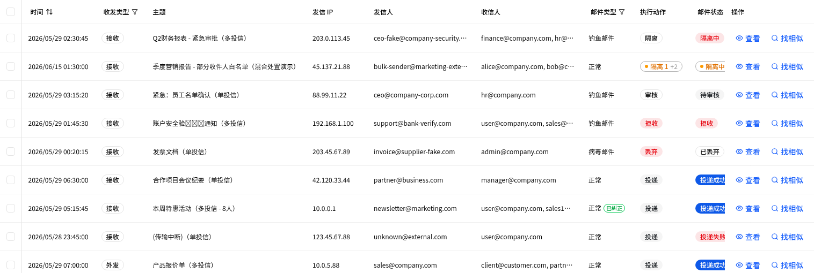
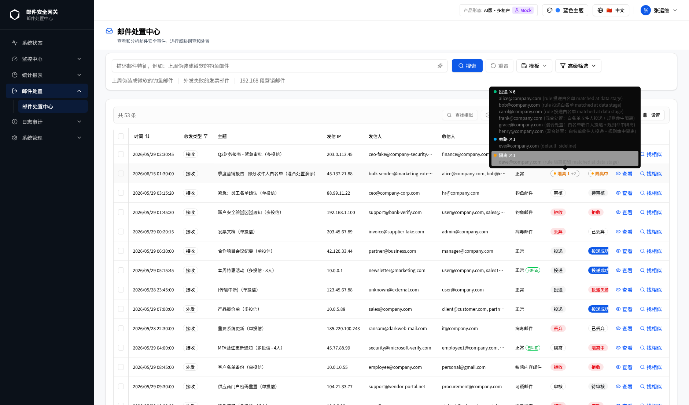
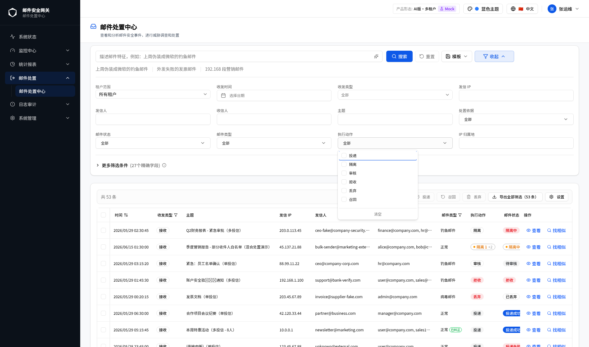
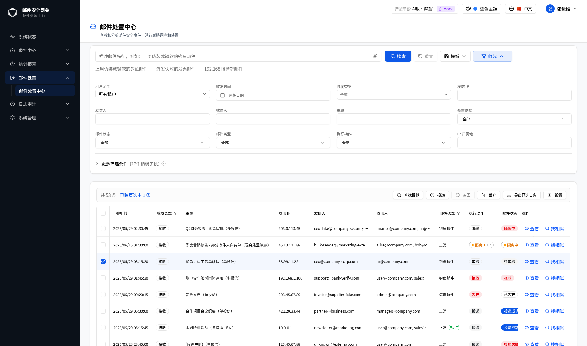
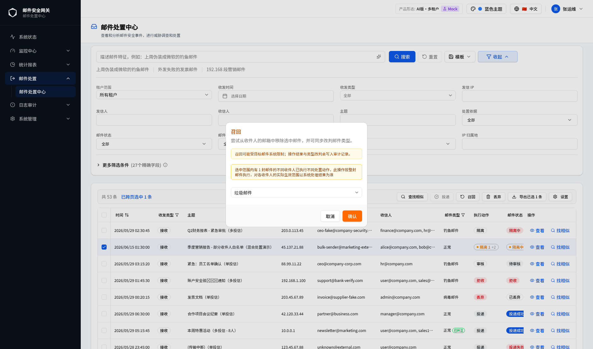
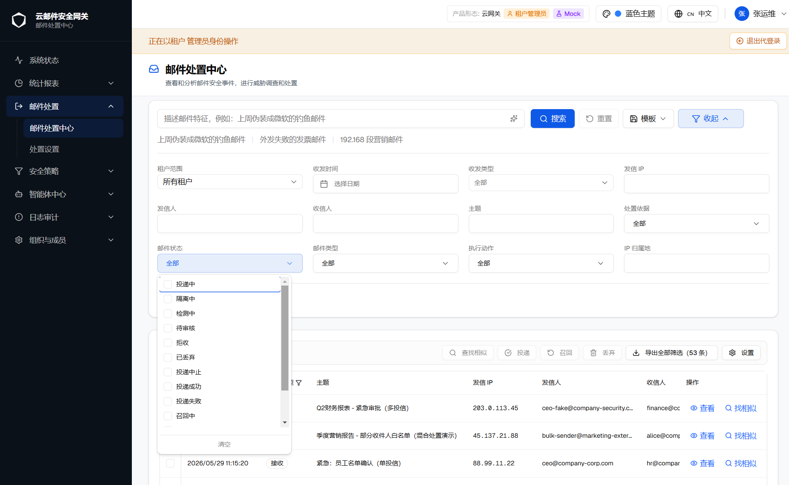

# GT-12923【0813】邮件处置中心总优化工单

| 字段 | 内容 |
|---|---|
| 规格版本 | v5 |
| 生成日期 | 2026-08-14 |
| 页面路由 | `zh/email-disposal/center` |
| webapp 源码 | `src/components/email-disposal/` |
| 需求依据 | 用户在本工单多轮对话中提出的具体问题与确认 |
| 历史对话 | 已使用（阶段五 UI 复盘 + 文案修正 + 技能改造，均在当前会话内完成） |
| 对照 spec | not-used |
| 验证环境 | Mock 数据、zh locale、蓝色主题、桌面视口、AI-多租户形态、租户管理员/平台管理员视角 |

> 本文档汇总"邮件处置中心"模块在本工单下完成的全部改动，作为多个子变更的总览索引。每个子变更的详细验证过程（浏览器截图、单测、tsc 检查）已在开发过程中逐项完成，本文档记录变更内容、涉及文件与验证结论，不重复粘贴过程截图。

## 目录

- [A. 变更清单总览](#a-变更清单总览)
- [B. 产品形态 × 角色矩阵](#b-产品形态--角色矩阵)
- [GT-12931群发邮件/多投递信：执行动作筛选逻辑，以及展示逻辑调整](#gt-12931群发邮件多投递信执行动作筛选逻辑以及展示逻辑调整)
  - [1. 多收件人（mixed）记录展示逻辑优化：单一主要类别 Badge + hover 明细](#1-多收件人mixed记录展示逻辑优化单一主要类别-badge--hover-明细)
  - [2. 执行动作批量按钮文案统一：「放行」→「投递」](#2-执行动作批量按钮文案统一放行投递)
  - [3. CSV 导出新增收件人明细列](#3-csv-导出新增收件人明细列)
  - [4. 批量重新分类确认弹窗的 mixed 记录警示](#4-批量重新分类确认弹窗的-mixed-记录警示)
  - [5. mixed 邮件统计口径修正](#5-mixed-邮件统计口径修正)
  - [6. ru/th 国际化空洞补齐](#6-ruth-国际化空洞补齐)
- [GT-12955邮件状态枚举值优化](#gt-12955邮件状态枚举值优化)
  - [1. 邮件状态枚举维度重定义：从"风险/结果"维度改为"位置"维度](#1-邮件状态枚举维度重定义从风险结果维度改为位置维度)
  - [2. 已废弃枚举值的归并规则](#2-已废弃枚举值的归并规则)
- [H. 需确认事项](#h-需确认事项)
- [I. 版本历史](#i-版本历史)

## A. 变更清单总览

| 编号 | 变更内容 | 类型 | 主要涉及文件 | 所属需求 | 状态 |
|---|---|---|---|---|---|
| 1 | 多收件人（mixed）记录的执行动作/邮件状态列改为单一"主要类别"Badge + hover 明细 | UI 优化 | `recipient-status-badges.tsx` | [GT-12931](#gt-12931群发邮件多投递信执行动作筛选逻辑以及展示逻辑调整) | 已完成 |
| 2 | CSV 导出新增"收件人明细"列，逐收件人展开 mixed 记录的实际处置动作 | 功能新增 | `lib/csv-export.ts` | [GT-12931](#gt-12931群发邮件多投递信执行动作筛选逻辑以及展示逻辑调整) | 已完成 |
| 3 | 批量重新分类确认弹窗对 mixed 记录范围增加黄色警示条 | UI 优化 | `reclassify-dialog.tsx` | [GT-12931](#gt-12931群发邮件多投递信执行动作筛选逻辑以及展示逻辑调整) | 已完成 |
| 4 | 修正 `mixedMailHint` 文案与统计口径不一致（仅统计当前页却暗示全部结果） | 缺陷修正 | 邮件列表提示文案 i18n key | [GT-12931](#gt-12931群发邮件多投递信执行动作筛选逻辑以及展示逻辑调整) | 已完成 |
| 5 | 补齐 ru/th 语言文件缺失的 `recipientStatusBar` 命名空间 | 国际化修复 | `messages/ru.json`、`messages/th.json` | [GT-12931](#gt-12931群发邮件多投递信执行动作筛选逻辑以及展示逻辑调整) | 已完成 |
| 6 | 执行动作批量操作按钮文案由"放行"改为"投递" | 文案修正 | `messages/zh.json`（`emailDisposal.batch.release`） | [GT-12931](#gt-12931群发邮件多投递信执行动作筛选逻辑以及展示逻辑调整) | 已完成 |
| 7 | "邮件状态"枚举维度重定义：由"风险/结果"维度改为"邮件当前所在位置"维度，17 项精简为 13 项，新增 `delivery_cancelled` | 需求变更 | `types/email-disposal.ts`、`lib/display-status.ts`、`lib/disposal-api.ts`、`quick-filters.tsx`、`mail-list-table.tsx`、`similar-results-sheet.tsx`、`lib/mock/fixtures.ts`、`messages/zh.json`、`messages/en.json` | [GT-12955](#gt-12955邮件状态枚举值优化) | 已完成 |

> 编号 1–6 全部围绕"群发邮件/多投递信"场景下的执行动作筛选、展示与统计逻辑，v4 起统一归拢为独立需求 **GT-12931群发邮件/多投递信：执行动作筛选逻辑，以及展示逻辑调整**（见下方章节第 1–6 节），不再作为 GT-12923 下的零散变更条目单独描述；本表格保留编号仅用于追溯，具体内容以 GT-12931 章节为准。
>
> 编号 7 为独立需求 **GT-12955邮件状态枚举值优化**（见下方章节），v3 新增。

## B. 产品形态 × 角色矩阵

| 形态 \ 角色 | 平台管理员 | 租户管理员 |
|---|---|---|
| AI-单 | ✅ | ✅ |
| 传统-单 | ✅ | ✅ |
| 云-多 | ✅ | ✅ |
| AI-多 | ✅ | ✅ |
| 传统-多 | ✅ | ✅ |

邮件处置中心为全形态通用模块，各形态与角色下的可见性与可编辑性一致，无差异分支。

## GT-12931群发邮件/多投递信：执行动作筛选逻辑，以及展示逻辑调整

> 本需求收录本工单（GT-12923）下全部与"群发邮件/多投递信"场景相关的变更点——既包括"执行动作"筛选逻辑、展示逻辑本身（第 1、2 节），也包括围绕同一场景衍生出的 CSV 导出、批量操作弹窗提示、统计口径修正、国际化补齐（第 3–6 节）。原分散记录于变更一~六，v4 起统一归拢为独立需求名称，内容不变，仅重新组织归属与目录层级。

### 1. 多收件人（mixed）记录展示逻辑优化：单一主要类别 Badge + hover 明细

#### 1.1 背景

同一封邮件的不同收件人可能被系统执行了不同的处置动作（即 mixed 记录，对应"群发邮件/多投递信"场景）。优化前的实现会把每个处置类别渲染成一个独立 Badge 平铺展示（如 `[投递 6][旁路 1][隔离 1]`），导致：

- 该行的行高显著高于普通记录（单一动作只有 1 个 Badge），破坏列表整体的视觉节奏；
- 多个类别色同屏叠加（最多可达 7 种类别色），与设计规范"3–5 种色彩"的克制原则冲突。

#### 1.2 方案取舍

在 UI 优化讨论中比较了三个方向：

| 方案 | 描述 | 结论 |
|---|---|---|
| A（采用） | 只渲染 1 个"主要类别"Badge，其余类别折叠为 Badge 尾部的中性灰 `+N`，hover 展开完整明细 | 高度/密度与普通行完全一致，颜色数量始终为 1 种类别色，改动成本最低 |
| B（未采用） | 合并为单个多段文字 Badge（"投递 6 · 旁路 1 · 隔离 1"），放弃颜色编码 | 丢失"扫一眼颜色判断风险"的能力，对安全运营场景是实质倒退 |
| C（未采用） | 迷你分段进度条（stacked bar），按比例分配色块宽度 | 视觉语言与表格其余"离散状态"列不统一；1 人和 2 人的宽度差异不明显，不适合需要精确决策的处置场景 |

#### 1.3 执行动作筛选逻辑：主要类别选取规则（`pickPrimaryBucket`）

单纯"选数量最多的类别"会导致"筛选执行动作=投递，却看到隔离 Badge"的表面矛盾（因为后端对 mixed 记录的筛选是按 `disposition_actions` 数组做**交集匹配**）。因此规则分两种场景：

1. **筛选生效时**（`highlightKeys` 非空）：只在命中筛选值的类别里选，取人数最多的一个，保证"筛的是什么，展示的主 Badge 也一定是什么"。
2. **无筛选（默认列表态）**：按业务风险优先级选（隔离/审核/旁路排队中 优先于 拒绝/丢弃/投递成功），让运营人员刷列表时第一眼看到风险信号，而不是被数量占多数但价值最低的"投递成功"占据主 Badge 位置。

#### 1.4 实际页面呈现：邮件处置中心日志列表

上述 Badge 组件的实际落地位置是**邮件处置中心（`zh/email-disposal/center`）日志列表**的"执行动作"列与"邮件状态"列（列表最右两个状态列，紧邻"操作"列之前）。以下是该页面在浏览器中的真实渲染（Mock 数据，mixed 场景邮件主题为"季度营销报告 - 部分收件人白名单（混合处置演示）"，8 个收件人）：

该行"执行动作"列渲染为单一 Badge `隔离 1 +2`（黄色，因当前无筛选，按 [1.3](#13-执行动作筛选逻辑主要类别选取规则pickprimarybucket) 风险优先级规则选中"隔离"为主要类别，人数为 1，`+2` 表示还有 2 个其他类别未展开），"邮件状态"列同步渲染为对应的 `隔离中 +2`；与列表中其余单一动作记录（如同页"投递成功""待审核""拒收"）的行高完全一致。

鼠标 hover 该 Badge 后展开的完整明细（真实抓取自浏览器 DOM，未做文案改写）：

tooltip 内按类别分组列出全部 8 个收件人及每个人的实际处置依据：

- **投递 ×6**：`alice@company.com`、`bob@company.com`、`carol@company.com`（均为 `rule 投递白名单 matched at data stage`）；`frank@company.com`、`grace@company.com`、`henry@company.com`（均标注"混合处置：白名单收件人投递 + 规则命中隔离"）
- **旁路 ×1**：`eve@company.com`（`default_sideline`）
- **隔离 ×1**：`dave@company.com`（`rule 隔离扣留 matched at data stage`）

可见即使"投递"类别人数最多（6 人），主 Badge 仍按风险优先级选中人数更少但风险更高的"隔离"（1 人），与 [1.3](#13-执行动作筛选逻辑主要类别选取规则pickprimarybucket) 描述的规则一致。

"执行动作"高级筛选下拉的可选值（浏览器实际展开，与 Badge 类别文案一一对应）：

批量工具栏中的"投递"按钮（原"放行"，见 [第 2 节](#2-执行动作批量按钮文案统一放行投递)），勾选一条"待审核"记录后按钮从禁用变为可点击：

#### 1.5 展示逻辑：涉及文件

- `src/components/email-disposal/components/recipient-status-badges.tsx` — 新增 `pickPrimaryBucket`、`RISK_PRIORITY`，多桶渲染分支改为单 Badge。
- `src/components/email-disposal/components/recipient-status-badges.test.ts` — 新增 `pickPrimaryBucket` 单测（筛选命中优先、多类别命中取最大、无命中回退风险优先级、同优先级按人数排序）。
- `src/components/email-disposal/mail-list-table.tsx` — 更新注释，无逻辑变更。

#### 1.6 验证结论

- 单元测试：22 项（含新增 5 项）全部通过。
- 浏览器验证：mixed 行 Badge 高度与普通行一致；hover tooltip 展开完整逐收件人明细，主要类别对应行有浅底色高亮，与 Badge 上数字一一对应（见 1.4 实际截图）。
- `tsc --noEmit`：涉及文件零新增错误。

### 2. 执行动作批量按钮文案统一：「放行」→「投递」

#### 2.1 变更内容

邮件处置中心工具栏中批量执行动作按钮的文案由"放行"改为"投递"，与筛选器"执行动作"下拉选项、上一节 mixed 记录列表徽章的文案统一，避免同一模块内三处"执行动作"相关文案不一致。

#### 2.2 涉及文件

- `messages/zh.json` — 仅修改 `emailDisposal.batch.release` 键的值，未新增硬编码文案。

#### 2.3 验证结论

- 组件 `data-testid`、`onClick`（`onBatchAction('release')`）及批量处置逻辑均未改动。
- 浏览器可访问性快照验证：工具栏按钮实际渲染文本已更新为"投递"。
- 2318 项相关单元测试全部通过，UTF-8 编码自检无 `�` 乱码。

### 3. CSV 导出新增收件人明细列

#### 3.1 背景

CSV 导出此前只输出邮件层面的单一"执行动作"字段，mixed 记录导出后无法体现每个收件人具体被执行了什么动作，运营人员需要逐条回到列表页 hover 查看才能确认。

#### 3.2 方案

新增"收件人明细"列：

- 普通（单一动作）记录该列留空；
- mixed 记录列出全部收件人及各自的处置动作，格式为 `邮箱:动作; 邮箱:动作; ...`，动作文案复用列表页 Badge 使用的同一套中文标签映射，保证列表 Badge、hover tooltip、CSV 导出三处文案完全一致。

#### 3.3 涉及文件

- `src/components/email-disposal/lib/csv-export.ts`（新建，含单测）。

#### 3.4 验证结论

- 6 项单元测试通过。
- 实际触发导出并读取生成的 CSV blob 内容验证：mixed 记录的"收件人明细"列包含全部 8 个收件人及其各自动作（如"alice@company.com:投递; ...; dave@company.com:隔离; eve@company.com:旁路; ..."），文案与列表页 Badge 完全一致。

### 4. 批量重新分类确认弹窗的 mixed 记录警示

#### 4.1 背景

批量放行/召回操作是对整封邮件执行的，但如果选中范围内包含 mixed 记录（邮件内不同收件人已有不同处置结果），操作对各收件人的实际生效范围需要以系统处理结果为准，此前确认弹窗没有对这种情况做出提示，用户可能误以为操作会均匀作用于所有收件人。

#### 4.2 方案

`ReclassifyDialog` 新增 `mixedSelectionCount` 属性：当选中范围内的 mixed 记录数量大于 0 时，弹窗内显示一条黄色警示条，明确告知"此操作按整封邮件执行，对各收件人的实际生效范围以系统处理结果为准"。

浏览器实际验证：在日志列表中勾选前述 mixed 记录（"季度营销报告 - 部分收件人白名单（混合处置演示）"）并点击"召回"，弹窗在原有的"召回可能受目标邮件系统限制……"提示条下方，新增一条黄色 mixed 警示条：

对照组：勾选单一动作记录（非 mixed）时，弹窗内不出现该警示条，仅保留原有的召回限制提示。

#### 4.3 涉及文件

- `src/components/email-disposal/reclassify-dialog.tsx`

#### 4.4 需确认事项

- 收件人级的实际生效判断逻辑（即批量放行/召回对 mixed 记录中已经是终态的收件人是否会重新处理）需要与后端确认，当前警示条只做提示，不改变实际提交行为。见 [H. 需确认事项](#h-需确认事项) Q-001。

### 5. mixed 邮件统计口径修正

#### 5.1 问题

`mixedMailHint` 提示文案的原文暗示"当前结果"中共有 N 封 mixed 邮件，但背后的计算逻辑实际只统计了**当前页**（`data.items`），而不是当前筛选条件下的**全部结果**。当结果跨多页时，文案会让用户误以为看到了完整统计。

#### 5.2 修正

将文案改为明确的"本页结果"表述，并注明其他分页可能还有更多 mixed 邮件，使文案与其背后真实的计算口径（仅当前页）保持一致，不再产��"文案暗示全量、逻辑只算当前页"的误导。

#### 5.3 涉及文件

- 邮件列表页 mixed 提示条对应的 i18n key（`emailDisposal` 命名空间下）。

### 6. ru/th 国际化空洞补齐

#### 6.1 问题

阶段四为"收件人状态徽章"功能新增的 `recipientStatusBar` 命名空间只在 `zh.json`/`en.json` 补齐，`ru.json`、`th.json` 两个语言文件完全缺失该子命名空间，是阶段四遗留的国际化空洞。现有的 i18n parity 测试当时未覆盖到这个子命名空间，因此没有在阶段四被发现。

#### 6.2 修正

在 `messages/ru.json`、`messages/th.json` 中补齐 `recipientStatusBar` 命名空间下的全部翻译键，与 `zh.json`/`en.json` 的键结构保持一致。

## GT-12955邮件状态枚举值优化

> 本需求为"邮件处置中心"搜索模块"邮件状态"筛选枚举值的重新定义，仅涉及展示态状态词表与其归并映射逻辑，不改变列表数据本身、执行动作词表、召回等其他筛选维度。

### 1. 邮件状态枚举维度重定义：从"风险/结果"维度改为"位置"维度

#### 1.1 方案概述

优化前的"邮件状态"枚举（`DisplayStatus`）按"结果性质"组织（如已退信、审核驳回、已删除等 17 项），运营人员在实际排查时更关心的是"这封邮件现在在哪个环节、卡在谁手里"，而不是抽象的结果分类。本次优化将枚举维度改为"邮件当前所在位置"，共 13 项，按以下五组位置节点组织：

| 分组 | 枚举值（`DisplayStatus`） | 中文标签 |
|---|---|---|
| 仍在我方系统内 | `delivering` | 投递中（含"投递失败但仍在重试"、"部分投递成功"等未确定为单一终态的情况，位置未变） |
| 仍在我方系统内 | `quarantine_pending` | 隔离中 |
| 仍在我方系统内 | `sideline_pending` | 检测中 |
| 仍在我方系统内 | `audit_pending` | 待审核 |
| 已停在网关（未离开我方） | `rejected` | 拒收 |
| 已停在网关（未离开我方） | `discarded` | 已丢弃 |
| 已停在网关（未离开我方） | `delivery_cancelled`（新增） | 投递中止 |
| 已离开网关，去向已确定 | `delivered` | 投递成功 |
| 已离开网关，去向已确定 | `delivery_failed` | 投递失败（含对方退信场景） |
| 针对已送达邮件的位置变更 | `recall_pending` | 召回中 |
| 针对已送达邮件的位置变更 | `recall_success` | 召回成功 |
| 针对已送达邮件的位置变更 | `recall_failed` | 召回失败 |
| 已归档/清理 | `expired` | 已过期 |

新增枚举值 `delivery_cancelled`（投递中止）用于区分两种此前被合并展示为"已丢弃"的场景：邮件从未进入投递队列直接被丢弃（`discard`，位置维度下仍是 `discarded`），与邮件已进入投递队列、由我方主动中止转发（原始值 `deliveryStatus=cancelled`）——后者已经"离开过决策阶段、进入过投递流程"，是与前者不同的位置节点，因此拆分为独立枚举值。

#### 1.2 截图式交互预览

**状态 1 / 邮件状态筛选下拉框展开态**

| 字段 | 内容 |
|---|---|
| 触发路径 | 邮件处置中心 → 搜索区域筛选栏 → 点击"邮件状态"下拉框 |
| 路由 | `/zh/email-disposal/center` |
| 视口 | 桌面 1888×1152 |
| 形态/角色 | 全形态通用（AI-多租户 · 租户管理员视角下验证） |
| 验证依据 | 用户实拍浏览器截图 |

*下拉框自上而下依次为：投递中、隔离中、检测中、待审核、拒收、已丢弃、投递中止、投递成功、投递失败、召回中（滚动条下方另有召回成功、召回失败、已过期，共 13 项），与上表枚举顺序一致；下拉框底部为"清空"按钮。截图中页面字体渡染为方块，是当前预览环境的字体加载问题，不影响枚举文案与选项结构的验证。*

#### 1.3 逐元素说明

| 元素 | 类型 | 说明 |
|---|---|---|
| "邮件状态"筛选下拉框 | 多选下拉（Checkbox 列表） | 位于搜索筛选栏第三行第一列，与"邮件类型""执行动作""IP 归属地"同行 |
| 下拉选项 | 13 个 Checkbox 选项 | 文案见 1.1 表格"中文标签"列，i18n key 为 `emailDisposal.filters.statuses.<枚举值>`（`zh.json`/`en.json` 均已补齐，其余语言文件沿用既有 fallback 规则，本次未新增语言空洞） |
| 列表徽章（Badge） | 每条邮件记录"邮件状态"列 | 复用 `src/lib/display-status.ts` 的 `DISPLAY_STATUS_VARIANTS` 配色表：`rejected`/`quarantine_pending`/`delivery_failed`/`recall_failed` 为 `destructive`（红）；`delivered`/`recall_success` 为 `default`；`sideline_pending`/`audit_pending`/`delivering`/`recall_pending` 为 `secondary`；`discarded`/`delivery_cancelled`/`expired` 为 `outline` |
| 清空按钮 | 文字按钮 | 清空全部已选状态选项 |

### 2. 已废弃枚举值的归并规则

#### 2.1 方案概述

`DisplayStatus` 同时被"邮件处置中心"与"钓鱼邮件检测智能体 › 检测日志"两个模块共用（`src/lib/display-status.ts` 为唯一状态源，避免两处维护两份配色）。移除的 5 个旧枚举值（`bounced`/`partial_delivered`/`partial_recall_success`/`deleted`/`reviewed_rejected`）在展示层归并到语义最贴近的新枚举值，映射逻辑集中在 `mapToDisplayStatus`（`src/components/email-disposal/lib/disposal-api.ts`）与 mock 层的 `displayStatusOf`（`src/lib/mock/fixtures.ts`）：

| 原始动作/工作流值 | 旧展示态 | 新展示态 | 归并理由 |
|---|---|---|---|
| `action=bounce`（对方退信） | `bounced` | `delivery_failed` | 均表示"邮件已离开网关但未成功停在收件箱"这同一个位置结果 |
| `deliveryStatus=partial_delivered` | `partial_delivered` | `delivering` | 位置未确定为单一终态时，统一按"投递中"展示 |
| `deliveryStatus=cancelled` | `discarded` | `delivery_cancelled`（新增，见 1.1） | 已进入投递队列后被中止，与从未进入队列的 `discard` 是不同的位置节点 |
| `workflowOutcome=rejected_after_review` | `reviewed_rejected` | `discarded` | 审核后拦截本质仍是"停在网关"，不再单列 |
| `workflowOutcome=deleted` | `deleted` | `discarded` | 人工清除本质仍是"停在网关"的一次清理动作，不再单列 |
| `recallStatusSummary=partial_recall_success`（历史值 `expanded`） | `partial_recall_success` | `recall_success` | 邮件仍留在收件箱这个位置（多收件人场景下只召回了一部分），不视为独立位置节点 |

#### 2.2 涉及文件

- `src/types/email-disposal.ts` — `DisplayStatus` 类型定义，17 项精简为 13 项。
- `src/lib/display-status.ts` — `DISPLAY_STATUS_VARIANTS` 配色表、`PHISHING_MAIL_STATUS_OPTIONS` 选项列表、`mapPhishingDispositionToDisplayStatus` 映射函数（供检测日志模块复用，本次联动更新）。
- `src/components/email-disposal/lib/disposal-api.ts` — `mapToDisplayStatus` 归并逻辑。
- `src/components/email-disposal/quick-filters.tsx` — 搜索筛选栏"邮件状态"选项数组。
- `src/components/email-disposal/mail-list-table.tsx` — 列表内联状态选项数组、"可召回"判断条件（原 `['delivered', 'partial_delivered']` 收窄为 `['delivered']`）。
- `src/components/email-disposal/similar-results-sheet.tsx` — 移除本文件内重复维护的配色表，改为直接复用 `display-status.ts` 的 `DISPLAY_STATUS_VARIANTS`。
- `src/components/phishing-detection/detail-actions.ts` — 移除已废弃的 `partial_delivered` case 分支。
- `src/lib/mock/fixtures.ts` — `displayStatusOf` mock 筛选逻辑，与生产映射逻辑保持一致。
- `messages/zh.json`、`messages/en.json` — `emailDisposal.filters.statuses` 命名空间：新增 `delivery_cancelled`，移除 `bounced`/`partial_delivered`/`partial_recall_success`/`deleted`/`reviewed_rejected` 对应词条。
- `src/components/email-disposal/lib/disposal-api.test.ts` — 同步更新受影响的单元测试断言。

#### 2.3 验证结论

- 单元测试：邮件处置中心与���鱼检测模块相关测试文件（含 `disposal-api.test.ts`、`display-status.test.ts`、mock 相关测试）合计 601 项全部通过。
- `tsc --noEmit`：涉及文件零新增错误（既有错误均为其他模块历史遗留，与本次改动无关）。
- 浏览器验证：见 [1.2 截图式交互预览](#12-截图式交互预览)，下拉框实际展开的 13 个选项与设计方案一致，且不再包含已移除的 5 个旧值。

#### 2.4 差异标注

- 与优化前相比，"邮件状态"筛选下拉框选项数量由 17 项减少为 13 项；已移除的 5 个筛选值不会再出现在搜索结果中（数据仍归并展示为对应的新状态，不影响可检索性）。
- `mail-list-table.tsx` 内"可召回"判断条件收窄：原可对 `delivered`/`partial_delivered` 两种状态的邮件发起召回，现由于 `partial_delivered` 已归并入 `delivering`（未确定为单一终态），只有 `delivered` 状态可发起召回。

## H. 需确认事项

| 编号 | 事项 | 原因 | 状态 | 复核日期 | 验证依据 | 处理说明/版本 |
|---|---|---|---|---|---|---|
| Q-001 | 批量放行/召回对 mixed 记录中已处于终态的收件人是否会被重新处理 | 浏览器和前端源码均无法确认后端的收件人级判定逻辑 | **无法验证** | 2026-08-13 | 已检查 `reclassify-dialog.tsx` 及批量操作前端调用路径 | 需要后端/业务侧确认实际生效范围规则 |

## I. 版本历史

| 版本 | 日期 | 摘要 |
|---|---|---|
| v1 | 2026-08-13 | 首版：汇总本工单下的 6 项变更（mixed 记录 UI 优化、CSV 收件人明细列、重新分类弹窗警示、统计口径修正、ru/th 国际化补齐、"放行"→"投递"文案修正） |
| v2 | 2026-08-13 | 将编号 1（mixed 记录展示逻辑优化）与编号 6（执行动作按钮文案统一）两项变更归拢为独立需求名称 **GT-12931群发邮件/多投递信：执行动作筛选逻辑，以及展示逻辑调整**，内容不变，仅调整目录层级与归属；同步在 HTML Spec 索引的对应一级目录下新增该需求的导航入口 |
| v3 | 2026-08-14 | 新增独立需求 **GT-12955邮件状态枚举值优化**（编号 7）：将"邮件状态"枚举维度由"风险/结果"改为"邮件当前所在位置"，17 项精简为 13 项，新增 `delivery_cancelled`；同步更新与该枚举共用的检测日志模块配色表、mock 筛选逻辑及相关单元测试；同步在 HTML Spec 索引的对应一级目录下新增该需求的导航入口 |
| v4 | 2026-08-14 | 调整文档章节顺序：原独立的"C. CSV 导出新增收件人明细列""D. 批量重新分类确认弹窗的 mixed 记录警示""E. mixed 邮件统计口径修正""F. ru/th 国际化空洞补齐"四项变更，内容本质均围绕"群发邮件/多投递信"的 mixed 记录场景，归并为 **GT-12931群发邮件/多投递信：执行动作筛选逻辑，以及展示逻辑调整** 章节下的第 3–6 节，移动到 GT-12955 之前；同步更新目录、变更清单总览表"所属需求"列及章节内部交叉引用锚点，内容与结论均未变更 |
