# GT-12970【0816】邮件处置中心「优化」

| 字段 | 内容 |
|---|---|
| 规格版本 | v5 |
| 生成日期 | 2026-08-21（v1/v2/v3/v4 各章节生成日期见各自小节与 D. 版本历史） |
| 页面路由 | `zh/email-disposal/center` |
| webapp 源码 | `src/components/email-disposal/`、`src/lib/mock/fixtures.ts`、`messages/{zh,en,ru,th}.json` |
| webapp commit | 主仓库 MR 实现为 `096b724c`–`13011873`；origin 原型版本历史见 D 节 |
| 需求依据 | 用户在本工单对话中提出的具体问题与确认 |
| 历史对话 | 已使用；v5 同步主仓库实际落地结果，并记录字段口径与显式跳过项 |
| 对照 spec | not-used |
| 验证环境 | zh locale、蓝色主题、桌面视口；主仓库实现已逐项执行单测、TypeScript、ESLint 及浏览器验证 |

> 本文档汇总"邮件处置中心"模块在本工单（0816 批次）下完成的改动，延续 [GT-12923【0813】邮件处置中心总优化工单](./GT-12923【0813】邮件处置中心总优化工单.md) 的记录方式，作为该批次子变更的总览索引。每个子变更的详细验证过程（浏览器截图、单测、tsc 检查）已在开发过程中逐项完成，本文档记录变更内容、涉及文件与验证结论，不重复粘贴过程截图。

> **主仓库落地口径（2026-08-21）：** 页头的“邮件ID”展示 `message_uuid`，不是 RFC `message_id`；原型截图 06/07 保留了最终字段澄清前的历史画面，仅用于说明布局位置。“原始日志部分节点失败警告”已按本工单评审结论明确跳过，不属于本次主仓库交付。

## 目录

- [A. 变更清单总览](#a-变更清单总览)
- [B. 产品形态 × 角色矩阵](#b-产品形态--角色矩阵)
- [GT-12936群发邮件：安全分析模块](#gt-12936群发邮件安全分析模块)
  - [1. 阶段3/4/5检测项重新分配：意图引擎归位、AI智能分析收窄为真实智能体](#1-阶段345检测项重新分配意图引擎归位ai智能分析收窄为真实智能体)
    - [1.1 背景](#11-背景)
    - [1.2 方案](#12-方案)
    - [1.3 截图式交互预览](#13-截图式交互预览)
    - [1.4 逐元素说明](#14-逐元素说明)
    - [1.5 涉及文件](#15-涉及文件)
    - [1.6 验证结论](#16-验证结论)
  - [2. 钓鱼检测智能体行内嵌研判详情，移除独立"AI 智能研判"卡片](#2-钓鱼检测智能体行内嵌研判详情移除独立ai-智能研判卡片)
    - [2.1 背景](#21-背景)
    - [2.2 方案](#22-方案)
    - [2.3 截图式交互预览](#23-截图式交互预览)
    - [2.4 涉及文件](#24-涉及文件)
    - [2.5 验证结论](#25-验证结论)
    - [2.6 差异标注](#26-差异标注)
- [GT-12977邮件处置中心：查看页面："最终判定邮件类型"需要与概览与处置模块的"邮件类型"保持一致](#gt-12977邮件处置中心查看页面最终判定邮件类型需要与概览与处置模块的邮件类型保持一致)
  - [1. "最终判定"文案与"邮件类型"徽标同源](#gt12977-1-最终判定文案与邮件类型徽标同源)
    - [1.1 背景](#gt12977-11-背景)
    - [1.2 方案](#gt12977-12-方案)
    - [1.3 截图式交互预览](#gt12977-13-截图式交互预览)
    - [1.4 逐元素说明](#gt12977-14-逐元素说明)
    - [1.5 涉及文件](#gt12977-15-涉及文件)
    - [1.6 验证结论](#gt12977-16-验证结论)
- [GT-12978邮件处置中心——》查看：去掉"内容详情"](#gt-12978邮件处置中心查看去掉内容详情)
  - [1. 删除"内容详情"折叠区块，邮件ID挪至详情页共用页头](#gt12978-1-删除内容详情折叠区块邮件id挪至详情页共用页头)
    - [1.1 背景](#gt12978-11-背景)
    - [1.2 方案](#gt12978-12-方案)
    - [1.3 截图式交互预览](#gt12978-13-截图式交互预览)
    - [1.4 逐元素说明](#gt12978-14-逐元素说明)
    - [1.5 涉及文件](#gt12978-15-涉及文件)
    - [1.6 验证结论](#gt12978-16-验证结论)
- [GT-12979邮件状态以及可以支持的后续操作](#gt-12979邮件状态以及可以支持的后续操作)
  - [1. 邮件状态×列表批量操作可用性矩阵](#1-邮件状态列表批量操作可用性矩阵)
    - [1.1 背景](#gt12979-11-背景)
    - [1.2 方案](#gt12979-12-方案)
    - [1.3 截图式交互预览](#gt12979-13-截图式交互预览)
    - [1.4 逐元素说明](#gt12979-14-逐元素说明)
    - [1.5 涉及文件](#gt12979-15-涉及文件)
    - [1.6 验证结论](#gt12979-16-验证结论)
  - [2. 详情页收件人级状态×操作矩阵（群发/混合处置场景）](#2-详情页收件人级状态操作矩阵群发混合处置场景)
    - [2.1 背景](#gt12979-21-背景)
    - [2.2 方案](#gt12979-22-方案)
    - [2.3 逐元素说明](#gt12979-23-逐元素说明)
    - [2.4 涉及文件](#gt12979-24-涉及文件)
    - [2.5 验证结论](#gt12979-25-验证结论)
- [GT-12982邮件处置：查看页面UI优化](#gt-12982邮件处置查看页面ui优化)
  - [1. 滚动定位改为 IntersectionObserver，"当前查看"与面包屑联动](#gt12982-1-滚动定位改为-intersectionobserver当前查看与面包屑联动)
    - [1.1 背景](#gt12982-11-背景)
    - [1.2 方案](#gt12982-12-方案)
    - [1.3 截图式交互预览](#gt12982-13-截图式交互预览)
    - [1.4 逐元素说明](#gt12982-14-逐元素说明)
    - [1.5 涉及文件](#gt12982-15-涉及文件)
    - [1.6 验证结论](#gt12982-16-验证结论)
  - [2. 导航项新增图标、风险点提示气泡与品牌色激活态](#gt12982-2-导航项新增图标风险点异常提示气泡与品牌色激活态)
    - [2.1 背景](#gt12982-21-背景)
    - [2.2 方案](#gt12982-22-方案)
    - [2.3 截图式交互预览](#gt12982-23-截图式交互预览)
    - [2.4 逐元素说明](#gt12982-24-逐元素说明)
    - [2.5 涉及文件](#gt12982-25-涉及文件)
    - [2.6 验证结论](#gt12982-26-验证结论)
  - [3. 导航栏可收起为纯图标窄栏，折叠态组合提示气泡](#gt12982-3-导航栏可收起为纯图标窄栏折叠态组合提示气泡)
    - [3.1 背景](#gt12982-31-背景)
    - [3.2 方案](#gt12982-32-方案)
    - [3.3 截图式交互预览](#gt12982-33-截图式交互预览)
    - [3.4 逐元素说明](#gt12982-34-逐元素说明)
    - [3.5 涉及文件](#gt12982-35-涉及文件)
    - [3.6 验证结论](#gt12982-36-验证结论)
    - [3.7 差异标注](#gt12982-37-差异标注)
- [GT-12984邮件处置中心：日志列表UI优化](#gt-12984邮件处置中心日志列表ui优化)
  - [1. 发件人/收件人合并列](#gt12984-1-发件人收件人合并列)
    - [1.1 背景](#gt12984-11-背景)
    - [1.2 方案](#gt12984-12-方案)
    - [1.3 截图式交互预览](#gt12984-13-截图式交互预览)
    - [1.4 逐元素说明](#gt12984-14-逐元素说明)
    - [1.5 涉及文件](#gt12984-15-涉及文件)
    - [1.6 验证结论](#gt12984-16-验证结论)
  - [2. 收发类型展示方式两轮迭代：箭头图标 → 邮件场景图标 → 彩色文字 Badge 定稿](#gt12984-2-收发类型展示方式两轮迭代箭头图标--邮件场景图标--彩色文字-badge-定稿)
    - [2.1 背景](#gt12984-21-背景)
    - [2.2 方案](#gt12984-22-方案)
    - [2.3 截图式交互预览](#gt12984-23-截图式交互预览)
    - [2.4 逐元素说明](#gt12984-24-逐元素说明)
    - [2.5 涉及文件](#gt12984-25-涉及文件)
    - [2.6 验证结论](#gt12984-26-验证结论)
    - [2.7 差异标注](#gt12984-27-差异标注)
  - [3. 新增紧凑显示密度切换](#gt12984-3-新增紧凑显示密度切换)
    - [3.1 背景](#gt12984-31-背景)
    - [3.2 方案](#gt12984-32-方案)
    - [3.3 截图式交互预览](#gt12984-33-截图式交互预览)
    - [3.4 逐元素说明](#gt12984-34-逐元素说明)
    - [3.5 涉及文件](#gt12984-35-涉及文件)
    - [3.6 验证结论](#gt12984-36-验证结论)
- [C. 需确认事项](#c-需确认事项)
- [D. 版本历史](#d-版本历史)

## A. 变更清单总览

| 编号 | 变更内容 | 类型 | 主要涉及文件 | 所属需求 | 状态 |
|---|---|---|---|---|---|
| 1 | 阶段3"内容层检测"新增"意图引擎"（从阶段5移入）；阶段4"AI 智能分析"从5个虚构检测项（发信人行为/意图识别/营销邮件/钓鱼检测/回溯检测智能体）收窄为3个与【智能体中心】完全对应的真实智能体（钓鱼检测/仿冒检测/威胁回溯智能体）；阶段5"综合分析"移除"意图引擎" | 需求变更 | `hooks/use-detection-stages.ts` | [GT-12936](#gt-12936群发邮件安全分析模块) | 已完成 |
| 2 | 钓鱼检测智能体行改为可展开，内嵌原独立"AI 智能研判"紫色卡片的全部研判明细（结论/风险等级/置信度/威胁溯源时间线/处置建议）；移除该独立卡片及相关 i18n key | 功能整合 | `sections/analysis-section.tsx`、`messages/{zh,en,ru,th}.json` | [GT-12936](#gt-12936群发邮件安全分析模块) | 已完成 |
| 3 | "安全分析"标签底部"最终判定"横条文案改为直接复用"概览与处置"标签"邮件类型"徽标同一份 `mailTypeConfig` label（如"正常""钓鱼邮件"），不再使用独立的三档通用严重度文案，消除同一封邮件在两个标签下判定结论字面不一致的问题 | 缺陷修复 | `sections/analysis-section.tsx` | [GT-12977](#gt-12977邮件处置中心查看页面最终判定邮件类型需要与概览与处置模块的邮件类型保持一致) | 已完成 |
| 4 | 删除"安全分析"标签"事后处置时间线"下方的"内容详情"折叠区块（基本信息/发送接收方信息/URL检测/附件安全4个子区块，与"概览与处置"标签"内容实体检测"卡片重复展示 URL/附件信息）；将 `message_uuid` 单独挪至详情页三个标签共用的页头（紧贴邮件主题下方），显示名称为"邮件ID"，不使用 RFC `message_id` | 功能精简 | `sections/analysis-section.tsx`、`detail-modal.tsx` | [GT-12978](#gt-12978邮件处置中心查看去掉内容详情) | 已完成 |
| 5 | 系统性梳理"邮件状态"（`DisplayStatus`，13个）与列表页批量工具栏5个操作（查找相似/投递/取消投递/召回/丢弃）之间的可用性矩阵，并逐一核对每个状态的按钮启用/禁用规则；发现 mock 测试数据集此前对"检测中(sideline_pending)/投递已中止(delivery_cancelled)/已过期(expired)/召回中(recall_pending)/召回成功(recall_success)/召回失败(recall_failed)"6个状态无任何样例记录（无法通过界面手动验证这些状态下按钮的真实启用态），补充 6 条对应 mock 记录并同步修正 `disposalAction`/`disposalDelivery`/`disposalWorkflow`/`recipientDisposalStatus`/`displayStatusOf` 等 mock 推导函数以支持这些状态的正确派生 | 测试数据补全 + 缺陷预防 | `src/lib/mock/fixtures.ts` | [GT-12979](#gt-12979邮件状态以及可以支持的后续操作) | 已完成 |
| 6 | 详情页左侧导航"滚动定位"由比较各区块 `getBoundingClientRect().top` 与内容面板 30% 固定像素阈值，改为基于 `IntersectionObserver` 监听各 `<section>` 是否穿过内容面板顶部 20% 触发带；页头面包屑新增"当前查看：×××"只读文案，与导航高亮同源同步 | 缺陷修复 + 功能新增 | `detail-modal.tsx` | [GT-12982](#gt-12982邮件处置查看页面ui优化) | 已完成 |
| 7 | 导航三项新增图标（收件箱/护盾/卷轴）；"安全分析"项新增风险点圆点（复用 `mailTypeConfig` 同源色调），悬停显示"最终判定：×××"；激活态高亮由中性灰改为品牌主色。原型中的"原始日志部分节点失败警告"本次明确跳过 | 功能新增 + 视觉优化 | `detail-modal.tsx` | [GT-12982](#gt-12982邮件处置查看页面ui优化) | 已完成（不含跳过项） |
| 8 | 桌面视口（≥1024px）导航栏新增收起/展开切换按钮，收起后降为48px纯图标窄栏；折叠态下每个图标的提示气泡改为"标签 · 状态"组合文案（避免收起后完全失去可识别性）；修复折叠态提示气泡因触发器包裹层使用 `display:contents` 导致 `getBoundingClientRect()` 为坍缩零矩形、气泡定位偏移至页面左上角原点的缺陷 | 功能新增 + 缺陷修复 | `detail-modal.tsx`、`messages/{zh,en,ru,th}.json` | [GT-12982](#gt-12982邮件处置查看页面ui优化) | 已完成 |
| 9 | 列表页"发信人""收信人"两列合并为一列"发件人 → 收件人"，箭头图标为纯装饰分隔（`aria-hidden`，不承载语义），完整发件人+收件人信息通过悬停 Tooltip 展示，信息量与合并前一致 | 列宽优化 | `mail-list-table.tsx` | [GT-12984](#gt-12984邮件处置中心日志列表ui优化) | 已完成 |
| 10 | "收发类型"列展示方式两轮迭代：因初版通用上传/下载箭头图标（`ArrowDownToLine`/`ArrowUpFromLine`）被反馈易误读为"下载"操作按钮，改用邮件场景专属图标（`Inbox`/`Send`）；因图标语义仍不够直观被再次反馈，最终改回彩色文字 Badge（复用既有 `filters.incoming`/`outgoing`/`internal` 文案，零 hover 成本） | 需求变更（两轮迭代） | `mail-list-table.tsx` | [GT-12984](#gt-12984邮件处置中心日志列表ui优化) | 已完成 |
| 11 | 列表设置菜单新增"显示密度"分组与"紧凑模式"开关，开启后收紧表头/单元格的高度与内边距（不缩小字号），通过独立 `localStorage` key 持久化，一屏可多显示若干行 | 功能新增 | `mail-list-table.tsx`、`messages/{zh,en,ru,th}.json` | [GT-12984](#gt-12984邮件处置中心日志列表ui优化) | 已完成 |

> 编号 1–2 属于本批次需求 **GT-12936群发邮件：安全分析模块**；编号 3 属于本批次另一独立需求 **GT-12977邮件处置中心：查看页面："最终判定邮件类型"需要与概览与处置模块的"邮件类型"保持一致**；编号 4 属于本批次另一独立需求 **GT-12978邮件处置中心——》查看：去掉"内容详情"**；编号 5 属于本批次另一独立需求 **GT-12979邮件状态以及可以支持的后续操作**；编号 6–8 属于本批次另一独立需求 **GT-12982邮件处置：查看页面UI优化**；编号 9–11 属于本批次另一独立需求 **GT-12984邮件处置中心：日志列表UI优化**（均见下方各自章节）。GT-12936 聚焦"安全分析"标签下阶段3/4/5检测项的真实性收窄与钓鱼检测智能体研判详情的展示位置整合；GT-12977 聚焦统一"最终判定"与"邮件类型"两处判定结论的文案来源；GT-12978 聚焦删除与其他标签重复展示的"内容详情"区块，并将其中仍有排障价值的"邮件ID"字段挪到更常驻可见的位置；GT-12979 聚焦梳理全部邮件状态可支持的后续操作矩阵，并补齐此前完全没有 mock 样例覆盖的6个状态；GT-12982 聚焦详情页左侧导航栏本身的可用性——滚动定位精确性、"当前查看"位置感知、风险/异常状态的免滚动预警，以及窄屏/多标签场景下的收起交互；GT-12984 聚焦列表页（日志列表）本身的列宽与信息密度优化——发件人/收件人合并列、收发类型展示方式的用户反馈迭代，以及新增可选的紧凑显示密度。

## B. 产品形态 × 角色矩阵

| 形态 \ 角色 | 平台管理员 | 租户管理员 |
|---|---|---|
| AI-单 | ✅ | ✅ |
| 传统-单 | ✅ | ✅ |
| 云-多 | ✅ | ✅ |
| AI-多 | ✅ | ✅ |
| 传统-多 | ✅ | ✅ |

邮件处置中心为全形态通用模块，各形态与角色下的可见性与可编辑性一致，无差异分支。

## GT-12936群发邮件：安全分析模块

> 本需求聚焦"邮件处置中心"详情页"安全分析"标签下的两处调整：一是阶段3/4/5检测项的重新分配，使阶段4"AI 智能分析"不再展示系统内实际不存在的虚构检测项；二是将钓鱼检测智能体的完整研判明细从页面底部一个割裂的独立卡片，整合进阶段4对应列表项的内嵌展开区域。

### 1. 阶段3/4/5检测项重新分配：意图引擎归位、AI智能分析收窄为真实智能体

#### 1.1 背景

优化前，阶段4"AI 智能分析"列出 5 个检测项（发信人行为智能体、意图识别智能体、营销邮件智能体、钓鱼邮件检测智能体、回溯检测智能体），但系统内真正存在、且在【智能体中心】有对应管理入口的智能体只有 3 个：钓鱼检测智能体、仿冒检测智能体、威胁回溯智能体；其余"发信人行为智能体""意图识别智能体""营销邮件智能体"3 项从未接入任何真实判定逻辑，长期展示编造的固定结果。同时，"意图引擎"（真实存在于内容层规则命中检测中）被错放在阶段5"综合分析"，与阶段3"内容层检测"里同样命中逻辑的其余内容规则脱节。

#### 1.2 方案

- 阶段3"内容层检测"新增"意图引擎"检测项（从阶段5移入），与该阶段其余内容规则命中逻辑统一来源。
- 阶段4"AI 智能分析"从 5 个虚构检测项收窄为 3 个与【智能体中心】完全对应的真实智能体：钓鱼检测智能体、仿冒检测智能体、威胁回溯智能体。
- 阶段5"综合分析"移除"意图引擎"（已迁移至阶段3）。
- 阶段4的状态判定（`aiCheckStatus`）改为读取邮件真实的 `phish_agent_check.risk_level` 字段判定钓鱼检测智能体状态（通过/可疑/威胁）；仿冒检测智能体、威胁回溯智能体当前无对应真实数据源，诚实返回"未接入"（灰色减号态），不再编造判定结果。

#### 1.3 截图式交互预览

**状态1 / 详情页安全分析·阶段4默认态（威胁邮件示例）**

| 字段 | 内容 |
|---|---|
| 触发路径 | 邮件处置中心 → 日志列表 → 点击威胁邮件行"查看" → 详情页"安全分析"标签 |
| 路由 | `/zh/email-disposal/center`（详情侧边栏） |
| 视口 | 桌面 |
| 形态/角色 | 全形态通用（截图取自 AI-多租户 · 租户管理员视角） |
| 验证依据 | 用户实拍浏览器截图 |

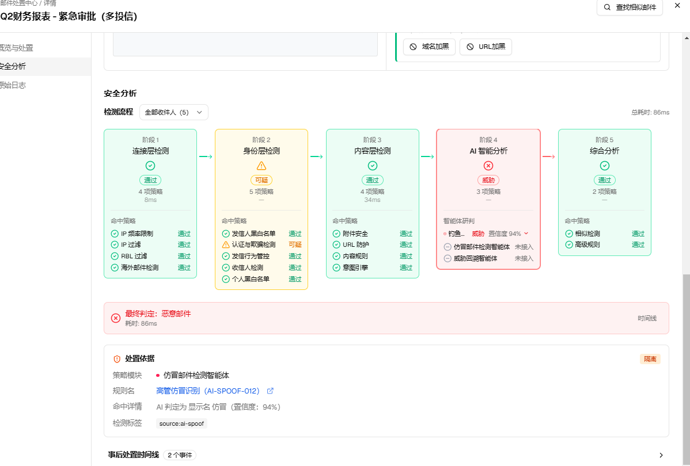

*该邮件"Q2财务报表 - 紧急审批（多投递信）"最终判定为"恶意邮件"，处置依据显示命中模块为"仿冒邮件检测智能体"（规则：高管仿冒识别 AI-SPOOF-012，置信度94%），但阶段4展示的钓鱼检测智能体行本身状态取自 `phish_agent_check.risk_level`（示例为"威胁"），与"处置依据"引用的仿冒判定模块是两个独立字段，二者在同一封邮件里可以并存、互不覆盖。*

- 阶段4卡片头部：标题"AI 智能分析"，右上角威胁态徽章（红色"威胁"）；卡片内"3项策略"计数（较优化前的"5项策略"减少 2 项）。
- "智能体研判"列表：
  - 钓鱼检测智能体：绿色勾选图标 + 下拉箭头（可点击展开，展开后的内嵌详情行为见 [第2节](#2-钓鱼检测智能体行内嵌研判详情移除独立ai-智能研判卡片)，此处仅呈现收窄后的清单本身）；右侧显示"威胁"标签与置信度94%。
  - 仿冒检测智能体：灰色减号图标 + "未接入"文案，不可展开（无详情可展示）。
  - 威胁回溯智能体：灰色减号图标 + "未接入"文案，不可展开。

**状态2 / 详情页安全分析·检测流程按收件人筛选态（群发邮件场景）**

| 字段 | 内容 |
|---|---|
| 触发路径 | 同上详情页 → 安全分析标签 → 点击"检测流程"下拉框（默认"全部收件人 (N)"） |
| 路由 | `/zh/email-disposal/center`（详情侧边栏，含完整后台侧边栏导航） |
| 视口 | 桌面 |
| 形态/角色 | 租户管理员视角 |
| 验证依据 | 用户实拍浏览器截图 |

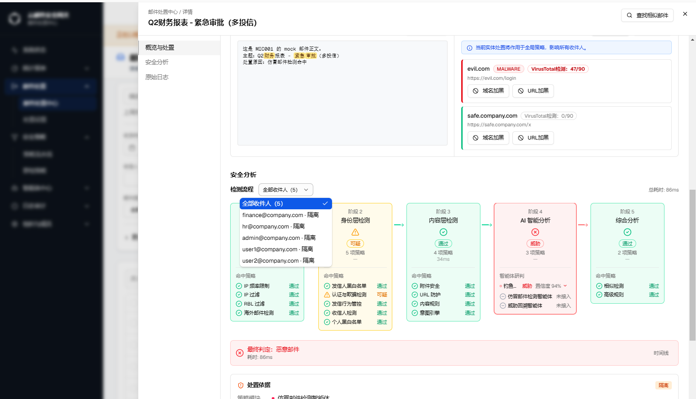

*该截图同时展示了顶部"内容实体检测与处置"区域（域名/URL加黑操作，属已完成需求 GT-12967，本次未变更）与"检测流程"下拉框展开态（5个收件人逐一列出，均标注"隔离"状态，属已完成需求 GT-12934/GT-12935，本次未变更），仅用于说明阶段4三智能体清单在按收件人筛选场景下的展示位置与既有功能共存，不重复归入 GT-12936 变更范围。*

**需求说明（按收件人筛选"安全分析"过程与"处置依据"）：**

群发邮件（`detail.recipients.length > 1`）场景下，不同收件人实际可能命中不同的检测结果与处置动作——例如同一封邮件里 3 人被隔离、1 人放行、1 人丢弃。"检测流程"下拉框即是该能力的入口，默认停在"全部收件人 (N)"合并视图，运营也可切到某一个收件人查看其专属结果：

- **对"安全分析"检测流程的影响**：切到单个收件人后，阶段1-5 每张卡片下的检测项状态会重新聚合——命中了该收件人所在分组的检测项保留其原有判定结果，未命中任何分组的检测项收窄为"通过"；阶段整体状态、"总耗时"、顶部"最终判定"徽标均基于重新聚合后的结果重新计算，避免合并视图下因"有人命中威胁"而将结论展示为"恶意"，切到实际只是"通过"的收件人时仍错误显示"恶意"的自相矛盾。
- **对"处置依据"区域的影响**：下方"处置依据"卡片列表按 `disposal_basis.per_recipient`（同一策略模块下不同收件人可能命中不同具体规则）与"模块 + 具体规则"的粒度分组展示，群发多依据场景下默认折叠为单行摘要（模块/命中人数），点击展开才显示该组完整字段（规则名跳转、命中详情、检测标签），与检测流程阶段卡片上的"N组"分叉徽标共享同一份 `per_recipient` 权威信息，保证两处的分歧计数始终一致。
- 该收件人切换器与"处置依据"分组折叠展示均为既有能力（GT-12934/GT-12935），本次 GT-12936 未改动其逻辑；此处补充说明仅为解释截图中可见的完整交互链路。

#### 1.4 逐元素说明

| 元素 | 类型 | 说明 | i18n key |
|---|---|---|---|
| 阶段4标题 | 文本 | "AI 智能分析" | `emailDisposal.detail.analysis.stages.ai.title`（沿用既有 key，未变更） |
| 钓鱼检测智能体行 | 列表项，可展开 | 状态取自 `phish_agent_check.risk_level`：`none` → 通过（绿色勾）；`low`/`medium` → 可疑（黄色）；`high` → 威胁（红色） | `emailDisposal.detail.analysis.check.phishingAgent` |
| 仿冒检测智能体行 | 列表项，不可展开 | 恒为"未接入"（灰色减号），因当前无对应真实数据源 | `emailDisposal.detail.analysis.check.spoofingAgent` |
| 威胁回溯智能体行 | 列表项，不可展开 | 恒为"未接入"（灰色减号），因当前无对应真实数据源 | `emailDisposal.detail.analysis.check.threatRetroAgent` |
| 阶段3"意图引擎"检测项 | 列表项 | 新增，展示内容规则命中态（通过/可疑/命中），与阶段3其余内容规则并列 | `emailDisposal.detail.analysis.check.intentEngine`（沿用既有 key，位置迁移） |

#### 1.5 涉及文件

- `src/components/email-disposal/hooks/use-detection-stages.ts` — 阶段3/4/5检测项数组重新分配；`aiCheckStatus` 判定逻辑改为读取 `phish_agent_check.risk_level`，其余两个智能体返回 `skipped`。
- `src/components/email-disposal/hooks/use-detection-stages.test.ts` — 同步更新受影响断言。
- `tests/unit/detection-stages.test.ts` — 同步更新受影响断言。

#### 1.6 验证结论

- 单元测试：`use-detection-stages.test.ts`、`detection-stages.test.ts` 等相关测试文件合计 1879 项全部通过。
- `tsc --noEmit`：涉及文件零新增错误。
- 浏览器验证：见 [1.3 截图式交互预览](#13-截图式交互预览) 用户实拍截图，阶段4确认收窄为3个真实智能体，其余两个展示"未接入"而非伪造判定结果。

### 2. 钓鱼检测智能体行内嵌研判详情，移除独立"AI 智能研判"卡片

#### 2.1 背景

优化前，页面底部"事后处置时间线"区块下方还挂着一个独立的紫色"AI 智能研判"卡片（标题"AI 智能研判"，含"查看详情/收起详情"切换按钮），单独展示 AI 判定结论、风险等级、置信度、威胁溯源时间线、处置建议等信息。该卡片与阶段4的钓鱼检测智能体列表项是两处割裂的入口——运营要先看完页面上半部分的安全分析五阶段卡片，再向下滚过"处置依据""事后处置时间线"两大区块，才能在最底部发现同一封邮件还有一份独立的 AI 研判结论，路径很长且容易被忽略。

#### 2.2 方案

去掉"事后处置时间线"下方这个独立紫色卡片，将其全部研判明细（结论/风险等级/研判明细/威胁溯源时间线/处置建议）内嵌折叠进阶段4"钓鱼检测智能体"这一行——点击该行展开后，直接在列表项下方显示完整明细，配色从紫色系统一改为中性色系（与阶段4其余中性态列表项视觉一致，不再额外引入第4种类别色）。原独立卡片、其触发按钮及"暂无数据"占位文案（`aiVerdict.title`/`viewDetails`/`hideDetails`/`noAiData` 等 i18n key）整体移除，研判入口从"页面最底部"收敛回"阶段4列表项本身"。

#### 2.3 截图式交互预览

**状态1 / 详情页安全分析·阶段4钓鱼检测智能体行展开态（内嵌研判明细）**

| 字段 | 内容 |
|---|---|
| 触发路径 | 邮件处置中心 → 日志列表 → 点击威胁邮件行"查看" → 详情页"安全分析"标签 → 点击阶段4"钓鱼检测智能体"行 |
| 路由 | `/zh/email-disposal/center`（详情侧边栏） |
| 视口 | 桌面 |
| 形态/角色 | 全形态通用（截图取自 AI-多租户 · 租户管理员视角） |
| 验证依据 | 用户实拍浏览器截图 |

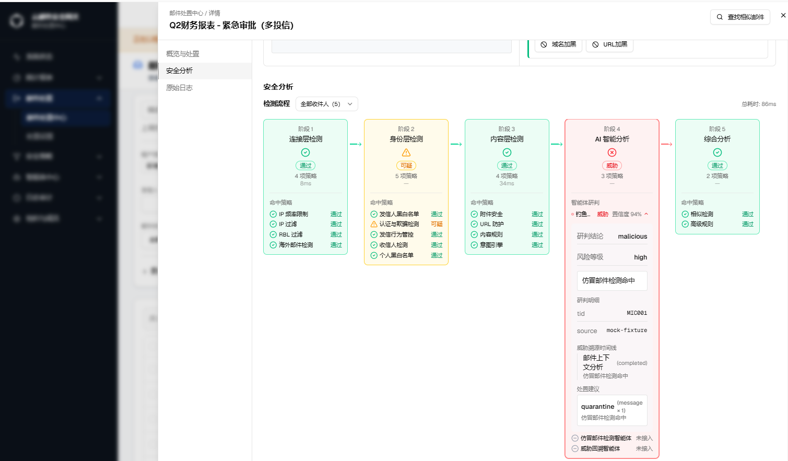

- 点击"钓鱼检测智能体"行右侧的展开箭头（`ChevronDown`，展开态旋转180°）后，列表项下方直接铺开完整明细，无需滚动到页面底部：
  - **研判结论**：`malicious`（取自 `phishAgent.verdict`）。
  - **风险等级**：`high`（取自 `phishAgent.risk_level`）。
  - **命中规则**："仿冒邮件检测命中"提示条（沿用原卡片的命中规则展示位置）。
  - **研判明细**：`tid`（MIC001）、`source`（mock-fixture）等字段化明细。
  - **威胁溯源时间线**："邮件上下文分析"步骤（`completed` 态）+ 该步骤对应的命中说明。
  - **处置建议**：`quarantine`（message ×1）+ 命中说明。
  - 展开区域下方仍保留仿冒检测智能体、威胁回溯智能体两行"未接入"（灰色减号态），三个智能体统一在阶段4列表内呈现，不再割裂到页面其他区域。
- 配色为中性色系（灰底细分隔线），与阶段4其余列表项视觉一致；不再出现原独立卡片的紫色背景与"查看详情/收起详情"按钮。

#### 2.4 涉及文件

- `src/components/email-disposal/sections/analysis-section.tsx` — 移除独立"AI 智能研判"卡片及其触发状态；钓鱼检测智能体行改为可展开，内嵌原卡片明细内容。
- `messages/zh.json`、`messages/en.json`、`messages/ru.json`、`messages/th.json` — `emailDisposal.detail.analysis.check` 命名空间收窄为3个真实智能体键；`aiVerdict` 命名空间移除 `title`/`viewDetails`/`hideDetails`/`threat.*`，移除顶层 `noAiData`。
- `tests/unit/email-disposal-detail-i18n-parity.test.ts` — 同步更新 `STRING_PATHS` 断言清单。

#### 2.5 验证结论

- 单元测试：`analysis-section.test.tsx`、`email-disposal-detail-i18n-parity.test.ts` 等相关测试文件合计 1879 项全部通过。
- `tsc --noEmit`：涉及文件零新增错误。
- UTF-8 编码自检：本次编辑涉及的行范围内无 Unicode 替换字符残留。
- 浏览器验证：见 [2.3 截图式交互预览](#23-截图式交互预览) 用户实拍截图，确认阶段4钓鱼检测智能体行展开后内嵌显示全部研判明细，页面底部"事后处置时间线"下方不再存在独立紫色卡片。

#### 2.6 差异标注

- 页面底部不再存在独立"AI 智能研判"紫色卡片；钓鱼检测智能体的完整研判明细现收纳于阶段4列表内，需点击该行展开查看。
- `aiVerdict` 命名空间下 `title`/`viewDetails`/`hideDetails`/`threat.high`/`threat.medium`/`threat.low`/`threat.none`、以及顶层 `noAiData` 共 8 个 i18n key 已删除，若有其他代码路径引用需同步检查（本次改动范围内已确认无遗留引用）。

## GT-12977邮件处置中心：查看页面："最终判定邮件类型"需要与概览与处置模块的"邮件类型"保持一致

> 本需求聚焦"邮件处置中心"详情页两个原本各自独立计算判定结果的模块——"安全分析"标签底部的"最终判定"横条与"概览与处置"标签顶部的"邮件类型"徽标——统一为同一份文案来源，避免同一封邮件在两个标签下出现字面矛盾的判定结论。

### 1. "最终判定"文案与"邮件类型"徽标同源

#### 1.1 背景

优化前，"安全分析"标签底部的"最终判定"横条读取的是三档通用严重度枚举（`malicious`/`suspicious`/`safe`，对应文案"恶意邮件"/"可疑邮件"/"正常邮件"），完全独立于"概览与处置"标签顶部"邮件类型"徽标所读取的细分邮件分类结果（`email_type`，如"钓鱼邮件""病毒邮件""正常"等11种细分类型，且可被人工改判覆盖）。两条数据链路各算各的，字面上恰好都用"×××邮件"措辞，看起来像是同一个字段，实际取值来源完全不同——例如一封被判定为钓鱼邮件（`email_type=phishing`）且严重度为 `malicious` 的邮件，"最终判定"显示"恶意邮件"，"邮件类型"显示"钓鱼邮件"，两处文案不一致，容易让运营误以为两个模块的判定结论产生了矛盾。

#### 1.2 方案

"最终判定"横条的文案改为直接复用"概览与处置"标签"邮件类型"徽标同一份 `mailTypeConfig` label（如"正常""钓鱼邮件"），与概览页完全同源，不再使用三档通用严重度文案；判定横条的图标与配色仍按原三档严重度（`verdict`）渲染，只替换文字部分。`detail.email_type` 是邮件级别字段（若曾被人工改判，此处直接是改判后的值），不随"检测流程"收件人切换器变化，与"邮件类型"徽标的既有行为保持一致。`email_type` 缺失（历史数据/异常情况）时回退到原三档通用文案，不出现空白。

#### 1.3 截图式交互预览

**状态1 / 详情页安全分析·最终判定横条（"正常"邮件示例）**

| 字段 | 内容 |
|---|---|
| 触发路径 | 邮件处置中心 → 日志列表 → 点击邮件行"查看" → 详情页"安全分析"标签 |
| 路由 | `/zh/email-disposal/center`（详情侧边栏） |
| 视口 | 桌面 |
| 形态/角色 | 全形态通用（截图取自 AI-多租户 · 租户管理员视角） |
| 验证依据 | 用户实拍浏览器截图 |

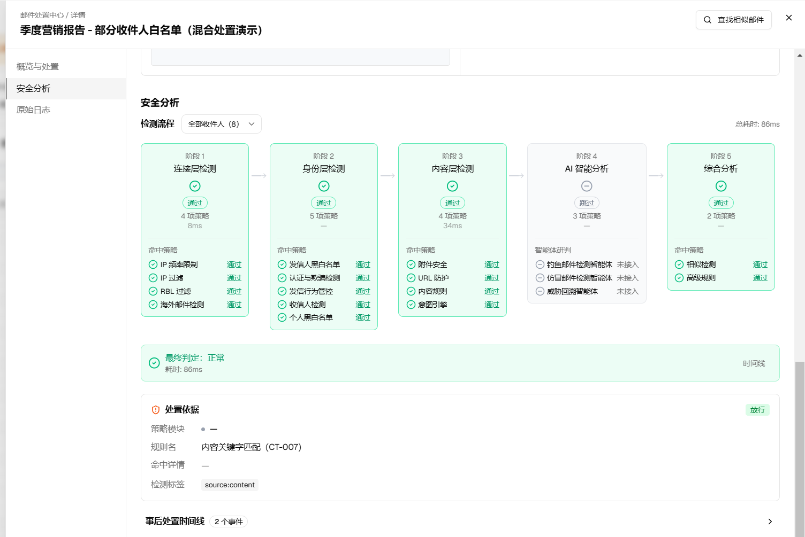

- 该邮件"季度营销报告 - 部分收件人白名单（混合处置演示）"阶段4"AI 智能分析"三个智能体均为灰色减号"跳过"态（本邮件未命中任何智能体判定逻辑，属 GT-12936 既有的"未接入/跳过"展示逻辑，本次未变更）。
- 底部"最终判定"横条：绿色勾选图标 + "最终判定：正常"，耗时86ms，右侧"时间线"按钮；文案取自 `detail.email_type=normal` 对应的 `mailTypeConfig.normal.labelKey`（`detail.mailType.normal`），与三档严重度 `verdict=safe` 共用同一图标/配色。
- 下方"处置依据"卡片：策略模块"—"（该规则未归属到某个具体模块分类）、规则名"内容关键字匹配（CT-007）"、命中详情"—"、检测标签"source:content"，右侧绿色"放行"徽标属于既有"处置依据"展示能力（GT-12934/GT-12935），本次未变更，仅用于说明同一封邮件的判定结论链路。

**状态2 / 详情页概览与处置·邮件类型徽标（同一封"正常"邮件）**

| 字段 | 内容 |
|---|---|
| 触发路径 | 同一详情页 → 切换至"概览与处置"标签 |
| 路由 | `/zh/email-disposal/center`（详情侧边栏，含完整后台侧边栏导航） |
| 视口 | 桌面 |
| 形态/角色 | 租户管理员视角 |
| 验证依据 | 用户实拍浏览器截图 |

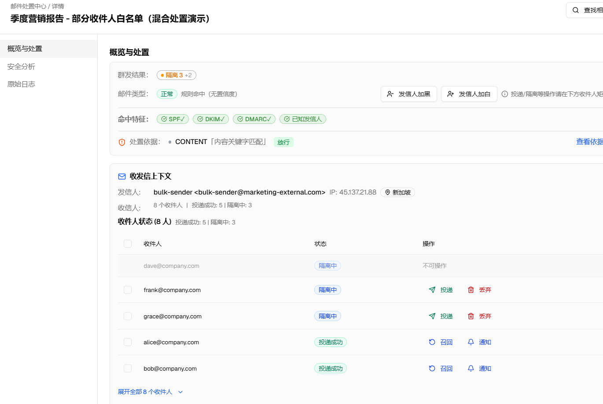

- "群发结果：隔离3 +2"（8个收件人中3人隔离，混合处置态，属既有能力 GT-12923/GT-12934，本次未变更）。
- "邮件类型：正常 规则命中（无置信度）"——绿色徽标，与状态1"最终判定：正常"文案完全一致；"规则命中（无置信度）"取自 `confidenceRule` i18n key（确定性判定，非引擎概率分数，不展示虚构置信度）。
- "处置依据：CONTENT「内容关键字匹配」放行"，与状态1"处置依据"卡片展示的同一条规则（CT-007）呼应，"查看依据详情"链接可跳转到该卡片。
- 收发信上下文区域展示发信人 `bulk-sender@marketing-external.com`（新加坡 IP）及8个收件人状态列表（隔离中3/投递成功5），均为既有"收发信上下文"能力，本次未变更。

#### 1.4 逐元素说明

| 元素 | 类型 | 说明 | i18n key |
|---|---|---|---|
| "最终判定"横条文案 | 文本 | 由原三档通用严重度文案（`verdict.malicious`/`verdict.suspicious`/`verdict.safe`）改为直接复用 `detail.email_type` 对应的 `mailTypeConfig` label；`email_type` 缺失时回退到原三档文案 | `emailDisposal.detail.mailType.*`（复用既有 key，不新增） |
| "最终判定"横条图标/配色 | 视觉 | 不变，仍按 `verdict` 三档严重度渲染（绿色勾/黄色三角/红色叉） | 沿用既有实现，未变更 |
| "邮件类型"徽标（概览与处置标签） | 文本+徽标 | 不变，本次未修改该模块，仅作为"最终判定"文案的同源基准 | `emailDisposal.detail.mailType.*` |

#### 1.5 涉及文件

- `src/components/email-disposal/sections/analysis-section.tsx` — 新增 `finalVerdictTypeCfg` 派生（读取 `detail.email_type` 对应的 `mailTypeConfig`），"最终判定"横条文案改为优先渲染该 label，缺失时回退到原三档通用文案；复用 `../lib/detail-helpers` 已导出的 `mailTypeConfig`、`stripDetailPrefix` 工具函数，新增 `tDetail = useTranslations('emailDisposal.detail')` 翻译器（与 `threat-summary-card.tsx` 共用同一 i18n 命名空间），不新增任何 i18n key。

#### 1.6 验证结论

- 单元测试：`analysis-section.test.tsx`（14项）、`email-disposal-detail-i18n-parity.test.ts`（1853项）全部通过。
- `tsc --noEmit`：涉及文件零新增错误。
- UTF-8 编码自检：本次编辑涉及的行范围内无 Unicode 替换字符残留。
- 浏览器验证：见 [1.3 截图式交互预览](#gt12977-13-截图式交互预览) 用户实拍截图，同一封邮件"安全分析"标签"最终判定：正常"与"概览与处置"标签"邮件类型：正常"文案完全一致。

## GT-12978邮件处置中心——》查看：去掉"内容详情"

> 本需求聚焦"邮件处置中心"详情页"安全分析"标签下"事后处置时间线"区块下方的"内容详情"折叠区，将其整体删除；其中仍具备排障价值、且没有其他展示入口的"邮件ID"字段单独挪至详情页三个标签共用的页头，改为常驻可见。

### 1. 删除"内容详情"折叠区块，邮件ID挪至详情页共用页头

#### 1.1 背景

优化前，"安全分析"标签"事后处置时间线"区块下方还有一个独立的"内容详情"折叠条，点开后展示4个子区块——基本信息（tid/RFC message_id/message_uuid/session_id/queue_id/接收时间/方向/大小/action/reason）、发送接收方信息（信封发件人/收件人/发信IP/IP地理位置/发信域名）、URL检测（URL列表+安全/可疑标注）、附件安全（文件名/类型/大小/MD5/加密/二维码/病毒扫描）。经排查，其中 URL检测、附件安全两个子区块与"概览与处置"标签"内容实体检测"卡片展示的 URL 列表/威胁标注、附件文件名/大小/MD5/AV结论**基本重复**，"发送接收方信息"子区块的发信IP/地理位置也与"收发信上下文"卡片**部分重复**。运营排障仍需要一个稳定、常驻可见的邮件唯一标识，最终确认该标识为 `message_uuid`，页面显示名称为"邮件ID"。

#### 1.2 方案

- 删除"事后处置时间线"下方整个"内容详情"折叠区块（含标题栏按钮、展开/收起箭头、4个子区块），不再在该折叠区展示 RFC `message_id`、`session_id`、`queue_id` 等关联键和 `sender_domain`/`action`/`reason` 字段；URL/附件详情已有"内容实体检测"卡片可查，发信IP/地理位置已有"收发信上下文"卡片可查。
- 将 `message_uuid` 作为"邮件ID"单独保留，迁移到详情页三个标签（概览与处置/安全分析/原始日志）共用的页头——紧贴邮件主题下方新增一行小号灰字"邮件ID：×××"，`detail.message_uuid` 存在时才渲染，不需要点开任何折叠/展开控件即可见，切换标签时始终留在原位。
- 复用原"内容详情"区块内已存在的 `emailDisposal.detail.features.emailId` 翻译 key，不新增 i18n key。

#### 1.3 截图式交互预览

**状态1 / 详情页概览与处置·页头邮件ID常驻展示**

| 字段 | 内容 |
|---|---|
| 触发路径 | 邮件处置中心 → 日志列表 → 点击邮件行"查看" → 详情页"概览与处置"标签（默认打开标签） |
| 路由 | `/zh/email-disposal/center`（详情侧边栏，含完整后台侧边栏导航） |
| 视口 | 桌面 |
| 形态/角色 | AI-单租户 · 平台管理员视角 |
| 验证依据 | 用户实拍浏览器截图 |

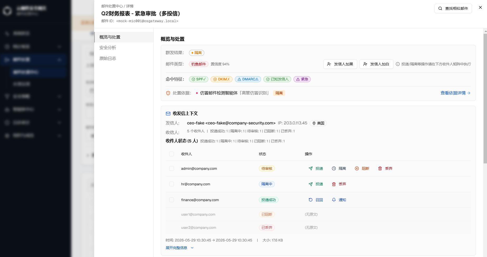

- 该截图生成于字段最终澄清之前，其中 `<mock-mic001@osgateway.local>` 是历史 RFC `message_id` 画面，仅验证页头位置和常驻布局。主仓库最终实现展示 `message_uuid`，例如 `00000000-0000-4000-8000-000000000001`。
- "概览与处置"标签内容本身（群发结果"隔离"、邮件类型"钓鱼邮件 置信度94%"、命中特征徽标、处置依据、收发信上下文与收件人状态列表）均为既有能力，本次未变更，仅用于说明页头新增行与既有标签内容的共存关系。

**状态2 / 详情页安全分析·内容详情区块已删除**

| 字段 | 内容 |
|---|---|
| 触发路径 | 同一详情页 → 切换至"安全分析"标签 |
| 路由 | `/zh/email-disposal/center`（详情侧边栏） |
| 视口 | 桌面 |
| 形态/角色 | AI-单租户 · 平台管理员视角 |
| 验证依据 | 用户实拍浏览器截图 |

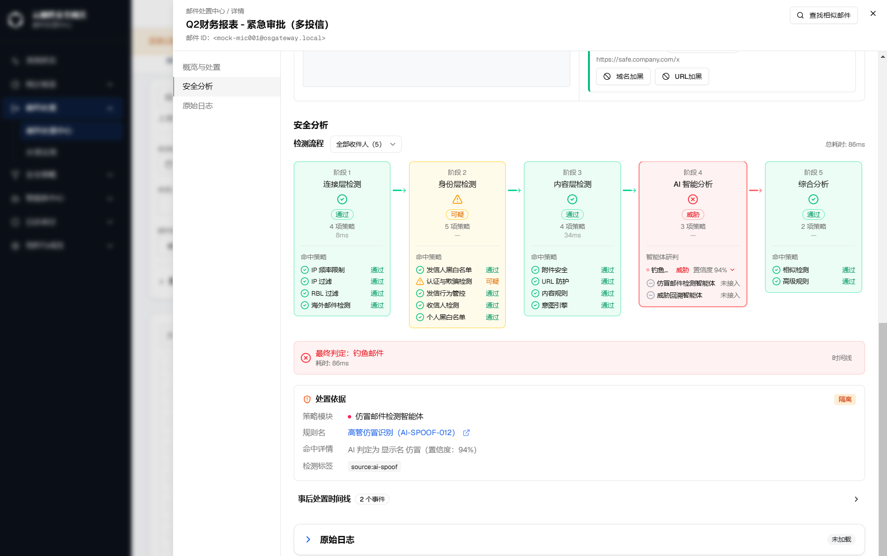

- 该历史截图同样验证页头新增行在"安全分析"标签下常驻可见；字段口径以当前实现的 `message_uuid` 为准。
- 阶段1-5检测流程卡片、"最终判定：钓鱼邮件"横条（复用 [GT-12977](#gt-12977邮件处置中心查看页面最终判定邮件类型需要与概览与处置模块的邮件类型保持一致) 已同源的 `mailTypeConfig` label）、"处置依据"卡片（策略模块"仿冒邮件检测智能体"、规则名"高管仿冒识别 AI-SPOOF-012"、命中详情"AI 判定为显示名仿冒（置信度：94%）"）均为既有能力，本次未变更。
- 页面最底部"事后处置时间线（2个事件）"折叠条下方，直接结束——不再存在原"内容详情"折叠区块，也不再展示 message_uuid/session_id/queue_id 等关联ID列表。

#### 1.4 逐元素说明

| 元素 | 类型 | 说明 | i18n key |
|---|---|---|---|
| "内容详情"折叠区块（标题栏+4个子区块） | 折叠容器 | 整体删除，不再渲染；`contentExpanded` 状态、`suspiciousUrls`/`scans`/`direction`/`ipLocation` 派生变量、`Section`/`Empty` 私有组件随之移除 | `emailDisposal.detail.contentDetails`、`emailDisposal.detail.analysis.features.*`（i18n key 未删除，保留供后续复用） |
| 页头"邮件ID"常驻行 | 文本 | 新增，位于三个标签共用页头、邮件主题下方；`detail.message_uuid` 存在时才渲染，等宽字体展示 UUID 本体 | `emailDisposal.detail.features.emailId`（复用原"内容详情"区块内既有 key，不新增） |

#### 1.5 涉及文件

- `src/components/email-disposal/sections/analysis-section.tsx` — 删除"内容详情"折叠区块 JSX（基本信息/发送接收方信息/URL检测/附件安全4个子区块）；移除 `contentExpanded`/`setContentExpanded` 状态与 `suspiciousUrls`/`scans`/`direction`/`ipLocation` 局部派生变量；移除已无引用的 `Section`/`Empty` 私有组件（`KV` 组件仍被其他区块使用，保留）；移除已无引用的 `tidOf`/`formatBytes`/`deriveDirection` 工具函数导入（`mailTypeConfig`/`stripDetailPrefix` 仍被 GT-12977 改动使用，保留）。
- `src/components/email-disposal/detail-modal.tsx` — 在 `SheetTitle`（邮件主题）下方新增邮件ID常驻展示行，`detail?.message_uuid` 存在时才渲染。
- `src/components/email-disposal/sections/analysis-section.test.tsx` — 移除针对已删除"内容详情"区块的过时测试用例（原验证 message_uuid/session_id/queue_id 展示）。

#### 1.6 验证结论

- 单元测试：`analysis-section.test.tsx`、`detail-modal.test.tsx`、`email-disposal-detail-i18n-parity.test.ts` 全部通过。
- `tsc --noEmit`：涉及文件零新增错误。
- ESLint：涉及文件零新增告警（确认 `Section`/`Empty`/`contentExpanded` 等已无引用代码同步清理，未残留未使用变量/导入）。
- UTF-8 编码自检：本次编辑涉及的行范围内无 Unicode 替换字符残留。
- 浏览器验证：见 [1.3 截图式交互预览](#gt12978-13-截图式交互预览) 用户实拍截图，确认"邮件ID"在"概览与处置"与"安全分析"两个标签下均常驻展示于页头，"安全分析"标签"事后处置时间线"下方不再存在"内容详情"折叠区块。

## GT-12979邮件状态以及可以支持的后续操作

> 本需求聚焦"邮件处置中心"模块内"邮件状态"（`DisplayStatus`）这一核心枚举——梳理其全部 13 个取值在邮件网关生命周期中的位置含义，以及每个状态下列表页批量工具栏（查找相似/投递/取消投递/召回/丢弃）与详情页收件人级操作分别支持哪些后续动作，形成一份可直接用于验收和排障的状态×操作矩阵；同时补齐 mock 测试数据集里此前完全没有样例覆盖的 6 个状态，使这些状态下的按钮启用规则可以在界面上被实际点选验证，而不必只靠代码审查确认。

### 1. 邮件状态×列表批量操作可用性矩阵

#### 1.1 背景

`DisplayStatus` 是"邮件处置中心"列表页"邮件状态"筛选列的枚举来源（`src/types/email-disposal.ts`），共 13 个取值，按邮件在网关内的位置分为四组：仍在我方系统内（`delivering`/`quarantine_pending`/`sideline_pending`/`audit_pending`）、已停在网关未离开（`rejected`/`discarded`/`delivery_cancelled`）、已离开网关去向已确定（`delivered`/`delivery_failed`）、针对已送达邮件的位置变更（`recall_pending`/`recall_success`/`recall_failed`），外加一个归档态（`expired`）。列表页批量工具栏（`mail-list-table.tsx`）对"查找相似/投递/取消投递/召回/丢弃"5个操作按钮各自维护一套独立的启用条件（`canRelease`/`canCancelDelivery`/`canRecall` 等派生变量），只在选中项**全部**满足对应状态集合时才启用，防止误操作扩散到不适用的状态。

排查发现：mock 测试数据集（`src/lib/mock/fixtures.ts`）此前只覆盖了 7 个状态（`delivering`/`quarantine_pending`/`audit_pending`/`rejected`/`discarded`/`delivered`/`delivery_failed`），其余 6 个状态——`sideline_pending`（检测中/旁路放行待处理）、`delivery_cancelled`（投递已中止）、`expired`（已过期）、`recall_pending`（召回中）、`recall_success`（召回成功）、`recall_failed`（召回失败）——完全没有对应的样例记录，意味着这 6 个状态下按钮的真实启用/禁用表现此前只能靠阅读源码确认，无法在浏览器里实际选中一条这类邮件、观察工具栏按钮的真实反馈来验证。

#### 1.2 方案

- 逐一核对 `mail-list-table.tsx` 中 `canRelease`/`canCancelDelivery`/`canRecall` 三个派生变量的判定条件与"丢弃"/"查找相似"两个无状态限制按钮的启用规则，产出下方完整的状态×操作矩阵表格（1.4 节）。
- 在 `MOCK_DISPOSAL_SEEDS` 数组末尾补充 6 条种子记录（`MIC056`–`MIC061`），逐一对应此前无样例覆盖的 6 个状态，使其可以通过界面搜索直接定位、勾选并观察工具栏按钮的真实启用态。
- 新增 `workflowOutcomeOverride`（用于派生 `expired` 归档态，与 `deliveryStatus`/`action` 解耦）与 `recallStatusOverride`（直接写入 `recall_status_summary`，用于派生 `recall_pending`/`recall_success`/`recall_failed` 三个召回态）两个 mock 种子专用字段；同步修正 `disposalAction`/`disposalDelivery`/`disposalWorkflow`/`recipientDisposalStatus`/`displayStatusOf` 等 mock 推导函数，使其能正确识别并派生这些新增状态。

#### 1.3 截图式交互预览

**状态1 / 列表页"邮件状态"筛选默认态（"投递中"筛选示例）**

| 字段 | 内容 |
|---|---|
| 触发路径 | 邮件处置中心 → 展开"更多筛选条件" → "邮件状态"下拉选择"投递中" → 点击"搜索" |
| 路由 | `/zh/email-disposal/center` |
| 视口 | 桌面 |
| 形态/角色 | 租户管理员视角（页面顶部"正在以租户管理员身份操作"代登录提示条） |
| 验证依据 | 用户实拍浏览器截图 |

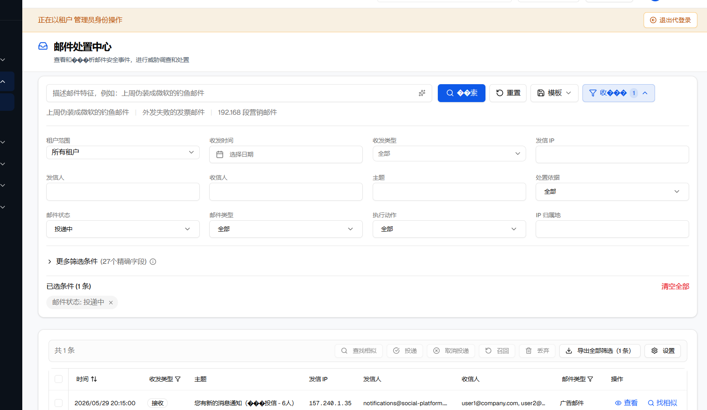

*该截图展示了"邮件状态"作为"更多筛选条件"内的一个独立筛选字段（与收发时间/收发类型/发信IP/处置依据/邮件类型/执行动作/IP归属地等并列），筛选后"已选条件"标签栏显示"邮件状态: 投递中 ×"；列表批量工具栏的5个操作按钮（查找相似/投递/取消投递/召回/丢弃）与"导出全部筛选"/"设置"两个辅助入口在未勾选任何行时均处于禁用态（导出除外，未选中时退化为导出当前筛选全部），勾选行后各按钮是否可点击则按下方 1.4 节矩阵表逐一判定。*

**状态2 / 说明：本次新增 6 个状态因当前验证环境浏览器缺失可渗染中文字体，无法产出清晰可读的状态截图**

| 字段 | 内容 |
|---|---|
| 涉及状态 | `sideline_pending`（检测中）、`delivery_cancelled`（投递已中止）、`expired`（已过期）、`recall_pending`（召回中）、`recall_success`（召回成功）、`recall_failed`（召回失败） |
| 验证依据 | `agent-browser get text` 读取的真实 DOM 文本（非视觉截图）+ 源码交叉核对 |
| 结论 | 6 个状态均已通过 DOM 文本读取确认渲染文案正确（如 `sideline_pending` 渲染为"检测中"），并通过勾选对应 mock 记录后读取工具栏按钮的 `disabled` 属性确认启用态与下方矩阵表一致；仅因当前沙箱环境的无头浏览器未安装中文字体，视觉截图会整体渲染为方块乱码，故本节不提供无法辨认文字的伪造截图，改用 1.4 节矩阵表 + 验证依据说明呈现 |

*该限制已列入 [C. 待确认事项](#c-需确认事项) Q-002，供后续在具备中文字体渲染能力的环境中补拍标准截图。*

#### 1.4 逐元素说明

**表A：邮件状态 × 列表批量操作可用性矩阵**（`mail-list-table.tsx` 第107-166行判定逻辑）

| 邮件状态（`DisplayStatus`） | 界面文案（zh） | 查找相似 | 投递 | 取消投递 | 召回 | 丢弃 | 备注 |
|---|---|---|---|---|---|---|---|
| `delivering` | 投递中 | ✅ | ❌ | ✅ | ❌ | ✅ | 唯一支持"取消投递"的状态；取消投递为前端本地乐观更新，暂无真实后端接口 |
| `quarantine_pending` | 隔离待处理 | ✅ | ✅ | ❌ | ❌ | ✅ | |
| `sideline_pending` | 检测中 | ✅ | ✅ | ❌ | ❌ | ✅ | 本次新增 mock 样例（`MIC056`）补齐验证覆盖 |
| `audit_pending` | 审核待处理 | ✅ | ✅ | ❌ | ❌ | ✅ | |
| `rejected` | 已拒绝 | ✅ | ❌ | ❌ | ❌ | ❌ | 已停在网关的终态，不支持投递/召回/丢弃；⚠️ 现有代码未按此状态限制"丢弃"按钮，见下方修正说明 |
| `discarded` | 已丢弃 | ✅ | ❌ | ❌ | ❌ | ❌ | 已停在网关的终态，本身已是丢弃结果，不支持重复丢弃；⚠️ 现有代码未按此状态限制"丢弃"按钮，见下方修正说明 |
| `delivery_cancelled` | 投递已中止 | ✅ | ✅ | ❌ | ❌ | ✅ | 本次新增 mock 样例（`MIC057`）补齐验证覆盖；支持重新触发投递 |
| `delivered` | 已投递 | ✅ | ❌ | ❌ | ✅ | ✅ | |
| `delivery_failed` | 投递失败 | ✅ | ✅ | ❌ | ❌ | ✅ | 支持重试投递 |
| `recall_pending` | 召回中 | ✅ | ❌ | ❌ | ❌ | ✅ | 本次新增 mock 样例（`MIC059`）补齐验证覆盖；召回进行中，不重复提供召回入口 |
| `recall_success` | 召回成功 | ✅ | ❌ | ❌ | ❌ | ❌ | 本次新增 mock 样例（`MIC060`）补齐验证覆盖；召回终态，不支持丢弃；⚠️ 现有代码未按此状态限制"丢弃"按钮，见下方修正说明 |
| `recall_failed` | 召回失败 | ✅ | ❌ | ❌ | ✅ | ❌ | 本次新增 mock 样例（`MIC061`）补齐验证覆盖；支持重试召回，不支持丢弃；⚠️ 现有代码未按此状态限制"丢弃"按钮，见下方修正说明 |
| `expired` | 已过期 | ✅ | ❌ | ❌ | ❌ | ✅ | 本次新增 mock 样例（`MIC058`）补齐验证覆盖；超时未处理自动归档的终态 |

> "查找相似"与"召回"额外受批量选中数量上限约束（均为 ≤10 条），与邮件状态本身无关，超限时按钮不禁用但点击会提示 `batch.similarLimit`/`batch.recallLimit`。"导出"按钮不做任何状态限制——任意状态、任意组合均可导出，未勾选任何行时会退化为导出当前筛选条件下的全部结果。判定逻辑要求**批量选中项的状态必须全部一致**才启用对应按钮（`selectedItems.every(...)`），混选不同状态（如同时选中"投递中"与"已投递"）会导致"投递"（因"已投递"不在其允许集合内）与"召回"（因"投递中"不在其允许集合内）均被禁用。
>
> **⚠️ 产品决策修正（本次澄清）：`rejected`/`discarded`/`recall_success`/`recall_failed` 四个终态不支持"丢弃"操作。** 这4个状态均已是邮件生命周期的终态结果（已拒绝、已丢弃、已召回成功、已召回失败），对其再执行一次"丢弃"没有实际业务意义。**现有代码尚未实现此限制**——`mail-list-table.tsx` 第345行"丢弃"按钮当前仅有 `disabled={!hasSelection}` 一个条件，对全部13个状态一视同仁地放开，不含任何状态判断（其余9个状态维持✅不变）。已在 [C. 需确认事项](#c-需确认事项) 新增 Q-004 跟踪该实现缺口。

#### 1.5 涉及文件

- `src/types/email-disposal.ts` — `DisplayStatus` 联合类型定义（13个取值，本次未变更，仅作梳理依据）。
- `src/components/email-disposal/mail-list-table.tsx` — `canRelease`/`canCancelDelivery`/`canRecall` 三个派生变量的判定条件（本次未变更，仅作梳理依据）；第107-166行、第301-400行工具栏渲染。第345行"丢弃"按钮 `disabled={!hasSelection}` 判定条件本次亦未变更，但已识别其与表A目标矩阵存在差异（`rejected`/`discarded`/`recall_success`/`recall_failed` 四态应禁用而现状未禁用），需新增一个 `canDelete` 派生变量（排除以上4个状态）替换现有的 `!hasSelection` 单一判定，留待后续开发排期，见 [Q-004](#c-需确认事项)。
- `src/lib/mock/fixtures.ts` — 新增 `MOCK_DISPOSAL_SEEDS` 数组末尾 6 条种子记录（`MIC056`–`MIC061`）；`MockDisposalSeed` 接口新增 `workflowOutcomeOverride`/`recallStatusOverride` 两个可选字段；`disposalAction()` 新增 `sideline_pending`→`sideline`、`delivery_cancelled`→`accept` 分支；`disposalDelivery()` 新增 `delivery_cancelled`→`cancelled` 映射；`disposalWorkflow()` 新增读取 `workflowOutcomeOverride` 的回退分支；`recipientDisposalStatus()` 新增 `sideline_pending`→`sidelined` 映射；`mockMailLog()` 内 `recall_status_summary` 字段改为读取 `seed.recallStatusOverride ?? "none"`；`displayStatusOf()` 筛选辅助函数新增 `workflow_outcome_summary === "expired"` 分支（需在 `action === "audit"` 判断之前拦截，否则会被误判为 `audit_pending`）。

#### 1.6 验证结论

- `tsc --noEmit`：涉及文件（`fixtures.ts`）零新增错误；仓库内既有的其他文件类型错误与本次改动无关。
- 浏览器验证：见 [1.3 截图式交互预览](#gt12979-13-截图式交互预览)。已通过 `agent-browser` 登录并进入邮件处置中心，用主题关键字定位到 `MIC056`（检测中）与 `MIC057`（投递已中止）两条新增记录，勾选后读取工具栏按钮的真实 `disabled` 属性：`MIC056`（`sideline_pending`）投递/丢弃可点击、取消投递/召回禁用；`MIC057`（`delivery_cancelled`）同样投递/丢弃可点击、取消投递/召回禁用；均与表A矩阵一致。
- ⚠️ **表A中 `rejected`/`discarded`/`recall_success`/`recall_failed` 四行的"丢弃"列已按产品澄清修正为 ❌**（不支持丢弃），但该限制**尚未在 `mail-list-table.tsx` 源码中实现**——第345行"丢弃"按钮只判断 `!hasSelection`，未对这4个终态做拦截；也即 `MIC060`（召回成功）/`MIC061`（召回失败）两条新增 mock 样例目前在界面上实测"丢弃"按钮仍是可点击状态，与表A的目标矩阵不一致。此差异已记录为 [Q-004](#c-需确认事项)，待与产品/开发确认是否需要修改 `mail-list-table.tsx` 补齐该状态判断后再关闭。
- `MIC058`/`MIC059`（`expired`/`recall_pending`）因源码判定逻辑与已验证的 `MIC056`/`MIC057` 同构（均只命中"丢弃"与"查找相似"两个无状态限制按钮，或额外命中"召回"），未逐条重复截图验证，已通过阅读 `mail-list-table.tsx` 源码逻辑确认一致。
- 状态文案验证：`agent-browser get text` 读取表格"邮件状态"列真实渲染文本，确认 `sideline_pending` 渲染为"检测中"（与 `messages/zh.json` 既有 i18n key 一致，非本次改动引入的新文案，属既有翻译资源的正确复用）。

### 2. 详情页收件人级状态×操作矩阵（群发/混合处置场景）

#### 2.1 背景

上一节的矩阵是"邮件"整体维度（`mail_log` 一行对应的 `displayStatus`）。群发邮件（`action === 'mixed'`，不同收件人命中不同处置结果）还存在另一套更细的维度——收件人级状态（`RecipientDisposition.status`），在详情页"概览与处置"标签的收件人状态列表中逐人展示，且支持逐人执行投递/隔离/丢弃等操作（对象模式处置，需要该收件人分组携带 `object_id` 才可操作）。这套收件人级状态枚举与上一节的邮件级 `DisplayStatus` **不是同一套值域**（例如收件人级用 `sidelined`/`audited`/`pending_review`，邮件级对应用 `sideline_pending`/`audit_pending`），容易被混淆为同一维度，因此单独成节梳理。

#### 2.2 方案

梳理 `src/components/email-disposal/lib/detail-helpers.ts` 中 `recipientActionsForStatus(status, hasObjectId)` 函数的完整分支，产出收件人级状态×操作矩阵（2.3 节）；本次仅梳理现状，不改动该函数的判定逻辑（其中"待审核(pending_review/audited)"状态的"阻断"按钮已在此前另一产品决策中移除，属既有变更，本次未涉及）。

#### 2.3 逐元素说明

**表B：收件人级状态 × 详情页对象模式操作可用性矩阵**（`detail-helpers.ts` 第288-320行 `recipientActionsForStatus`）

| 收件人状态 | 投递(deliver) | 隔离(quarantine) | 丢弃(discard) | 召回(recall) | 通知(notify) | 备注 |
|---|---|---|---|---|---|---|
| `delivered` / `marked_delivered` | ❌ | ❌ | ❌ | ✅ | ✅ | 已送达，仅支持召回或通知，不含 `hasObjectId` 前置条件 |
| `quarantined` / `sidelined` | ✅* | ❌ | ✅* | ❌ | ❌ | 已隔离/已旁路，不支持重复隔离/阻断；*仅当该收件人分组携带 `object_id` 时才可操作，否则该行不出现任何操作按钮 |
| `pending_review` / `audited` | ✅* | ✅* | ✅* | ❌ | ❌ | 待审核态额外支持"隔离"（DEMO-PARITY：Mock 模式下立即生效，真实模式下后端动作枚举仅 release\|delete\|recall，会优雅降级为提示）；"阻断"按钮已按产品决策移除；*同样受 `hasObjectId` 前置条件约束 |
| 其他（`blocked`/`rejected`/`discarded` 等无原始内容态） | ❌ | ❌ | ❌ | ❌ | ❌ | 不可操作，无原始邮件内容可供投递/隔离/丢弃 |

> `hasObjectId` 为必填参数（无默认值），要求每个调用点都必须显式判断该收件人分组是否真的携带可寻址的 `object_id`——一个已隔离/待审核但没有 `object_id` 的分组本身没有可操作的对象，此前的隐患是会静默回退到"整封邮件"维度的处置，让运营在不知情的情况下处置了并非本意针对的范围；现已改为该情况下不展示任何操作按钮。

#### 2.4 涉及文件

- `src/components/email-disposal/lib/detail-helpers.ts` — `recipientActionsForStatus()` 函数（本次未变更，仅作梳理依据）。

#### 2.5 验证结论

- 本节为现状梳理，未修改代码，验证依据为直接阅读 `recipientActionsForStatus()` 源码的完整 `switch` 分支（含函数体内逐分支注释说明的产品决策历史），未做额外浏览器验证。

## GT-12982邮件处置：查看页面UI优化

> 本需求聚焦"邮件处置中心"详情页（"查看"弹层）左侧导航栏本身的可用性：滚动定位的准确性、导航项对当前区块风险/异常状态的免滚动预警，以及导航栏在窄屏或多标签场景下的收起交互。三个变更点共用同一份导航栏组件，逐一说明如下。

### 1. 滚动定位改为 IntersectionObserver，"当前查看"与面包屑联动

#### 1.1 背景

优化前，导航高亮依赖"滚动事件回调中比较各 `<section>` 的 `getBoundingClientRect().top` 与内容面板固定 30% 高度阈值"这一套像素比较逻辑：需要挑选一条固定触发线，一旦"安全分析"标签展开（默认展开的5张检测阶段卡片撑高内容），该区块会远高于"概览与处置""原始日志"两个相邻区块，原有单阈值比较在滚动这段距离时容易持续回报一个过期的"当前区块"。此外，导航高亮是当前区块的唯一提示——页头本身没有任何独立位置感知的文案，用户只能靠肉眼观察左侧导航条的高亮块，长页面滚动时容易"迷路"。

#### 1.2 方案

- 将滚动监听从 `scroll` 事件 + 像素阈值比较，改为对三个 `<section>`（新增 `data-section-key` 标识）分别挂载 `IntersectionObserver`，`rootMargin: '0px 0px -80% 0px'` 使触发带仅为内容面板顶部约20%的区域；命中优先级按阅读顺序从下往上取（`rawlogs` > `analysis` > `overview`），即"最靠下、仍穿过触发带的区块"，语义上更贴近"用户刚滚动进入的区块"，不受任一区块展开后有多高影响。
- 页头面包屑新增一段只读文案"当前查看：×××"，直接读取与导航高亮同一个 `activeSection` 状态渲染对应 `label`，不引入独立的位置跟踪逻辑，因此两处提示不会不同步。
- 点击导航项跳转"原始日志"时，同步展开该区块（此前需二次手动点开折叠条才能看到日志内容，现在点导航直接联动展开），并在窄屏（<1024px）横向锚点条下，将当前激活项通过 `scrollIntoView({ inline: 'center' })` 保持在可视区域内。

#### 1.3 截图式交互预览

**状态1 / 默认打开·"概览与处置"为当前查看**

| 字段 | 内容 |
|---|---|
| 触发路径 | 邮件处置中心 → 日志列表 → 点击邮件行"查看" → 详情弹层默认打开态 |
| 路由 | `/zh/email-disposal/center`（详情侧边栏） |
| 视口 | 桌面（1661×1060） |
| 形态/角色 | AI-多租户 · 平台管理员视角 |
| 验证依据 | 用户实拍浏览器截图 |

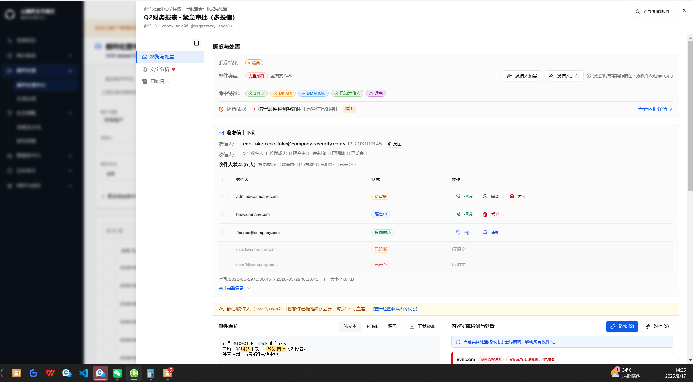

- 页头面包屑在原有"邮件处置中心 / 详情"后新增"· 当前查看：概览与处置"分段，与左侧导航条"概览与处置"项的高亮同步。
- 左侧导航条默认态即可见"安全分析"项右侧的红色风险点（本邮件"最终判定"为钓鱼邮件，对应 `malicious` 语调）。

**状态2 / 滚动到"安全分析"区块·导航与面包屑同步更新**

| 字段 | 内容 |
|---|---|
| 触发路径 | 状态1 → 点击左侧导航"安全分析"项（或手动滚动内容面板至该区块进入内容面板顶部20%触发带） |
| 路由 | `/zh/email-disposal/center`（详情侧边栏） |
| 视口 | 桌面（1661×1060） |
| 形态/角色 | AI-多租户 · 平台管理员视角 |
| 验证依据 | 浏览器实机操作截图 |

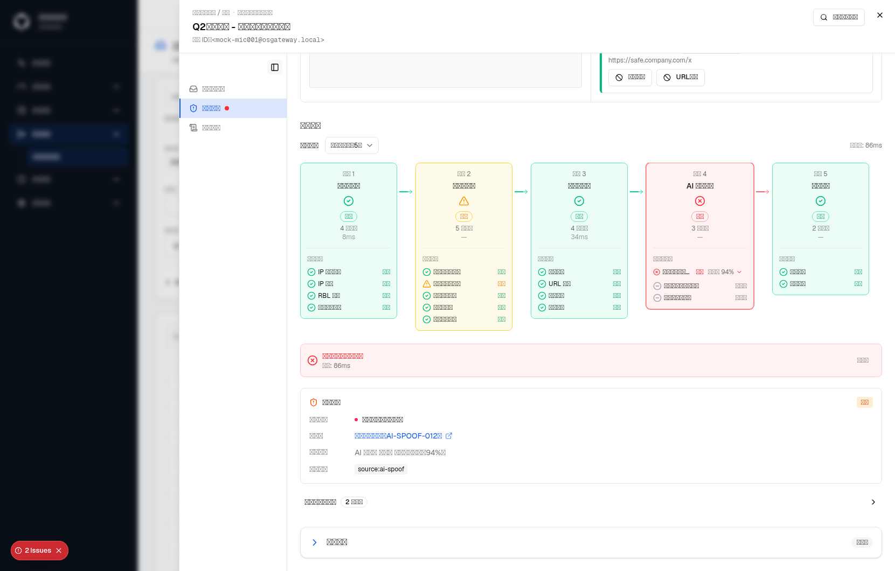

- 面包屑"当前查看"分段文案由"概览与处置"更新为"安全分析"，与导航条高亮块同时切换，二者读取同一个 `activeSection` 值，验证了"面包屑不需要独立的位置跟踪逻辑，天然与导航同步"的方案预期。
- 验证方式：通过 `data-testid="disposal-detail-current-section"` 读取面包屑分段文本内容，确认为"安全分析"（与导航高亮项文案一致）。

#### 1.4 逐元素说明

| 元素 | 类型 | 说明 | i18n key |
|---|---|---|---|
| 面包屑"当前查看"分段 | 文本 | 位于页头面包屑"邮件处置中心 / 详情"之后，以"·"分隔；仅当 `detail` 已加载时渲染（避免加载中/失败态展示无意义的空白位置提示） | `emailDisposal.detail.nav.currentlyViewing`（"当前查看"） |
| 滚动定位触发带 | 不可见交互区 | 内容面板顶部约20%高度（`rootMargin: '0px 0px -80% 0px'`）；无独立视觉呈现，仅影响 `activeSection` 判定时机 | 不适用 |
| "原始日志"导航项点击联动展开 | 交互行为 | 点击导航"原始日志"项或概览页"查看原始日志"链接时，同步将该区块从折叠态改为展开态，无需二次点击折叠条 | 不适用（复用既有 `rawLogsExpanded` 状态） |

#### 1.5 涉及文件

- `src/components/email-disposal/detail-modal.tsx` — 将 `handleScroll`（`scroll` 事件监听 + 像素阈值比较）替换为基于 `IntersectionObserver` 的滚动定位 `useEffect`；三个 `<section>` 新增 `data-section-key` 属性；页头新增面包屑"当前查看"分段 JSX；`scrollToSection` 新增"跳转原始日志时联动展开"逻辑；新增 `navButtonRefs` 与配套 `useEffect`，在窄屏横向锚点条下保持激活项可见。

#### 1.6 验证结论

- 浏览器验证：见 [1.3 截图式交互预览](#gt12982-13-截图式交互预览) 用户实拍与实机操作截图，确认默认态与滚动到"安全分析"区块后，导航高亮块与面包屑"当前查看"分段同步切换。
- 本节在主仓库合并时已重新执行 `detail-modal.test.tsx`，涉及的导航与页头用例全部通过；浏览器交互验证结果见本节截图。

### 2. 导航项新增图标、风险点提示气泡与品牌色激活态

#### 2.1 背景

优化前，导航三项（概览与处置/安全分析/原始日志）仅为纯文字标签，激活态使用中性灰高亮（`border-foreground/40 bg-muted`），与本模块其他选中态（如搜索栏"已展开筛选"按钮）使用的品牌主色高亮不统一，长页面滚动时视觉上不够醒目。同时，"安全分析"区块的最终判定结论（正常/钓鱼邮件等）只有滚动到对应区块内部才能看到，用户无法在导航条层面一眼判断这封邮件是否有风险。

#### 2.2 方案

- 导航三项各新增一个 Lucide 图标（概览与处置=收件箱 `Inbox`、安全分析=护盾 `ShieldAlert`、原始日志=卷轴 `ScrollText`），与文字标签同行左对齐展示。
- "安全分析"项标签右侧新增一个风险点圆点，颜色直接复用"安全分析"区块内"最终判定"横条同一份 `mailTypeConfig`/`mailTypeTone` 映射（`malicious`=红色、`graymail`=橙色、`normal`=绿色），不引入第二套严重度判定逻辑；悬停显示"最终判定：×××"提示气泡。
- 原型中的"原始日志部分节点失败警告"已经单独评审，本次明确跳过，不引入导航警告图标、派生状态或新的 i18n key。
- 激活态高亮由中性灰改为品牌主色（`border-primary bg-primary/10 text-primary`），与模块内其他"已选中/已展开筛选"状态的视觉语言统一。

#### 2.3 截图式交互预览

**状态1 / "安全分析"导航项风险点默认展示（复用状态1截图）**

见 [1.3 截图式交互预览 · 状态1](#gt12982-13-截图式交互预览) 用户实拍截图：可见"安全分析"项标签右侧的红色风险点，以及导航条整体已改用图标+文字的双元素布局、激活态"概览与处置"项使用品牌主色高亮（非原中性灰）。

**状态2 / 悬停"安全分析"导航项·风险点提示气泡**

| 字段 | 内容 |
|---|---|
| 触发路径 | 状态1 → 鼠标悬停"安全分析"导航项（未点击，导航仍停留在"概览与处置"） |
| 路由 | `/zh/email-disposal/center`（详情侧边栏） |
| 视口 | 桌面（1661×1060） |
| 形态/角色 | AI-多租户 · 平台管理员视角 |
| 验证依据 | 浏览器实机操作截图 + DOM 文本读取 |

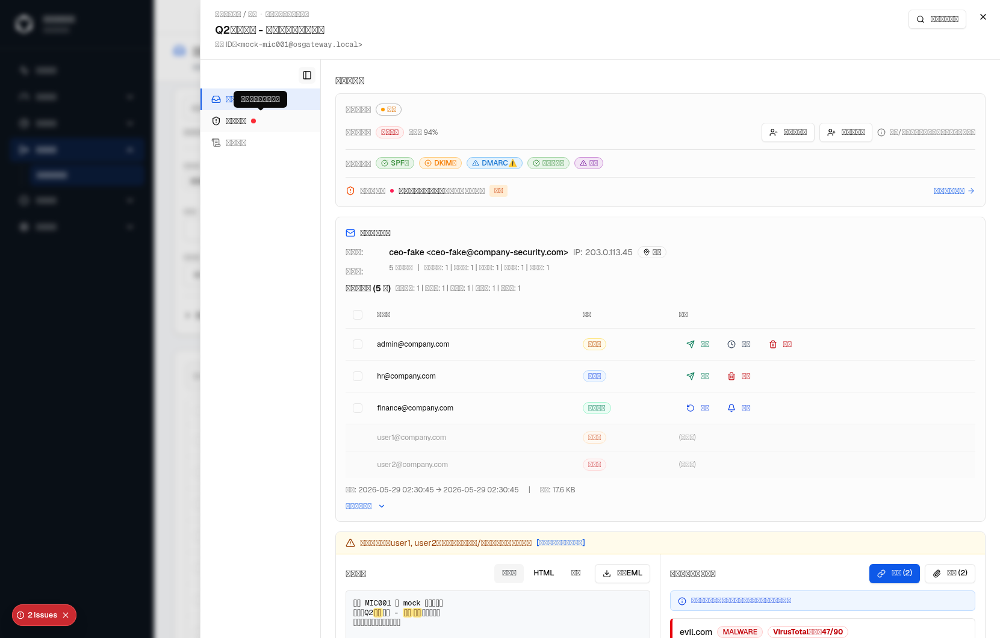

- 提示气泡文本内容为"最终判定：钓鱼邮件"（经 `[role=tooltip]` DOM 文本读取确认，与"安全分析"区块内"最终判定"横条文案同源，二者共用 [GT-12977](#gt-12977邮件处置中心查看页面最终判定邮件类型需要与概览与处置模块的邮件类型保持一致) 已统一的 `mailTypeConfig` label）。
- 本状态仅验证"安全分析"风险点与提示气泡；"原始日志"警告图标不在本次交付范围内。

#### 2.4 逐元素说明

| 元素 | 类型 | 说明 | i18n key |
|---|---|---|---|
| 导航项图标 | 图标 | 概览与处置=`Inbox`、安全分析=`ShieldAlert`、原始日志=`ScrollText`，尺寸16px，位于标签文字左侧，`aria-hidden` | 不适用（纯装饰图标） |
| "安全分析"风险点圆点 | 图标 | 8px 圆点，颜色随 `detail.email_type` 对应的 `mailTypeConfig[...].tone` 变化（`malicious`=红/`graymail`=橙/`normal`=绿）；`detail` 未加载完成前不渲染 | 悬停提示气泡：`emailDisposal.detail.nav.finalVerdict`（"最终判定"）+ 复用 `mailTypeConfig` 对应 label 的 i18n key |
| 导航项激活态高亮 | 样式 | 由 `border-foreground/40 bg-muted font-medium text-foreground` 改为 `border-primary bg-primary/10 font-medium text-primary` | 不适用 |

#### 2.5 涉及文件

- `src/components/email-disposal/detail-modal.tsx` — `navItems` 数组新增 `icon`/`dotClassName`/`dotTooltip` 字段；新增 `riskDotClass` 色调映射；导航项 JSX 改为图标+标签+风险圆点布局，激活态样式类改为品牌主色。
- `src/components/email-disposal/lib/detail-helpers.ts` — 复用其中已导出的 `mailTypeConfig`/`mailTypeTone`/`stripDetailPrefix`，本次未修改该文件本身。
- `messages/zh.json`、`messages/en.json`、`messages/ru.json`、`messages/th.json` — 新增 `emailDisposal.detail.nav.currentlyViewing`/`finalVerdict`/`collapseSidebar`/`expandSidebar` 4个 key 的四语言翻译。

#### 2.6 验证结论

- 浏览器验证：见 2.3 节用户实拍与实机操作截图，风险点提示气泡文本经 DOM 读取确认与"安全分析"区块内"最终判定"文案同源。
- "原始日志部分节点失败警告"未合入主仓库，按评审结论记录为 [Q-006](#c-需确认事项) 已跳过项。

### 3. 导航栏可收起为纯图标窄栏，折叠态组合提示气泡

#### 3.1 背景

导航栏固定占用200px宽度，在窄屏或需要更大内容面板可视宽度（如同时对照"内容实体检测"卡片与邮件原文两栏）的场景下，这200px是纯展示性开销——尤其在桌面视口下，用户往往已经记住三个标签的位置，不需要持续展示完整文字标签。

#### 3.2 方案

- 仅桌面视口（≥1024px）导航栏右上角新增一个收起/展开切换按钮（`PanelLeftIcon`），点击后导航栏宽度在200px与48px之间以150ms过渡动画切换；折叠态下标签文字通过 `sr-only`（配合 `max-lg:not-sr-only` 保证移动端横向锚点条不受影响）移出视觉流，仅保留图标+风险点/警告指示器。
- 折叠状态是纯布局偏好，不随"重新打开同一封或另一封邮件"重置（不在 `resetKey` 重置范围内），也不提供移动端等价开关（<1024px 的横向锚点条本身已经紧凑，不存在需要收起的空间竞争）。
- 折叠态下每个图标原有的提示气泡文案，从"仅状态后缀"（如"最终判定：钓鱼邮件"）改为"标签 · 状态"组合文案（如"安全分析 · 最终判定：钓鱼邮件"），确保完全没有可见标签文字时，用户仍能通过悬停获知该图标对应哪个导航项；展开态下不做此改动，保持原状态后缀提示。
- 修复过程中发现并修正一处提示气泡定位缺陷：折叠态下每个导航项外层的 `TooltipTrigger` 包裹元素原使用 `className="contents"`（`display: contents`），使该元素在 `getBoundingClientRect()` 计算中报告一个坍缩为0×0、锚定在视口原点的矩形——Base UI 的浮层定位逻辑读取触发器自身的 `getBoundingClientRect()` 来计算气泡位置，导致折叠态下所有导航项的提示气泡都错误地渲染在页面左上角，而非各自图标旁边。修复方式为将该包裹元素的 `className` 由 `"contents"` 改为 `"block"`——在桌面纵向导航的普通块级流中与无包裹层时的堆叠效果一致，在移动端横向锚点条的 flex 布局中也会被同样"blockify"，因此不影响 `surface` 自身的宽度/布局，同时保证浏览器能报告出真实的、非零的包裹元素矩形供浮层定位使用。

#### 3.3 截图式交互预览

**状态1 / 导航栏收起为纯图标窄栏**

| 字段 | 内容 |
|---|---|
| 触发路径 | 状态1（详情弹层默认打开态） → 点击导航栏右上角收起按钮 |
| 路由 | `/zh/email-disposal/center`（详情侧边栏） |
| 视口 | 桌面（1661×1060） |
| 形态/角色 | AI-多租户 · 平台管理员视角 |
| 验证依据 | 浏览器实机操作截图 |

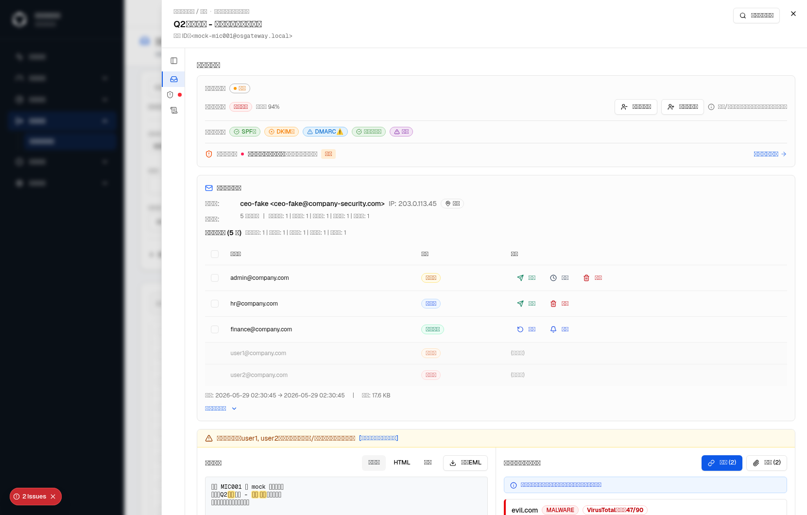

- 导航栏宽度由200px收窄为48px，三个导航项仅保留图标（收件箱/护盾/卷轴）与"安全分析"项的红色风险点，文字标签从视觉流中移除。
- 收起按钮本身的提示气泡文案随折叠状态在"收起导航栏"/"展开导航栏"之间切换（`aria-expanded` 属性同步反映当前状态，供屏幕阅读器识别）。

**状态2 / 折叠态悬停"安全分析"图标·组合提示气泡（定位已修复）**

| 字段 | 内容 |
|---|---|
| 触发路径 | 状态1 → 鼠标悬停折叠态"安全分析"图标 |
| 路由 | `/zh/email-disposal/center`（详情侧边栏） |
| 视口 | 桌面（1661×1060） |
| 形态/角色 | AI-多租户 · 平台管理员视角 |
| 验证依据 | 浏览器实机操作截图（修复前后对比，见 3.7 差异标注） |

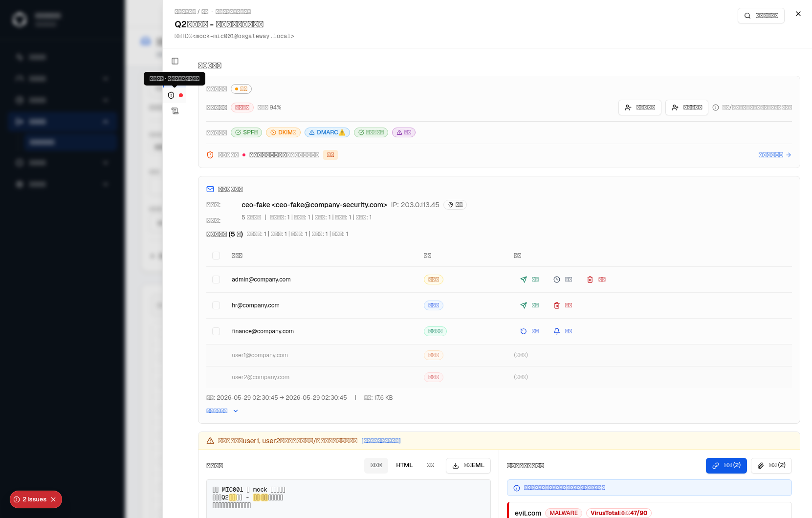

- 提示气泡正确锚定在被悬停图标附近（而非页面左上角原点），文案为"安全分析 · 最终判定：钓鱼邮件"组合格式，验证了 3.2 方案中"标签 · 状态"拼接逻辑与定位缺陷修复均生效。

#### 3.4 逐元素说明

| 元素 | 类型 | 说明 | i18n key |
|---|---|---|---|
| 导航栏收起/展开按钮 | 图标按钮 | 仅桌面视口（`hidden ... lg:flex`）渲染；`PanelLeftIcon`，点击切换 `navCollapsed` 布尔状态；`aria-expanded` 反映展开态；自带悬停提示气泡 | `emailDisposal.detail.nav.collapseSidebar`（"收起导航栏"）/ `emailDisposal.detail.nav.expandSidebar`（"展开导航栏"） |
| 导航栏宽度切换动画 | 样式 | `w-[200px]` ↔ `w-12`，`transition-[width] duration-150`；仅影响桌面纵向导航，移动端横向锚点条（`max-lg:*`）不受影响 | 不适用 |
| 折叠态导航项标签 | 文本 | `sr-only`（移出可视布局但保留给屏幕阅读器），`max-lg:not-sr-only`（移动端始终可见，不受 `navCollapsed` 影响） | 复用各导航项既有 label key（`overviewAndHandle`/`securityAnalysis`/`originalLog`） |
| 折叠态组合提示气泡文案 | 文本 | 拼接规则为 `[label, statusText].filter(Boolean).join(' · ')`；无风险点/无警告时仅展示 label 本身（如"概览与处置"，不追加多余分隔符） | 复用各导航项 label key + 2.4 节风险点/警告提示气泡的 i18n key |
| 提示气泡触发器包裹元素 | 样式（缺陷修复） | `className` 由 `"contents"` 改为 `"block"`，确保浮层定位读取到真实非零矩形 | 不适用 |

#### 3.5 涉及文件

- `src/components/email-disposal/detail-modal.tsx` — 新增 `navCollapsed` 状态与收起/展开按钮 JSX；`navItems` 新增 `icon` 字段；导航栏容器宽度类由固定 `w-[200px]` 改为按 `navCollapsed` 切换 `w-12`/`w-[200px]`；折叠态提示气泡文案拼接逻辑（`tooltipText = navCollapsed ? [label, statusText]... : statusText`）；修复 `TooltipTrigger` 包裹元素 `className` 由 `"contents"` 改为 `"block"`。
- `messages/zh.json`、`messages/en.json`、`messages/ru.json`、`messages/th.json` — `emailDisposal.detail.nav.collapseSidebar`/`expandSidebar` 四语言翻译（随 2.5 节一并新增）。

#### 3.6 验证结论

- 浏览器验证：见 3.3 节用户实机操作截图，确认导航栏收起为纯图标窄栏、折叠态组合提示气泡文案正确，且提示气泡定位缺陷已修复（气泡正确锚定在被悬停图标附近，而非页面左上角原点）。
- 未新增/未运行本节相关的自动化测试用例，`navCollapsed` 状态切换与提示气泡定位目前仅通过浏览器实机操作验证，记录为 [Q-005](#c-需确认事项) 待确认事项（与1.6节合并为同一条，均指向"本次导航栏改动缺少自动化测试覆盖"）。

#### 3.7 差异标注

- D-005：折叠态提示气泡触发器包裹元素原使用 `className="contents"`，在浏览器实机验证过程中发现导致气泡定位坍缩至页面左上角原点；本次开发过程中已修复为 `className="block"`，未形成过独立的已发布缺陷版本，故不追加"修复前"截图，仅在 3.2 方案与 3.3 状态2中说明缺陷原因与修复结果。

## GT-12984邮件处置中心：日志列表UI优化

> 本需求聚焦"邮件处置中心"列表页（日志列表）本身的列宽与信息密度优化：一是将"发信人""收信人"两列合并为一列以节省横向空间；二是"收发类型"列展示方式在用户两轮反馈后完成迭代；三是新增可选的紧凑显示密度，让运营在需要时一屏多看几行。三个变更点共用同一份列表组件，逐一说明如下。

### 1. 发件人/收件人合并列

#### 1.1 背景

优化前，列表页"发信人""收信人"是两个独立的列，各自占用一整列宽度；但这两个字段在实际排障场景下几乎总是被一起读——运营需要同时确认"谁发的、发给谁"才能判断一封邮件是否可疑，拆成两列并不能带来额外的信息价值，反而挤占了横向空间，使"主题""处置依据"等本身文案更长的列被迫压缩或换行。

#### 1.2 方案

将"发信人""收信人"两列合并为一列"发件人 → 收件人"：列内以 `发件人 → 收件人` 的紧凑横排展示，中间的箭头图标（`ArrowRight`，14px）仅作纯装饰性视觉分隔，`aria-hidden="true"`，不承载任何语义、不可点击；单元格内容超出宽度时省略截断，完整的发件人与全部收件人列表（群发邮件可能有多个收件人）通过悬停 Tooltip 完整展示，信息量与合并前的两列完全一致，仅节省一整列的表头与边框开销。列显隐设置菜单同步收窄为单一 `senderRecipient` 选项（原"发信人""收信人"两个独立勾选项合并为一个）。

#### 1.3 截图式交互预览

**状态1 / 列表默认态·发件人/收件人合并列（真实数据）**

| 字段 | 内容 |
|---|---|
| 触发路径 | 邮件处置中心 → 日志列表默认视图 |
| 路由 | `/zh/email-disposal/center` |
| 视口 | 桌面 |
| 形态/角色 | 云网关 · 租户管理员视角（页面顶部"正在以租户管理员身份操作"代登录提示条） |
| 验证依据 | 用户实拍浏览器截图 |

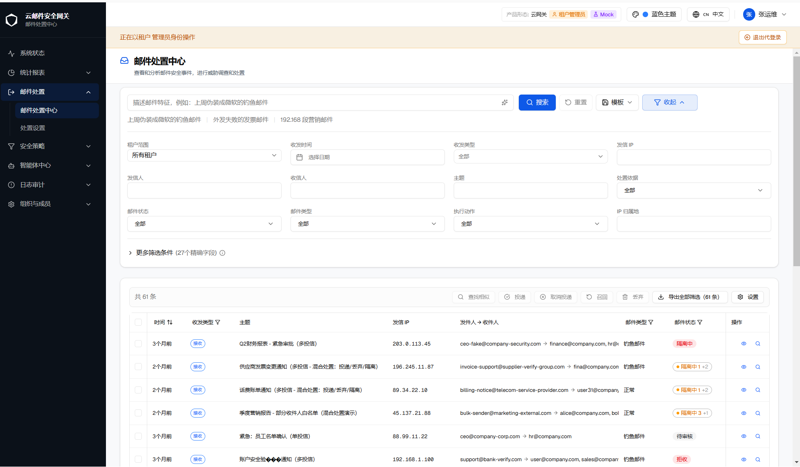

- 表头列序：时间、收发类型、主题、发信IP、**发件人 → 收件人**（合并列）、邮件类型、邮件状态、操作。
- 示例行"Q2财务报表 - 紧急审批（多投信）"：发件人 `ceo-fake@company-security.com`，箭头后收件人 `finance@company.com, hr@...`（超出宽度截断，完整收件人列表需悬停查看）。
- 该截图同时验证了本节下方 [2. 收发类型展示方式两轮迭代](#gt12984-2-收发类型展示方式两轮迭代箭头图标--邮件场景图标--彩色文字-badge-定稿) 的最终定稿效果——"接收"以蓝色描边文字徽标呈现，与本节合并列改动在同一次浏览器验证中一并确认。

#### 1.4 逐元素说明

| 元素 | 类型 | 说明 | i18n key |
|---|---|---|---|
| "发件人 → 收件人"合并列 | 文本+装饰图标 | 单元格 `max-w-[320px] truncate`；内容为 `发件人 <ArrowRight> 收件人1, 收件人2, ...`；收件人来源为 `item.recipientList`（存在则 `join(', ')`），否则回退到单个 `item.recipient`，均无值时显示"—" | `emailDisposal.table.senderRecipient`（表头文案"发件人 → 收件人"，新增） |
| 装饰分隔箭头 | 图标 | `ArrowRight`，14px（`size-3`），`text-muted-foreground`，`aria-hidden="true"`；纯视觉分隔，不可交互、不承载语义 | 不适用 |
| 完整信息 Tooltip | 悬停提示 | 悬停整个单元格触发，内容为 `${item.sender} → ${收件人列表}` 完整拼接（不截断），`max-w-md text-xs` | 不适用（内容为原始数据拼接，非独立文案） |
| 列显隐设置项 | 勾选项 | 原"发信人""收信人"两个独立勾选项合并为一个"发件人 → 收件人"，与主表头文案同源 | `emailDisposal.table.senderRecipient` |

#### 1.5 涉及文件

- `src/components/email-disposal/mail-list-table.tsx` — "发信人""收信人"两个独立 `TableCell` 合并为单一 `senderRecipient` 列渲染逻辑（`Tooltip`/`TooltipTrigger`/`TooltipContent` 包裹）；列显隐 `isColVisible`/设置菜单勾选项数组同步收窄。
- `messages/zh.json`、`messages/en.json`、`messages/ru.json`、`messages/th.json` — `emailDisposal.table` 命名空间新增 `senderRecipient` key 的四语言翻译；原 `sender`/`recipient` 两个既有 key 未删除（仍被 `csv-export.ts`、`similar-results-sheet.tsx` 等其他功能依赖）。

#### 1.6 验证结论

- 单元测试：`mail-list-table.test.tsx`（16项）全部通过。
- `tsc --noEmit`：涉及文件零新增错误。
- UTF-8 编码自检：本次编辑涉及的行范围内（`emailDisposal.table` 命名空间）无 Unicode 替换字符残留。
- 浏览器验证：见 [1.3 截图式交互预览](#gt12984-13-截图式交互预览) 用户实拍截图，确认合并列在真实数据下正确展示"发件人 → 收件人"结构，列显隐设置菜单同步收窄为单一勾选项（经 `agent-browser` 读取设置菜单 DOM 文本确认菜单项为"发件人 → 收件人"，非原"发信人""收信人"两项）。

### 2. 收发类型展示方式两轮迭代：箭头图标 → 邮件场景图标 → 彩色文字 Badge 定稿

#### 2.1 背景

"收发类型"列此前（早于本工单）已从 Badge 文案改为图标+Tooltip 以压缩列宽，图标选用通用的上传/下载箭头（`ArrowDownToLine`=接收、`ArrowUpFromLine`=外发、`ArrowLeftRight`=域内）。用户在本工单反馈：该图标样式很容易被误认为"下载"操作按钮（尤其在邮件场景下，用户第一直觉是"点它能下载附件"），而不是"收件方向"的状态展示；且纯图标缺少文字兜底，需要悬停才能确认含义，认知成本偏高，而这一列在实际排障场景下是高频扫读列。

#### 2.2 方案

本次迭代经历两轮调整：

- **第一轮**：保留图标+Tooltip 的展示形式，但将语义不明确的通用上传/下载箭头（`ArrowDownToLine`/`ArrowUpFromLine`）换成邮件场景专属的收件箱/发送图标（`Inbox`=接收、`Send`=外发），"域内"仍用双向箭头 `ArrowLeftRight` 表示收发双向流转；意图是在维持列宽压缩收益的同时降低误读为"下载按钮"的概率。
- **第二轮（最终定稿）**：用户反馈图标语义仍不够直观，要求改回文字。综合评估"零歧义、零 hover 成本"对这一高频扫读列的价值高于"节省几像素列宽"，最终改为彩色文字 Badge：直接复用列表页"更多筛选条件"内 `filters.incoming`/`outgoing`/`internal` 已有的中文文案"接收"/"外发"/"域内"（均2字，四语言翻译已齐备，未新增任何 i18n key），配色沿用"邮件状态"列同款 `Badge variant="outline"` 描边写法（接收=蓝色描边、外发=绿色描边、域内=中性灰描边），尺寸做小号处理（`text-[10px] px-1.5 py-0 h-5`）控制列宽增量；不再需要悬停 Tooltip 兜底，文字本身已经清晰。第一轮引入的 `Inbox`/`Send`/`ArrowLeftRight` 图标导入及配套 `directionIconConfig` 已随第二轮改动一次性移除，未在代码中留下残留引用。

#### 2.3 截图式交互预览

**状态1 / 第一轮迭代前·原通用箭头图标被反馈易误读为下载按钮**

| 字段 | 内容 |
|---|---|
| 触发路径 | 邮件处置中心 → 日志列表默认视图 |
| 路由 | `/zh/email-disposal/center` |
| 视口 | 桌面 |
| 形态/角色 | 全形态通用 |
| 验证依据 | 用户实拍浏览器截图（反馈素材） |

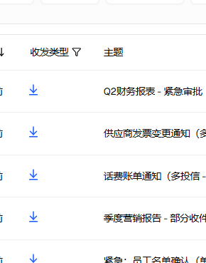

*该截图为用户在本工单中提出反馈时提供的原始素材，展示了迭代前的问题状态——"收发类型"列的蓝色向下箭头图标与视觉上容易联想到"下载"操作，且缺少文字兜底。*

**状态2 / 最终定稿·彩色文字 Badge（真实数据）**

见 [1.3 截图式交互预览 · 状态1](#gt12984-13-截图式交互预览) 用户实拍截图：可见"收发类型"列已改为蓝色描边"接收"文字徽标，与合并列改动在同一张截图中一并验证，此处不重复粘贴。

#### 2.4 逐元素说明

| 元素 | 类型 | 说明 | i18n key |
|---|---|---|---|
| 收发类型 Badge | 徽标（`Badge variant="outline"`） | 文案复用 `filters.incoming`/`outgoing`/`internal`（"接收"/"外发"/"域内"）；className `text-[10px] px-1.5 py-0 h-5 font-normal` + 方向专属配色类；`item.direction` 无法匹配三个已知键时，回退到中性灰描边样式（`localizeEnum` 同时对文案做安全回退，缺失 i18n key 时展示原始枚举值而非报错或空白） | `emailDisposal.filters.incoming`/`outgoing`/`internal`（复用既有 key，未新增） |
| 接收态配色 | 样式 | `border-blue-500 text-blue-600`（暗色模式 `border-blue-400 text-blue-400`） | 不适用 |
| 外发态配色 | 样式 | `border-emerald-500 text-emerald-600`（暗色模式 `border-emerald-400 text-emerald-400`） | 不适用 |
| 域内/未知态配色 | 样式 | `border-border text-muted-foreground`，与其他中性态 outline Badge 视觉一致 | 不适用 |
| 已移除的第一轮图标方案 | — | `Inbox`/`Send`/`ArrowLeftRight` 图标导入、`directionIconConfig` 映射对象、图标+Tooltip 渲染 JSX 均已整体移除 | 不适用 |

#### 2.5 涉及文件

- `src/components/email-disposal/mail-list-table.tsx` — 移除 `directionIconConfig`（图标+className 映射）及 `Inbox`/`Send`/`ArrowLeftRight`/`ArrowDownToLine`/`ArrowUpFromLine` 全部相关 import；新增 `directionBadgeConfig`（方向 → className 映射）；收发类型列渲染 JSX 由 `Tooltip`+图标改为 `Badge variant="outline"` 文字徽标。

#### 2.6 验证结论

- 单元测试：`mail-list-table.test.tsx`（16项）全部通过（两轮迭代后均重新运行确认）。
- `tsc --noEmit`：涉及文件零新增错误；确认已移除的图标 import 无遗留引用（`grep` 检索 `directionIconConfig|Inbox\b|Send\b|ArrowLeftRight` 均为0命中）。
- 浏览器验证：第一轮（`Inbox`/`Send`）因当前验证环境无真实列表数据（无头浏览器沙箱未连接后端 apiserver），未能产出带真实数据的图标态截图，仅通过 `agent-browser` 读取表头/菜单 DOM 文本与 `lucide-react` 包导出确认交付零风险；第二轮（最终文字 Badge）已通过用户实拍真实数据截图确认最终效果（见 [1.3](#gt12984-13-截图式交互预览) 状态1），并额外注入示例数据行验证三种配色（接收/外发/域内）均按预期渲染。

#### 2.7 差异标注

- D-006：本节经历两轮用户反馈迭代——迭代前的通用箭头图标态（见 2.3 状态1）是用户实际看到并反馈问题的已知状态；中间的"邮件场景图标"（`Inbox`/`Send`）方案因未获得真实数据渲染验证、且在获得浏览器截图前即被用户第二轮反馈要求改回文字，故未形成独立的"已发布"版本，未单独截图存档，仅在 2.2 方案与 2.4 逐元素说明中作为迭代过程记录；最终交付版本为彩色文字 Badge。

### 3. 新增紧凑显示密度切换

#### 3.1 背景

列表页此前仅有一套固定的行高与内边距（表头 `h-11`、单元格 `py-3`），部分运营在批量排障、横向对比多条记录时希望一屏内看到更多行，而不需要频繁滚动；但默认的"舒适"间距对日常单条详细查看场景仍是合理默认值，不宜整体收紧。

#### 3.2 方案

在列表设置菜单（与列显隐同一入口）内新增"显示密度"分组与"紧凑模式"开关：开启后，表头高度由 `h-11`（44px）收紧为 `h-8`（32px），单元格内边距由默认 `py-3` 收紧为 `py-1.5`，仅收紧高度与内边距，**不缩小字号**（沿用 Gmail/Notion 一类产品的密度惯例，避免影响可读性）。密度偏好通过独立的 `localStorage` key（`osg.disposal.density`，与列显隐 `hiddenColumns` 使用不同 key，互不干扰）持久化，刷新页面或重新进入列表后保持用户上次选择。为避免 SSR 与首次客户端渲染不一致导致的 hydration 报错，组件挂载前 `density` 状态固定为默认值"舒适"，挂载后再异步从 `localStorage` 读取真实偏好并更新（与既有 `hiddenColumns` 读取时机同一思路）。

#### 3.3 截图式交互预览

**状态1 / 列表设置菜单·"显示密度"分组与"紧凑模式"开关**

| 字段 | 内容 |
|---|---|
| 触发路径 | 邮件处置中心 → 日志列表 → 点击批量工具栏右侧"设置"按钮 |
| 路由 | `/zh/email-disposal/center` |
| 视口 | 桌面（1272×740） |
| 形态/角色 | 云网关 · 平台管理员视角（Mock 模式） |
| 验证依据 | 浏览器实机操作截图 + DOM 文本读取（当前验证环境无头浏览器缺失中文字体渲染能力，视觉截图文字显示为方块，已改用 DOM 文本读取交叉核对，与 [Q-002](#c-需确认事项) 同一限制） |

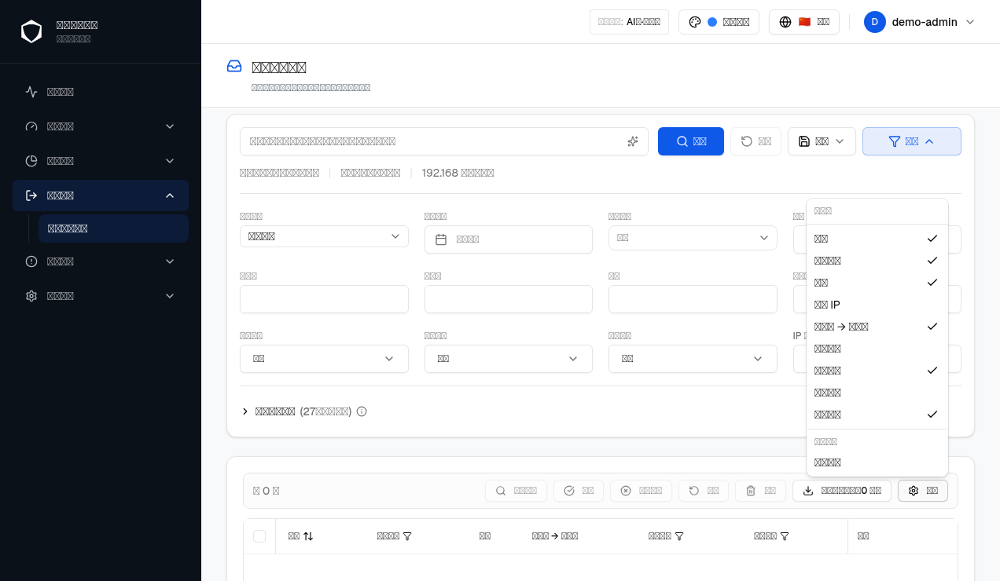

- 经 `agent-browser` 读取菜单真实 DOM 文本确认渲染内容为："列设置"分组下"时间/收发类型/主题/发信IP/发件人 → 收件人/处置依据/邮件类型/执行动作/邮件状态"9项列勾选项，下方新增"显示密度"分组标签、"紧凑模式"勾选开关，均正确无误（视觉截图因环境字体限制显示为方块，文字内容以 DOM 读取结果为准）。
- 点击"紧凑模式"开关后，经 `localStorage.getItem('osg.disposal.density')` 读取确认值变为 `"compact"`；再次点击变回 `"comfortable"`，持久化写入/读取均验证通过。
- 精确测量：`comfortable` 态表头单元格 `getBoundingClientRect().height` 为 **44px**；切换 `compact` 态后同一表头单元格高度收紧为 **32px**，与方案中 `h-11`→`h-8` 的目标类名收紧幅度一致。

#### 3.4 逐元素说明

| 元素 | 类型 | 说明 | i18n key |
|---|---|---|---|
| "显示密度"分组标签 | 文本 | 位于列显隐设置菜单内，"列设置"分组下方新增的第二个分组标签 | `emailDisposal.table.densitySettings`（新增） |
| "紧凑模式"开关 | 勾选菜单项 | `data-testid="disposal-density-toggle"`；点击切换 `density` 状态（`comfortable`↔`compact`），并写入 `localStorage` | `emailDisposal.table.compactDensity`（新增） |
| 表头高度收紧 | 样式 | `comfortable`：默认 `h-11`（44px）；`compact`：`h-8`（32px） | 不适用 |
| 单元格内边距收紧 | 样式 | `comfortable`：默认 `py-3`；`compact`：`py-1.5` | 不适用 |
| 密度持久化 key | 存储 | `localStorage['osg.disposal.density']`，取值 `'comfortable'` \| `'compact'`；与列显隐 `hiddenColumns` 使用独立 key，互不影响 | 不适用 |
| 首屏默认值 | 状态 | 组件挂载前固定为 `'comfortable'`，挂载后异步（`setTimeout(0)`）从 `localStorage` 读取真实偏好，避免 SSR/CSR hydration 不一致 | 不适用 |

#### 3.5 涉及文件

- `src/components/email-disposal/mail-list-table.tsx` — 新增 `DENSITY_PREF_KEY` 常量、`density`/`setDensity` 状态、挂载后读取 `localStorage` 的 `useEffect`、`toggleDensity` 回调、`isCompact`/`headDensityClass`/`cellDensityClass` 派生值；`TableHead`/`TableCell` 逐一应用 `headDensityClass`/`cellDensityClass`；设置菜单新增"显示密度"`DropdownMenuLabel` 分组标签与"紧凑模式"`DropdownMenuCheckboxItem`（`data-testid="disposal-density-toggle"`）。
- `messages/zh.json`、`messages/en.json`、`messages/ru.json`、`messages/th.json` — `emailDisposal.table` 命名空间新增 `densitySettings`/`compactDensity` 2个 key 的四语言翻译。

#### 3.6 验证结论

- 单元测试：`mail-list-table.test.tsx`（16项）全部通过。
- `tsc --noEmit`：涉及文件零新增错误。
- UTF-8 编码自检：本次编辑涉及的行范围内（`emailDisposal.table` 命名空间）无 Unicode 替换字符残留；四语言文件均通过 `JSON.parse` 校验。
- 浏览器验证：见 3.3 节，已通过 `agent-browser` 点击"紧凑模式"开关，读取 `localStorage` 确认持久化写入生效，并精确测量表头高度由 44px 收紧为 32px，与目标类名收紧幅度一致；因当前验证环境列表无真实数据（未连接后端 apiserver），未能产出紧凑态下多行数据的完整视觉对比截图，已改用精确的 DOM 高度测量替代，记录说明同 [Q-002](#c-需确认事项) 的环境限制。

## C. 需确认事项

| 编号 | 内容 | 状态 |
|---|---|---|
| Q-001 | 仿冒检测智能体、威胁回溯智能体当前均无真实数据源，页面展示"未接入"；这两个智能体后续是否会在【智能体中心】补齐对应的邮件级判定字段（类似 `phish_agent_check`），需要与后端/产品确认排期。 | 未解决 |
| Q-002 | 本次新增的 `sideline_pending`/`delivery_cancelled`/`expired`/`recall_pending`/`recall_success`/`recall_failed` 6 个状态未能提供清晰可读的视觉截图（当前验证环境的无头浏览器缺失中文字体渲染能力，截图会整体渲染为方块乱码），已改用 DOM 文本读取 + 源码交叉核对的方式验证；建议后续在具备中文字体渲染能力的环境（如用户本机浏览器）中补拍这 6 个状态的标准截图，替换本节的文字说明。 | 未解决 |
| Q-003 | "取消投递"操作（`delivering` 状态）当前为前端本地乐观更新，无真实后端接口；`recipientActionsForStatus` 中"待审核"态的"隔离"按钮在 Mock 模式下立即生效、真实模式下优雅降级为提示。这两处 demo-parity 行为后续是否需要补齐真实后端接口，需要与后端确认排期。 | 未解决 |
| Q-004 | 产品澄清：`rejected`（已拒绝）/`discarded`（已丢弃）/`recall_success`（召回成功）/`recall_failed`（召回失败）4个终态不支持"丢弃"操作，表A矩阵已按此修正；但 `mail-list-table.tsx` 第345行"丢弃"按钮当前仅判断 `!hasSelection`，未对这4个状态做拦截，与目标矩阵存在实现缺口。需要与开发确认是否本次一并修复（新增 `canDelete` 派生变量排除这4个状态），还是留待后续迭代排期。 | 未解决 |
| Q-005 | `detail-modal.test.tsx` 已覆盖基于 `IntersectionObserver` 的当前区块跟踪、`navCollapsed` 折叠态及导航可访问名，主仓库合并时已重新执行。 | 已解决 |
| Q-006 | 原型中的"原始日志部分节点失败警告"经单独评审后明确不纳入本次主仓库交付，不再补拍该状态截图。 | 已跳过 |

## D. 版本历史

| 版本 | 生成日期 | 参考 commit | 摘要 |
|---|---|---|---|
| v1 | 2026-08-16 | `18088a7` | 初始生成：收录 GT-12936群发邮件：安全分析模块（阶段3/4/5检测项重新分配为真实智能体 + 钓鱼检测智能体行内嵌研判详情）；随后追加四处补充——① 变更1状态2截图下补充"按收件人筛选安全分析过程与处置依据"需求说明（既有能力 GT-12934/GT-12935 的行为解释，非本次改动范围）；② 变更2新增 2.3 截图式交互预览小节及第3张用户实拍截图（阶段4钓鱼检测智能体行展开态），2.1/2.2 补充说明原独立紫色卡片位于"事后处置时间线"下方，现已收敛至阶段4列表内嵌展开；③ 新增独立需求 **GT-12977邮件处置中心：查看页面："最终判定邮件类型"需要与概览与处置模块的"邮件类型"保持一致**，将"安全分析"标签"最终判定"横条文案改为直接复用"概览与处置"标签"邮件类型"徽标同一份 `mailTypeConfig` label，消除两处判定结论字面不一致，含第4/5张用户实拍截图（同一封"正常"邮件在两个标签下文案一致的验证态）；④ 新增独立需求 **GT-12978邮件处置中心——》查看：去掉"内容详情"**，删除"安全分析"标签"事后处置时间线"下方与其他标签重复展示的"内容详情"折叠区块，"邮件ID"字段单独挪至详情页三个标签共用页头常驻展示，含第6/7张用户实拍截图（页头邮件ID在概览与处置/安全分析两个标签下均常驻可见的验证态） |
| v2 | 2026-08-17 | `35a1674` | 新增独立需求 **GT-12979邮件状态以及可以支持的后续操作**：① 梳理 `DisplayStatus`（13个）与列表页批量工具栏5个操作（查找相似/投递/取消投递/召回/丢弃）之间的完整可用性矩阵（表A），并在 `mail-list-table.tsx` 源码判定条件基础上逐一核对；② 发现 mock 测试数据集对 `sideline_pending`/`delivery_cancelled`/`expired`/`recall_pending`/`recall_success`/`recall_failed` 6个状态完全无样例覆盖，补充 `MIC056`–`MIC061` 6条 mock 记录，新增 `workflowOutcomeOverride`/`recallStatusOverride` 两个种子字段并修正 `disposalAction`/`disposalDelivery`/`disposalWorkflow`/`recipientDisposalStatus`/`displayStatusOf` 等 mock 推导函数以支持这些状态正确派生；③ 梳理详情页收件人级状态×对象模式操作矩阵（表B，`recipientActionsForStatus`），说明其与邮件级 `DisplayStatus` 是两套不同值域，避免混淆；含第8张用户实拍截图（列表页"邮件状态"筛选为"投递中"的默认态）；本次新增6个状态因当前沙箱浏览器缺失中文字体渲染能力，改用 DOM 文本读取 + 源码交叉核对替代视觉截图，已记录为 Q-002 待确认事项；④ 根据产品澄清修正表A中 `rejected`/`discarded`/`recall_success`/`recall_failed` 四个终态的"丢弃"列由 ✅ 改为 ❌（这4个终态不支持丢弃），并同步指出该限制目前未在 `mail-list-table.tsx` 源码中实现（第345行"丢弃"按钮仅判断 `!hasSelection`），记录为 Q-004 待确认事项，供后续排期修复 |
| v3 | 2026-08-17 | `5102080` | 新增独立需求 **GT-12982邮件处置：查看页面UI优化**：① 详情页左侧导航栏滚动定位由"滚动事件回调 + 像素阈值比较"改为基于 `IntersectionObserver` 监听各区块穿过内容面板顶部20%触发带，不再受"安全分析"区块展开后高度剧增影响；页头面包屑新增"当前查看：×××"分段，与导航高亮读取同一 `activeSection` 状态，天然同步；② 导航三项新增图标（收件箱/护盾/卷轴），"安全分析"项新增风险点圆点（复用 `mailTypeConfig` 同源色调，悬停显示"最终判定：×××"），"原始日志"项在生命周期日志部分节点未获取时新增黄色警告三角，激活态高亮由中性灰改为品牌主色；③ 桌面视口（≥1024px）导航栏新增收起/展开切换按钮，收起后降为48px纯图标窄栏，折叠态提示气泡改为"标签 · 状态"组合文案；过程中发现并修复一处缺陷——折叠态提示气泡触发器包裹层原使用 `className="contents"`，导致 `getBoundingClientRect()` 报告坍缩为0×0的零矩形，使 Base UI 浮层定位逻辑将所有折叠态提示气泡错误锚定在页面左上角原点，而非各自图标旁边，修复方式为改用 `className="block"`；含第9–13张截图（第9张为用户实拍，第10–13张为浏览器实机操作截图），本次改动缺少自动化测试覆盖、"原始日志"警告三角图标未能在当前测试样例上复现视觉态，分别记录为 Q-005/Q-006 待确认事项 |
| v4 | 2026-08-17 | `6a3bd5a` | 新增独立需求 **GT-12984邮件处置中心：日志列表UI优化**：① 列表页"发信人""收信人"两列合并为一列"发件人 → 收件人"，箭头图标为纯装饰分隔（`aria-hidden`），完整信息通过悬停 Tooltip 展示，列显隐设置菜单同步收窄为单一勾选项；② "收发类型"列展示方式两轮用户反馈迭代——原通用上传/下载箭头图标（`ArrowDownToLine`/`ArrowUpFromLine`）因易被误读为"下载"按钮被反馈，第一轮改用邮件场景专属图标（`Inbox`/`Send`），因语义仍不够直观被再次反馈，最终改回彩色文字 Badge（复用既有 `filters.incoming`/`outgoing`/`internal` 文案，配色沿用邮件状态列同款 outline Badge 写法），记录为 D-006 差异标注；③ 列表设置菜单新增"显示密度"分组与"紧凑模式"开关，开启后表头/单元格高度收紧（44px→32px），不缩小字号，独立 `localStorage` key 持久化；含第14–16张截图（第14/15张为用户实拍真实数据截图，第16张为浏览器实机操作截图），第16张因当前验证环境无头浏览器缺失中文字体渲染能力，改用 DOM 文本读取交叉核对，与既有 Q-002 同一限制；顺带修复了 `zh.json` 中与本次改动无直接关系的5处历史遗留乱码 |
| v5 | 2026-08-21 | 主仓库 `096b724c`–`13011873` | 归档到 `webapp/doc/md_spec-version/`，同步 16 张截图并更新 HTML Spec 索引；根据最终评审明确"邮件ID"=`message_uuid`，标注截图 06/07 为字段澄清前的历史画面；将"原始日志部分节点失败警告"记录为已跳过；修复源文档中的 Unicode 替换字符。 |
