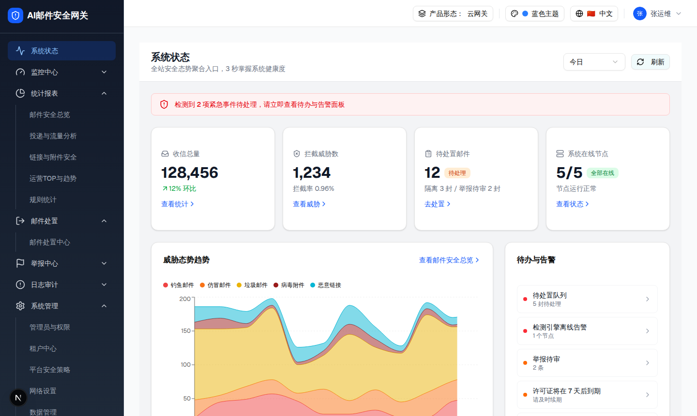
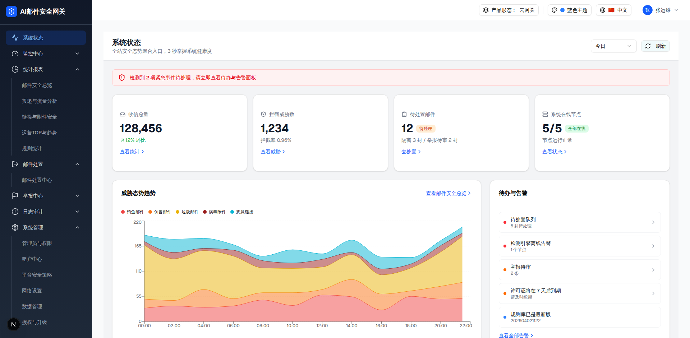
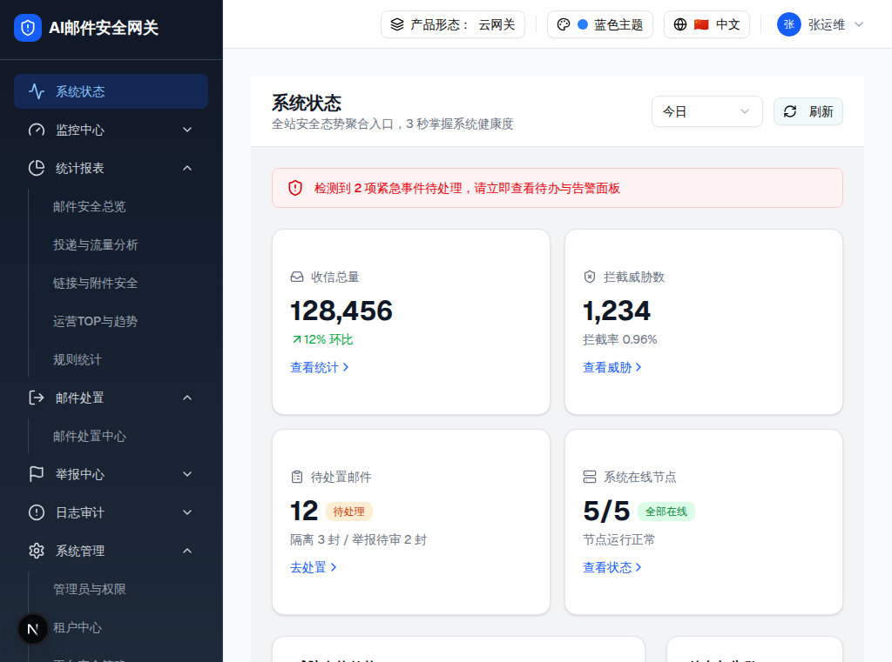

# Webapp 页面大布局 UI 规格

- 日期：2026-07-25
- 状态：v5，页面大布局、全局字体、标题栏控件与页级状态条整改基线
- 文档类型：跨页面 UI 布局规范
- 适用范围：`webapp/` 标准后台页面
- 首个验收页面：系统状态
- UI 事实源：运行中的 demo `/security-ops-dashboard`
- 上位设计语言：[`DESIGN.md`](../../../DESIGN.md)
- 配套交互规范：[跨页面柔和交互反馈 UI 规格](./2026-07-25-cross-page-gentle-interaction-feedback-ui-spec.md)
- 配套国际化规范：[跨页面国际化与文本完整性 UI 规格](./2026-07-28-cross-page-i18n-text-integrity-ui-spec.md)

## 0. v5 修订说明

v2 重新以运行中的 demo computed style 和截图为准，修正画布层级；
v3 补充标题栏字体字形、操作控件和代码复用规则；
v4 补充 PageBody 首屏状态条的几何、语义色和共享组件规则；
v5 将 demo 的 100–900 可变 Geist 提升为 webapp 全局字体基线，删除
PageHeader 和 StatusBanner 的局部字体补偿。

画布规则：

- 外层 32px 留白是 `gray-50`（`#F9FAFB`）；
- 内层 PageFrame/PageBody 是 `gray-100`（`#F3F4F6`）；
- PageHeader 和第一层卡片是白色；
- 外层与内层是刻意保留的两种颜色，不得合并；
- demo 的 PageBody 自身为透明背景，视觉上继承 PageFrame 的
  `gray-100`；webapp 可以在共享 PageBody 中显式声明同一颜色。

标题栏规则：

- 字号和 `font-weight` 数值相同不代表视觉已经对齐；PageHeader 的标题、
  副标题和操作控件还必须使用与 demo 同类型的 Geist 可变字体；
- 全局 `Button size="sm"` 和 `SelectTrigger` 是通用紧凑控件，不能直接
  当作 PageHeader 的视觉规格；
- 标题栏操作控件统一使用 `PageHeaderActionButton` 和
  `PageHeaderSelectTrigger`；
- 验收必须同时检查 computed style、实际字体资源、文字盒尺寸和同视口截图。

页级状态条规则：

- 状态条是 PageBody 内的一级区块，不是悬浮卡片；
- 外框统一为 46px 高、8px 圆角、1px 边框，无阴影；
- 内容使用 16px 水平、12px 垂直内边距，图标与文字间距 12px；
- 文字使用 Geist 14/20、500，图标为 20×20px；
- danger / warning / success / neutral 的几何完全一致，仅语义色和图标变化；
- 页面必须复用 `StatusBanner`，不得重新拼装状态条 class。

## 1. 目的

当前 webapp 与 demo 的主要差异不是卡片内部细节，而是页面最外层的空间关系不同。demo 中，侧边栏、顶部栏、主滚动区、页面外层留白、页面标题区和页面内容区构成稳定的六层布局；webapp 现有部分页面通过负边距把标题区拉到主滚动区边缘，导致页面整体轮廓与 demo 不一致。

本规格只定义**页面大布局**，不定义系统状态的 KPI、图表、告警、接口或业务交互。

目标：

- 固定后台外壳的尺寸和滚动责任；
- 保留 demo 中页面四周 32px 的呼吸空间；
- 统一“`gray-50` 外层留白 + 白色页面标题区 + `gray-100`
  页面内容区”的页面轮廓；
- 让页面通过共享布局组件获得一致结构，禁止逐页复制布局 class；
- 为后续其它页面整改提供可量化、可截图验收的基线。

## 2. 适用范围与例外

### 2.1 默认适用

以下页面默认使用本规格：

- 仪表盘、系统状态、监控和统计页面；
- 列表、日志、策略、设置等标准后台路由；
- 同时包含页面标题和主体内容的一级页面。

### 2.2 不直接适用

以下场景不套用完整结构：

- 登录、错误页等全屏路由；
- Dialog、Drawer、Popover 内的嵌入页面；
- 打印、导出和独立大屏；
- 明确登记为 full-bleed 的沉浸式页面。

嵌入场景不应重复渲染后台侧栏、顶部栏、32px 外层留白或页面标题区，由宿主容器提供标题和内边距。

### 2.3 与既有设计说明的关系

本规格是从运行中的 demo 浏览器实测得到的**页面大布局事实源**。对于系统状态及后续明确按 demo 对齐的标准后台页面：

- 侧边栏使用 demo 实测的 256px，而不是 `DESIGN.md` 旧描述中的 240px；
- 页面保留主滚动区内的 32px 外层留白，不使用负边距抵消；
- 页面标题区位于页面框架内部，不贴顶栏、不贴侧边栏；
- framed 页面外层/内层画布颜色以本规格的 `gray-50` / `gray-100`
  为准，该局部规则覆盖 `DESIGN.md` 的旧画布描述；
- 字体、圆角、品牌色、状态色和其它语义 token 仍遵循 `DESIGN.md`。

## 3. 标准布局结构

```text
Viewport
├── SidebarNav                         256px × 100dvh
└── Workspace                         width: calc(100vw - 256px)
    ├── Topbar                        56px
    └── MainScroll                    height: calc(100dvh - 56px)
        └── PageViewport              gray-50, padding: 32px
            └── PageFrame             gray-100, fluid, no max-width
                ├── PageHeader        white, px 24px, py 16px
                └── PageBody          gray-100, padding 24px
                    └── PageBlocks    vertical gap 24px
```

结构职责不可交换：

- `Viewport` 和 `Workspace` 只负责应用级布局；
- `MainScroll` 是标准页面唯一的纵向滚动容器；
- `PageViewport` 负责页面与应用外壳之间的 32px 外层画布；
- `PageFrame` 负责形成一张完整的内层页面画布；
- `PageHeader` 负责标题、描述和页面级操作；
- `PageBody` 负责业务区背景、内容内边距和区块间距。

## 4. 核心尺寸

### 4.1 几何尺寸

| 区域 | 规格 | demo 依据 |
|---|---:|---|
| 侧边栏宽度 | 256px | `w-64` |
| 顶部栏高度 | 56px | `h-14` |
| 顶部栏水平内边距 | 24px | `px-6` |
| 顶部栏控件间距 | 12px | `gap-3` |
| 页面外层留白 | 32px，四边一致 | `p-8` |
| 页面标题区内边距 | 上下 16px、左右 24px | `px-6 py-4` |
| 页面标题区底边 | 1px hairline | `border-b` |
| 页面内容区内边距 | 24px，四边一致 | `p-6` |
| 页面一级区块纵向间距 | 24px | `space-y-6` |
| 紧凑网格间距 | 16px | `gap-4` |
| 主内容网格间距 | 24px | `gap-6` |

所有尺寸以 CSS px 为基准，不随蓝色/绿色主题变化。

### 4.2 画布颜色

| 层级 | 亮色模式 | 暗色模式 | 说明 |
|---|---|---|---|
| PageViewport 外层画布 | `gray-50` / `#F9FAFB` | `gray-950` / `#030712` | 形成页面四周 32px 留白 |
| PageFrame 内层画布 | `gray-100` / `#F3F4F6` | `gray-900` / `#111827` | 承载 PageHeader 与 PageBody |
| PageBody | 同 PageFrame | 同 PageFrame | demo 为透明继承；webapp 可显式声明 |
| PageHeader | `#FFFFFF` | `gray-950` / `#030712` | 页面标题带 |
| 第一层卡片 | `bg-card` / `#FFFFFF` | `bg-card` | KPI、趋势、告警等业务表面 |

硬规则：

- PageViewport 与 PageFrame/PageBody 必须有一档可见但克制的灰阶差异；
- PageFrame 与 PageBody 必须同色，二者之间不能形成额外色带；
- 蓝色/绿色主题不改变这组中性画布颜色；
- 暗色映射是 webapp 的规范化适配；demo 的亮色实测值仍是视觉基线；
- 不得用当前项目的 `bg-background` 或 `bg-muted` 近似替代，除非对应
  token 的最终 computed color 已分别等于 `#F9FAFB` 和 `#F3F4F6`。

## 5. 宽度计算

标准桌面态不设置页面 `max-width`，页面随可用工作区流式拉伸。

设：

- 视口宽度为 `V`；
- 侧边栏宽度 `S = 256`；
- 页面外层留白 `G = 32`；
- 页面内容区内边距 `P = 24`。

则：

```text
WorkspaceWidth = V - S
PageFrameWidth = V - S - 2G
PageContentWidth = V - S - 2G - 2P
```

浏览器实测：

| 视口宽度 | Workspace | PageFrame | PageBody 可用宽度 |
|---:|---:|---:|---:|
| 1920px | 1664px | 1600px | 1552px |
| 1440px | 1184px | 1120px | 1072px |
| 1024px | 768px | 704px | 656px |

验收容差：

- 应用外壳、外层留白和页面内边距：`±1px`；
- 因子像素分配导致的等分网格列宽：`±1px`；
- 不允许通过新增 `max-width` 让大屏页面居中收窄。

## 6. 应用外壳

### 6.1 侧边栏

- 宽度固定为 256px，必须 `shrink-0`；
- 高度占满动态视口；
- 侧边栏内部菜单可以独立纵向滚动；
- 侧边栏不随主内容滚动离开视口；
- 深色侧边栏是页面唯一的大面积深色表面；
- 菜单悬浮与选中态遵循配套交互规范，不在页面内重复实现。

### 6.2 顶部栏

- 高度固定 56px，位于 Workspace 顶部；
- 白色表面，底部 1px 分隔线；
- 控件整体右对齐；
- 水平内边距 24px，组内间距 12px；
- 顶部栏 `shrink-0`，不参与主内容滚动；
- 产品形态、主题、语言和用户菜单只改变内容，不改变顶部栏高度。

### 6.3 主滚动区

- 高度为动态视口减去顶部栏及可见的全局横幅；
- 使用 `overflow: auto`；
- 页面滚动发生在主滚动区，而不是 `body`；
- `Workspace` 及其可收缩子节点必须使用 `min-width: 0`，防止宽内容撑破视口；
- 横向溢出由具体表格或图表容器处理，禁止让整个页面出现横向滚动。

### 6.4 全局字体

- webapp 全局无衬线字体必须与 demo 使用同版本的 100–900 可变 Geist；
- 根布局使用 `geist/font/sans` 的 `GeistSans`，并通过
  `--font-geist-sans` 提供给全局 `font-sans`；
- 全局等宽字体使用 `geist/font/mono` 的 100–900 可变 `GeistMono`；
- 禁止从 `geist/font` 根入口加载按 100–900 分档的多份静态字体；
- 页面标题、正文、按钮、状态条和表单控件默认继承全局字体，不再分别导入
  字体或添加局部 `font-family` 补丁；
- 浏览器验收必须在 `document.fonts.ready` 后确认加载的是单个
  `font-weight: 100 900` 字体资源，而不是 400/500/600/700 多个分档资源。

demo 的 computed family 可能显示为 `Geist`，webapp 的本地加载器可能显示为
`GeistSans`；两者使用同版本可变字体文件时，应以字重轴、文字盒和最终像素
为验收依据，不以 family 展示名称是否相同作为失败条件。

## 7. 页面框架

### 7.1 PageViewport

`PageViewport` 是主滚动区的直接内容容器：

- 四边统一 32px；
- framed 页面使用 demo 的外层画布 `gray-50`（`#F9FAFB`）；
- 暗色模式对应 `gray-950`；
- 页面标题区和页面主体都必须落在这 32px 留白之内；
- 禁止子页面使用 `-m-8`、`-mx-8`、`-mt-8` 抵消该留白。

这 32px 正是 demo 中顶部栏下方和侧边栏右侧可见的空白带，也是本次与现有 webapp 差异最大的区域。

### 7.2 PageFrame

- 宽度占满 `PageViewport` 的可用宽度；
- 不设置 `max-width`；
- 由 `PageHeader` 和 `PageBody` 两个连续区域组成；
- 背景使用 demo 的内层画布 `gray-100`（`#F3F4F6`）；
- 暗色模式对应 `gray-900`；
- 自身不增加卡片圆角和悬浮阴影；
- 最小高度应填满主滚动区扣除 64px 外层留白后的空间；
- 不直接使用 `min-height: 100vh`，避免在已有 56px 顶部栏和 64px 留白之外制造无意义滚动。

最后一条是对 demo `min-h-screen` 表现的结构化收敛：视觉结果保持一致，但高度按宿主滚动区计算。

### 7.3 PageHeader

#### 7.3.1 容器与位置

- 背景为亮色 `#FFFFFF`，暗色 `gray-950` / `#030712`；
- 底边为 1px：亮色 `gray-200` / `#E5E7EB`，暗色
  `gray-800` / `#1F2937`；
- 左右内边距 24px，上下内边距 16px；
- 不设圆角、不设阴影；
- 内层行使用 `display: flex`、`align-items: center`、
  `justify-content: space-between`；
- 左侧标题组起点为 `PageFrame.x + 24px`、`PageHeader.y + 16px`；
- 右侧操作组终点为 `PageFrame.right - 24px`；
- 标准 framed 页面默认不在标题前增加图标；确需图标的页面必须使用
  独立 variant，不得改变无图标页面的标题起点。

系统状态在 1440px 视口中的实测坐标：

| 节点 | x | y | 宽 | 高 |
|---|---:|---:|---:|---:|
| PageHeader | 288px | 88px | 1120px | 81px |
| 内层行 | 312px | 104px | 1072px | 48px |
| 标题组 | 312px | 104px | 278.09px | 48px |
| 操作组 | 1164px | 110px | 220px | 36px |

PageHeader 的 81px 高度来自 `16 + 48 + 16 + 1px bottom border`；
这是当前单行标题形态的结果，不得直接硬编码 `height: 81px`。

#### 7.3.2 标题与副标题

| 元素 | 字体 | 字号/行高 | 字重 | 亮色 | 暗色 | 字距 |
|---|---|---|---:|---|---|---|
| 页面标题 `h1` | Geist | 20px / 28px | 700 | `gray-900` / `#111827` | `gray-100` / `#F3F4F6` | `normal` |
| 页面副标题 `p` | Geist | 14px / 20px | 400 | `gray-500` / `#6B7280` | `gray-400` / `#9CA3AF` | `normal` |

排版规则：

- PageHeader 使用 Geist 可变字体文件（100–900），标题、说明和操作控件
  必须继承同一字形来源；不能只让 CSS `font-weight` 数值相同，却分别使用
  可变版与分档静态版字体；
- 一个页面只有一个主标题，使用语义化 `h1`；
- 标题和副标题的 margin、padding 均为 0；
- 两行之间不添加额外 gap：标题占 y=104–132px，副标题紧接
  y=132–152px；
- 不使用 `tracking-tight` 或自定义字距；
- 不得把标题降为 600 字重，也不得把副标题降为 12px；
- 副标题是可选项；无副标题时 PageHeader 高度随内容自然收敛；
- 文案来自 i18n，不在共享组件中硬编码；四语覆盖、长文案布局和
  `U+FFFD` 零容忍遵循配套国际化与文本完整性规格。

#### 7.3.3 页面级操作区

- 操作区 `display: flex`、`align-items: center`，控件间距 12px；
- 操作区 `shrink-0`，在同一行时垂直居中于 48px 标题组；
- 时间范围 Select 为 128×36px，字号 14/20、字重 400；
- Select 水平内边距 12px、内部间距 8px、圆角 8px、1px border；
- Select 使用 `shadow-xs`，亮色默认背景透明；
- 刷新按钮为 80×32px，字号 14/20、字重 500；
- 刷新按钮水平内边距 10px、内部 flex gap 6px、圆角 8px、1px
  border 和 `shadow-xs`；
- 刷新图标为 16×16px，右侧 margin 8px；图标与文字可见距离为
  14px；
- 刷新按钮文字盒为 28×18px，不得继承全局紧凑按钮的
  12.8px 字号或 14px 图标；
- Select 与刷新按钮的基础过渡均为 150ms，使用标准 ease-in-out；
- 操作组距 PageHeader 右边固定 24px，不得随标题长度漂移；
- 普通页面没有操作时，标题组仍保持相同的左上起点。

标题栏只规定操作区的尺寸和位置；hover、focus、pressed、loading
动效遵循配套的跨页面柔和交互反馈规格。

#### 7.3.4 宽度不足与长文案

- PageHeader 左侧文字容器必须 `min-width: 0`；
- 右侧操作区不得被标题挤压、截断或覆盖；
- 当标题组、至少 24px 安全间距和操作组无法同排时，操作区移到标题
  下方，PageHeader 高度随内容增长；
- 推荐以 PageHeader 内层可用宽度 560px 作为换行检查点，并通过
  container query 或等价布局判断，而不是只看 viewport；
- 换行后标题组占满一行，操作组保持 12px 间距并右对齐；
- zh/en/th/ru 下允许标题或副标题自然换行，不使用省略号隐藏页面语义；
- 响应式状态仍保持 16px 上下、24px 左右内边距；只有进入本规格
  §9.3 的窄屏形态后，才允许整体收敛为 16px。

#### 7.3.5 字体字形与控件验收方法

不得只看到 Tailwind class 或 computed `font-weight` 相同就判定通过。
例如，两端都显示标题 `700`、按钮 `500`，但一端使用可变字体、另一端使用
分档静态字体时，实际笔画仍可能不同。

标题栏字体验收至少包含：

1. 等待 `document.fonts.ready`；
2. 确认 PageHeader、标题、说明和按钮继承同一字体族；
3. 在浏览器资源列表中确认加载 `Geist_Variable*.woff2` 或等价的
   100–900 可变字体资源；
4. 读取 `font-size`、`line-height`、`font-weight`、`letter-spacing`；
5. 使用 `Range.getBoundingClientRect()` 测量实际文字盒，而不是只测
   `h1`、`p` 或 `button` 外框；
6. 在相同 viewport、zoom、device scale 下截取 PageHeader，并比较解码后
   的可见 RGBA 像素。

系统状态 1440×900 基线文字盒：

| 文本 | 字号/行高 | 字重 | 文字盒 |
|---|---:|---:|---:|
| `系统状态` | 20/28 | 700 | 80×26px |
| 副标题全文 | 14/20 | 400 | 278.09×18px |
| `今日` | 14/20 | 400 | 28×18px |
| `刷新` | 14/20 | 500 | 28×18px |

字体族在不同加载器中可能显示为 `Geist` 或 `GeistSans`；验收重点是字体资源
类型、权重轴、文字盒和最终可见像素，而不是只比较 family 字符串。

### 7.4 PageBody

- 视觉背景与 `PageFrame` 同为 `gray-100`（`#F3F4F6`），暗色模式为 `gray-900`；
- demo 的 PageBody 节点为透明背景并继承 PageFrame；webapp 为降低宿主
  变化导致的漂移，可在共享 PageBody 中显式声明同色背景；
- PageViewport 的 `gray-50` 与 PageFrame/PageBody 的 `gray-100`
  是刻意保留的两层画布，不得合并成同一颜色；
- 不使用白色大底伪装成一张超大卡片；
- 四边内边距 24px；
- 一级业务区块之间保持 24px；
- 第一个区块距 PageHeader 分隔线 24px；
- 页面内第一层卡片使用白色表面、统一边线和轻阴影；
- 页面自身不再额外添加第二层 32px 外边距。

### 7.5 页级状态条

页级状态条用于在页面主体顶部汇总全局健康、告警或加载失败状态。它位于
PageBody 的正常文档流中，参与 24px 一级区块间距，不使用绝对定位或浮层。

#### 7.5.1 几何与排版

| 项目 | 规格 | demo 依据 |
|---|---:|---|
| 宽度 | `100%`，占满 PageBody 可用宽度 | 1440px 下实测 1072px |
| 高度 | 46px | 1 + 12 + 20 + 12 + 1 |
| 内边距 | 左右 16px、上下 12px | `px-4 py-3` |
| 内容间距 | 12px | `gap-3` |
| 圆角 | 8px | demo computed `border-radius: 8px` |
| 边框 | 1px solid | `border` |
| 阴影 | 无 | demo computed `box-shadow: none` |
| 图标 | 20×20px，禁止收缩 | `size-5 shrink-0` |
| 文案 | Geist 14/20、500 | `text-sm font-medium` |

状态条不得使用卡片化的 `rounded-2xl`、`shadow-sm` 或更大的 20/16px
内边距。它的作用是安静地提示状态，不应在卡片网格上方形成另一张高浮层卡片。

状态条必须继承根布局统一加载的 100–900 可变 Geist，不得在 StatusBanner
内部再次导入字体或声明局部 `font-family`。如果根布局误用分档静态字体，
即使 computed `font-size: 14px`、`font-weight: 500` 完全相同，“检测到”
等文字仍可能出现笔画观感差异；应修正全局字体入口，而不是继续添加组件补丁。

demo 与 webapp 的圆角 token 命名不同：demo 的 `rounded-md` computed value
为 8px，webapp 必须使用 computed value 同为 8px 的 `rounded-lg`。不得为了
class 名字看起来相同而保留 6px 的实际圆角。

在 1440×900、DPR 1 的系统状态基线中：

| 节点 | x | y | 宽 | 高 |
|---|---:|---:|---:|---:|
| 状态条外框 | 312px | 193px | 1072px | 46px |
| 图标 | 329px | 206px | 20px | 20px |
| 文案起点 | 361px | 206px | 随文案 | 20px |

#### 7.5.2 语义色

| tone | 文字/图标 | 背景 | 边框 | 典型用途 |
|---|---|---|---|---|
| danger | `red-600` | `red-50` | `red-200` | 紧急事件、阻断性告警 |
| warning | `orange-600` | `orange-50` | `orange-200` | 待处理警告 |
| success | `green-600` | `green-50` | `green-200` | 系统健康、操作正常 |
| neutral | `slate-600` | `slate-50` | `slate-200` | 数据加载失败、未知状态 |

暗色模式使用相同色相的 `950/40` 背景与 `900` 边框；主题蓝/绿切换不改变
状态语义色。状态不能只靠颜色表达，必须同时提供对应图标和明确文案。

#### 7.5.3 状态与响应式

- loading 骨架占位必须保持 46px 高和 8px 圆角，避免数据返回后页面跳动；
- 状态文案必须继承与 PageHeader 相同的 Geist 可变字体来源；
- 多行文案允许状态条自然增高，保持 12px 上下内边距，不截断核心状态；
- 图标始终顶层语义可见并 `shrink-0`；
- danger、warning、success、neutral 切换不能改变外框尺寸；
- 默认使用 `role="status"`；需要立即打断读屏的破坏性告警才使用
  `role="alert"`；
- 状态条本身没有 hover 抬升动画；其中若含链接，链接独立遵循柔和交互规范。

## 8. 滚动与高度

标准页面只允许以下滚动层：

1. 侧边栏菜单在自身高度不足时滚动；
2. 主页面由 `MainScroll` 纵向滚动；
3. 表格、时间线或超宽图表可在自己的边界内横向滚动。

禁止：

- `body` 与 `MainScroll` 同时出现纵向滚动条；
- `PageFrame` 再创建一个整页纵向滚动容器；
- PageHeader 随页面内容单独滚动而顶部栏也滚动；
- 为避免溢出给业务根节点使用 `overflow: hidden`，导致菜单、Tooltip 或 focus ring 被裁切。

如果页面需要 sticky 工具栏，应相对 `MainScroll` 定位，并明确顶部偏移；不得创建新的整页滚动上下文。

## 9. 响应式规则

### 9.1 桌面基线

本规格的像素级基线为视口宽度 `≥ 1280px`：

- 侧边栏保持 256px；
- 页面外层留白保持 32px；
- PageHeader 标题和操作同一行；
- 页面框架流式占满剩余宽度。

### 9.2 中等宽度

在 `1024px–1279px`：

- 应用外壳尺寸不变；
- 页面外层留白和内容内边距不变；
- PageHeader 操作区可在空间不足时换到标题下方；
- 业务网格应根据 **PageBody 可用宽度** 降列，不能只依据整个 viewport 的 Tailwind `lg` 断点。

demo 在 1024px 视口下，PageBody 实际只剩 656px，但部分 `lg:grid-cols-3` 仍按视口命中，产生约 203px 的窄列。后续 webapp 实现不得复制这一断点副作用；大布局保持 demo，业务网格按容器宽度安全降级。

### 9.3 窄屏

在无法同时容纳 256px 侧边栏和有效页面内容时：

- 侧边栏切换为图标轨或覆盖式抽屉；
- 顶部栏保留 56px；
- 页面外层留白可收敛为 16px；
- PageBody 内边距可收敛为 16px；
- PageHeader 操作区换行，控件宽度不得溢出；
- 窄屏规则由共享 AppShell 统一处理，页面不得各自隐藏侧边栏。

具体侧边栏折叠断点由 AppShell 实现统一确定；系统状态桌面验收不依赖该断点。

## 10. 共享组件与实现边界

大布局必须收敛到共享组件，不允许每个页面重新拼装。

建议职责：

| 共享组件 | 负责 | 不负责 |
|---|---|---|
| `AppShell` | Sidebar、Topbar、MainScroll | 页面标题和业务内容 |
| `PageViewport` | `gray-50` 外层画布、32px 留白、页面可用高度 | 业务区块间距 |
| `FramedPage` | 标准路由页的 PageFrame、PageHeader、PageBody 组合与稳定测试锚点 | 数据获取和业务判断 |
| `PageShell` | `gray-100` PageFrame 与布局类型标识 | 标题排版和业务内容 |
| `PageHeader` | 标题、副标题、页面级操作 | 页面内容筛选逻辑 |
| `PageHeaderSelectTrigger` | 标题栏 Select 的尺寸、字体、边框、圆角和阴影 | Select 状态和选项内容 |
| `PageHeaderActionButton` | 标题栏次级按钮的字体、边框、圆角、阴影和反馈 | 点击行为和业务 loading |
| `PageBody` | 24px 内边距、24px 区块间距 | 卡片内部布局 |
| `StatusBanner` | 页级状态汇总的尺寸、语义色、图标和无阴影表面 | 健康等级计算和业务文案 |
| `PageSurface` | 第一层卡片表面 | 页面大布局 |

实现要求：

- 优先扩展现有 `webapp/src/components/shared/page-shell.tsx`，不新增一套同义组件；
- 标准路由页面必须优先使用 `FramedPage`，不得手工重复
  `PageShell + PageHeader + PageBody` 三层 JSX；
- `PageHeader` 不再通过负边距感知 AppShell 的 32px padding；
- 由 `FramedPage` 显式组合标题区和内容区；
- 页面只向 `FramedPage` 传入 `title`、`description`、`actions` 和业务
  children；
- 标题栏内的 Select 和次级按钮必须分别使用
  `PageHeaderSelectTrigger`、`PageHeaderActionButton`，不得直接依赖全局
  `SelectTrigger` / `Button size="sm"` 的紧凑默认值；
- RootLayout 全局使用 `geist/font/sans` 与 `geist/font/mono` 的可变字体；
  PageHeader、标题栏 actions 和业务内容统一通过继承获得同一字形来源；
- `PageShell`、`PageHeader`、`PageBody` 作为低层原语继续保留，仅供嵌入式
  页面或经过评审的特殊结构使用；
- embedded 场景使用明确的独立 variant 或低层原语，不通过覆盖 class
  猜测宿主环境；
- PageViewport 的外层颜色由共享 framed variant 驱动，页面不得用绝对定位
  或 box-shadow 反向涂抹父容器；
- 所有尺寸和画布颜色收敛到共享 variant，不在系统状态页面写一套专有数值。

标准页面调用示例：

```tsx
<FramedPage
  title={t('title')}
  description={t('subtitle')}
  actions={<PageActions />}
>
  <PageContent />
</FramedPage>
```

共享组件固定 PageHeader 的字体、颜色、位置和响应式换行；页面不得通过
`className` 重新声明这些核心规则。新增统一能力时应扩展 `FramedPage` 的显式
属性，再由所有调用方共同获得。

### 10.1 标题栏控件实现注意事项

webapp 的全局控件默认值与 demo PageHeader 存在以下差异：

| 项目 | 全局紧凑默认值 | PageHeader 标准值 |
|---|---|---|
| Button 字号 | 12.8px | 14px |
| Button 图标 | 14×14px | 16×16px |
| Button border | 仅有颜色时可能为 0px | 1px |
| Button 圆角 | 6px | 8px |
| Select 阴影 | 无 | `shadow-xs` |
| Select 水平 padding | 左 10px、右 8px | 两侧 12px |
| Select 内部 gap | 6px | 8px |

实现细节：

- 刷新图标使用 `size-4`，不要只写 `h-4 w-4`。全局小按钮包含
  `[&_svg:not([class*='size-'])]:size-3.5`，没有 `size-*` 标识时会把
  图标重新压回 14px；
- `border-border` 只规定边框颜色，不能替代 `border` 的 1px 宽度；
- 80px 刷新按钮使用 10px 水平 padding；16px 图标、6px flex gap、
  8px 图标右 margin 和 28px 文案共同形成 demo 的内容位置；
- 控件差异在共享组件中修复，业务页面只传状态、事件和文案，不能复制这一组
  class；
- 页级健康/告警汇总统一通过 `StatusBanner` 传入 tone、icon 和文案；
  页面不得复制圆角、padding、边框与状态色 class；
- 共享组件不得为了单测方便重新引入局部字体 class；字体来源属于 RootLayout
  契约，由浏览器资源、computed style、文字盒与像素截图联合验收。

## 11. 禁止模式

- 使用 `-m-8`、`-mx-8`、`-mt-8` 把页面标题拉出 PageViewport；
- 页面根节点再添加一层 `p-8`，形成 64px 双重留白；
- 将 PageViewport 与 PageFrame/PageBody 合并成同一种颜色；
- 使用 `bg-background`、`bg-muted` 或自定义透明度近似代替
  `#F9FAFB` / `#F3F4F6`，但不检查最终 computed color；
- PageBody 使用与 PageFrame 不同的背景，产生第三条灰色色带；
- 标题区和内容区分别放入无关联的卡片，导致页面轮廓断裂；
- 为标准桌面页面设置任意 `max-w-*` 并居中；
- 页面内硬编码侧边栏宽度或顶部栏高度；
- 页面自行使用 `position: fixed` 模拟 AppShell；
- `body`、MainScroll 和 PageFrame 三层同时滚动；
- 蓝色/绿色主题切换时改变布局尺寸；
- 为某个页面复制完整 PageShell JSX；
- 只比较 `font-weight` 数值，不核对实际字体资源和文字盒；
- 为了补偿错误字体而把标题盲目改成 800、按钮盲目改成 600；
- 在业务页面直接复制标题栏 Select、Button 的像素 class；
- 使用 `h-4 w-4` 后忽略全局 SVG 尺寸选择器造成的 14px 实际图标；
- 把页级状态条做成 `rounded-2xl + shadow-sm` 的悬浮卡片；
- 为状态条使用 20px 水平、16px 垂直内边距，导致标准高度从 46px
  漂移到 54px；
- danger 使用 rose、warning 使用 amber、success 使用 emerald，
  与 demo 的 red/orange/green 色阶不一致；
- 用截图近似值替代本规格中的 256/56/32/24px 核心尺寸。

## 12. 浏览器证据

本规格通过运行中的 demo `/security-ops-dashboard` 进行 DOM、computed style、边界尺寸和截图验证。

### 12.1 1440px 宽度基线



关键实测：

- Sidebar：`x=0`，`width=256px`；
- Topbar：`x=256px`，`height=56px`，`width=1184px`；
- MainScroll：`x=256px`，`y=56px`，`width=1184px`；
- PageFrame：`x=288px`，`y=88px`，`width=1120px`；
- PageHeader：`height=81px`，左右 padding 24px，上下 padding 16px；
- PageBody：`width=1120px`，padding 24px，可用宽度 1072px。

### 12.2 画布颜色实测

在 demo 的 1440px 浏览器视口中：

| 取样层 | demo class / 来源 | computed color | 标准色 |
|---|---|---|---|
| PageViewport 外层可见底色 | `body.bg-gray-50` | `lab(98.2596 -0.247031 -0.706708)` | `#F9FAFB` |
| PageFrame | `min-h-screen bg-gray-100` | `lab(96.1596 -0.0823438 -1.13575)` | `#F3F4F6` |
| PageBody 节点 | `p-6 space-y-6` | `transparent` | 视觉继承 `#F3F4F6` |
| PageHeader | `bg-white` | `rgb(255, 255, 255)` | `#FFFFFF` |

颜色层级必须读作：

```text
gray-50 outer gutter
└── gray-100 page frame/body
    ├── white page header
    └── white first-level cards
```

不得读作“所有浅色区域使用同一个 canvas token”。

原始颜色取样见
[`surface-colors.json`](./screenshots/page-layout/surface-colors.json)。

### 12.3 PageHeader 排版与位置实测


浏览器实测确认：

- PageHeader 内容盒为 80px，加 1px 底边后总高 81px；
- 标题 20/28、700，副标题 14/20、400；
- 标题与副标题无额外 margin/gap；
- 操作组宽 220px，距 PageHeader 右侧 24px；
- Select 为 128×36px，刷新按钮为 80×32px；
- 标题组与操作组均围绕 48px 内层行垂直对齐。

完整 computed style 与坐标见
[`page-header-metrics.json`](./screenshots/page-layout/page-header-metrics.json)。

### 12.4 Demo 与 Webapp 标题栏对齐复核

在相同的 1440×900 viewport、100% zoom、device scale 1 下，分别截取
demo 与 webapp 的 1120×81 PageHeader：

- 标题、说明、Select 和刷新按钮的外框与文字盒坐标完全一致；
- demo 与 webapp 均使用 100–900 Geist 可变字体来源；
- 解码 PNG 后比较可见 RGBA 像素，差异像素为 0；
- PNG 压缩流或完全透明像素中的 RGB 值不属于可见 UI 差异，不作为失败；
- 默认态像素一致不替代 hover、focus、pressed、disabled、loading 的
  独立交互验收。

复核数据见
[`page-header-webapp-alignment.json`](./screenshots/page-layout/page-header-webapp-alignment.json)。

### 12.5 1920px 宽度验证



页面没有设置最大宽度：PageFrame 从 1120px 流式增长到 1600px，左右外层留白仍为 32px。

### 12.6 1024px 宽度验证



应用外壳和页面留白仍保持 256/56/32/24px。该截图同时证明业务网格不能只按 viewport 断点降列，必须考虑 PageBody 实际只有 656px。

完整实测数据见 [`layout-metrics.json`](./screenshots/page-layout/layout-metrics.json)。

### 12.7 页级状态条实测

系统状态的 danger 状态条在 demo 1440×900、100% zoom、DPR 1 下实测为：

- 外框 1072×46px，圆角 8px，1px 边框，无阴影；
- 内边距为 12px 16px，图标与文案间距 12px；
- 图标 20×20px，文案为 14/20、500；
- demo 使用 red-600 / red-50 / red-200；
- webapp 整改前为 1072×54px、圆角 16px、20/16px 内边距并带
  `shadow-sm`，属于明确不合格状态。

整改后的 demo/webapp computed style 与像素复核数据归档到
[`status-banner-alignment.json`](./screenshots/page-layout/status-banner-alignment.json)。

### 12.8 全局可变字体与状态文案像素复核

webapp 整改前从 `geist/font` 根入口加载 400/500/600/700 等多份分档
GeistSans；整改后 RootLayout 改用 `geist/font/sans` 和
`geist/font/mono`，浏览器只加载：

- `GeistSans`：`font-weight: 100 900`；
- `GeistMono`：`font-weight: 100 900`。

在 `document.fonts.ready` 后进行状态文案复核：

- demo 与 webapp 的“检测到”Range 均为 `x=361`、`y=207`、
  `width=42`、`height=18`；
- 两侧均为 14/20、500；
- 将 demo 的动态数字 2 临时替换为与 webapp 相同的 3 后，分别截取
  1072×46px 状态条；
- 两张 PNG 的 SHA-256 均为
  `450edf0b73a08f923fa5f33b40e66a04ee3595d3ad2ea8470b2d49927a0fed9b`，
  可见像素完全一致。

完整证据见
[`global-font-alignment.json`](./screenshots/page-layout/global-font-alignment.json)。

## 13. Webapp 对齐验收

系统状态页面按本规格整改后，必须同时满足：

- [ ] 侧边栏实测宽度为 256px；
- [ ] 顶部栏实测高度为 56px；
- [ ] 页面与顶部栏、侧边栏、主滚动区右边和底边均保留 32px 外层留白；
- [ ] PageViewport 外层画布为 `#F9FAFB`；
- [ ] RootLayout 全局加载单个 100–900 GeistSans 与单个 100–900 GeistMono；
- [ ] 页面组件统一继承全局字体，不存在 PageHeader/StatusBanner 局部字体补丁；
- [ ] PageFrame 与 PageBody 视觉背景均为 `#F3F4F6`；
- [ ] 外层 `#F9FAFB` 与内层 `#F3F4F6` 保持两层色差，没有被合并；
- [ ] PageFrame 与 PageBody 之间没有第三种灰色或透明叠色造成的接缝；
- [ ] PageHeader 位于 PageFrame 内，没有负边距抵消；
- [ ] PageHeader 使用白色表面、1px `gray-200` 底边且无圆角/阴影；
- [ ] 标题起点为 PageHeader 左上内缩 24×16px；
- [ ] 标题使用 Geist 20/28、700、`#111827`；
- [ ] 副标题使用 Geist 14/20、400、`#6B7280`；
- [ ] 标题栏与操作控件实际加载 Geist 可变字体，不使用分档静态字体造成
  700/500 的笔画观感漂移；
- [ ] 标题与副标题之间没有额外 margin/gap；
- [ ] 操作区右边距为 24px、控件间距为 12px；
- [ ] Select 为 128×36px，刷新按钮为 80×32px；
- [ ] Select 为 14/20、400，具有 12px 水平内边距、8px 内部间距、
  8px 圆角、1px 边框和 `shadow-xs`；
- [ ] 刷新按钮为 14/20、500，具有 10px 水平内边距、8px 圆角、
  1px 边框和 `shadow-xs`；
- [ ] 刷新图标实测为 16×16px，按钮文字盒为 28×18px；
- [ ] 宽度不足时操作区换行且不覆盖、截断标题；
- [ ] PageBody 使用 24px 内边距和 24px 一级区块间距；
- [ ] 页级状态条宽度占满 PageBody，标准单行高度为 46px；
- [ ] 状态条为 8px 圆角、1px 边框、16/12px 内边距且无阴影；
- [ ] 状态条图标为 20×20px，文案为 Geist 14/20、500；
- [ ] danger / warning / success 使用 red / orange / green 语义色阶；
- [ ] loading 与所有 tone 保持相同 46px 基准高度；
- [ ] 系统状态通过共享 `StatusBanner` 渲染，不复制容器 class；
- [ ] 1440px 视口下 PageFrame 宽度为 1120px，允许 `±1px`；
- [ ] 1920px 视口下 PageFrame 流式增长到 1600px；
- [ ] 页面没有 `max-width` 造成大屏收窄；
- [ ] 只有 MainScroll 承担页面纵向滚动；
- [ ] 页面无横向滚动条；
- [ ] 蓝色和绿色主题下几何尺寸完全一致；
- [ ] zh/en/th/ru 文案变化不破坏 PageHeader；
- [ ] 系统状态通过 `FramedPage` 传入标题、操作和业务内容，没有复制布局 JSX；
- [ ] 其它页面可在不复制核心 class 的前提下复用同一大布局。

## 14. 完成定义

页面只有在以下条件全部满足时，才算完成大布局对齐：

1. 共享 AppShell 与 FramedPage 承担全部大布局职责；
2. 浏览器实测核心尺寸符合 256/56/32/24px 规则；
3. 外层 `gray-50`、内层 `gray-100`、标题/卡片白色的三层表面关系正确；
4. 页面滚动责任唯一，无嵌套整页滚动；
5. PageHeader 的字体、字重、行高、颜色、起点和操作区位置符合 §7.3；
6. 1440px 和 1920px 截图与 demo 的大空间关系一致；
7. 1024px 下无业务区块被压成不可用窄列；
8. 主题、语言和产品形态只改变内容或 token，不改变结构；
9. 页面内不存在针对 AppShell 的负边距补丁；
10. 后续页面可直接复用，无需重新定义尺寸。
11. 页级健康/告警状态通过共享 `StatusBanner` 获得统一的 46px 几何和语义色。
12. 全站统一继承与 demo 同版本的 100–900 可变 Geist，关键文案像素复核一致。
